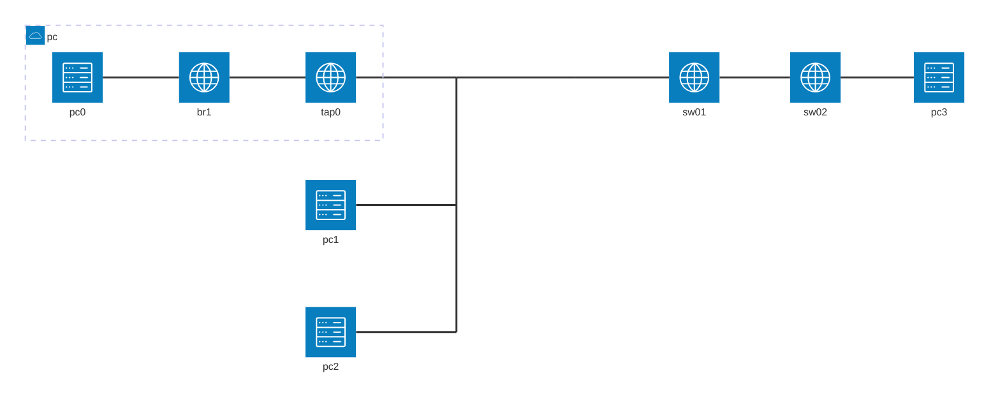

# 本エントリについて

Dynagen、Dynamips、vpcs を使って、VLAN の練習をします。
Dynagen、Dynamips、vpcs の利用環境はすでに整っているものとします。

Dynamips では Catalyst スイッチのエミュレーションができないので、ルータに NM-16ESW を乗せて練習します。
そのため、実際の Catalyst スイッチとは差異がある個所があります。

## 参考
https://www.infraexpert.com/study/vlanz10.html

## 環境について

同じVLANに属する pc0 と pc1 間、pc2 と pc3 間で疎通できるようにします。


| device | interface | ip address | network address | comment |
| --- | ----  | ---           | --- | --- |
| pc0 | br1   | 10.2.0.1/24 | 10.2.0.0 | vlan10 |
| pc1 | - | 10.2.0.2/24 | 10.2.0.0 | vlan10 |
| pc2 | - | 10.2.1.1/24 | 10.2.1.0 | vlan11 |
| pc3 | - | 10.2.1.2/24 | 10.2.1.0 | vlan11 |


追加する VLAN
| vlan | vlan name | nw address | default g/w |
| --- | --- | --- | --- |
| vlan10 | vlan0010 | 10.2.0.0/24 | 10.2.0.254 |
| vlan11 | vlan0011 | 10.2.1.0/24 | 10.2.1.254 |


sw01、sw02 とも下記の ポートVLAN

| port | mode | vlan |
| --- | --- | --- |
| fa1/0 | access | vlan 10 |
| fa1/1 | access | vlan 10 |
| fa1/2 | access | vlan 10 |
| fa1/3 | access | vlan 10 |
| fa1/4 | access | vlan 11 |
| fa1/5 | access | vlan 11 |
| fa1/6 | access | vlan 11 |
| fa1/7 | access | vlan 11 |


```:Dynagen 設定ファイル抜粋
        [[ROUTER sw01]]
                model = 3725
                slot1 = NM-16ESW
                console = 2001
                f1/0 = nio_tap:tap0
                f1/1 = NIO_udp:30000:127.0.0.1:20000
                f1/4 = NIO_udp:30001:127.0.0.1:20001
                f1/14 = sw02 f1/14

        [[ROUTER sw02]]
                model = 3725
                slot1 = NM-16ESW
                console = 2002
                f1/4 = NIO_udp:30002:127.0.0.1:20002
```

```:startup.vpc
1
ip 10.2.0.2 10.2.0.254 24
2
ip 10.2.1.1 10.2.1.254 24
3
ip 10.2.1.2 10.2.1.254 24
4
5
6
7
8
9
1
```

# VLAN作成

初期状態から VLAN を作成します。
```
sw01#show vlan-s

VLAN Name                             Status    Ports
---- -------------------------------- --------- -------------------------------
1    default                          active    Fa1/0, Fa1/1, Fa1/2, Fa1/3
                                                Fa1/4, Fa1/5, Fa1/6, Fa1/7
                                                Fa1/8, Fa1/9, Fa1/10, Fa1/11
                                                Fa1/12, Fa1/13, Fa1/14, Fa1/15
1002 fddi-default                     act/unsup
1003 token-ring-default               act/unsup
1004 fddinet-default                  act/unsup
1005 trnet-default                    act/unsup

VLAN Type  SAID       MTU   Parent RingNo BridgeNo Stp  BrdgMode Trans1 Trans2
---- ----- ---------- ----- ------ ------ -------- ---- -------- ------ ------
1    enet  100001     1500  -      -      -        -    -        1002   1003
1002 fddi  101002     1500  -      -      -        -    -        1      1003
1003 tr    101003     1500  1005   0      -        -    srb      1      1002
1004 fdnet 101004     1500  -      -      1        ibm  -        0      0
1005 trnet 101005     1500  -      -      1        ibm  -        0      0
```

VLANを作成するとき、必須ではありませんが、今回は名前を設定します。
```
sw01(config)#vlan 10
sw01(config-vlan)#name vlan0010

sw01(config-vlan)#vlan 11
sw01(config-vlan)#name vlan0011
```

VLANが作成され、名前が設定されたことを確認します。
```
sw01#show vlan-switch

VLAN Name                             Status    Ports
---- -------------------------------- --------- -------------------------------
1    default                          active    Fa1/0, Fa1/1, Fa1/2, Fa1/3
                                                Fa1/4, Fa1/5, Fa1/6, Fa1/7
                                                Fa1/8, Fa1/9, Fa1/10, Fa1/11
                                                Fa1/12, Fa1/13, Fa1/14, Fa1/15
10   vlan0010                         active
11   vlan0011                         active
1002 fddi-default                     act/unsup
1003 token-ring-default               act/unsup
1004 fddinet-default                  act/unsup
1005 trnet-default                    act/unsup

VLAN Type  SAID       MTU   Parent RingNo BridgeNo Stp  BrdgMode Trans1 Trans2
---- ----- ---------- ----- ------ ------ -------- ---- -------- ------ ------
1    enet  100001     1500  -      -      -        -    -        1002   1003
10   enet  100010     1500  -      -      -        -    -        0      0
11   enet  100011     1500  -      -      -        -    -        0      0
1002 fddi  101002     1500  -      -      -        -    -        1      1003
1003 tr    101003     1500  1005   0      -        -    srb      1      1002
1004 fdnet 101004     1500  -      -      1        ibm  -        0      0
1005 trnet 101005     1500  -      -      1        ibm  -        0      0
```

## ポートにVLANを割り当てる

初期状態では全てのスイッチポートが VLAN 1 に割り当てられています。
```
sw01#show int status

Port    Name               Status       Vlan       Duplex Speed Type
Fa1/0                      connected    1          a-full   a-100 10/100BaseTX
Fa1/1                      connected    1          a-full   a-100 10/100BaseTX
Fa1/2                      notconnect   1            auto    auto 10/100BaseTX
Fa1/3                      notconnect   1            auto    auto 10/100BaseTX
Fa1/4                      connected    1          a-full   a-100 10/100BaseTX
Fa1/5                      notconnect   1            auto    auto 10/100BaseTX
Fa1/6                      notconnect   1            auto    auto 10/100BaseTX
Fa1/7                      notconnect   1            auto    auto 10/100BaseTX
Fa1/8                      notconnect   1            auto    auto 10/100BaseTX
Fa1/9                      notconnect   1            auto    auto 10/100BaseTX
Fa1/10                     notconnect   1            auto    auto 10/100BaseTX
Fa1/11                     notconnect   1            auto    auto 10/100BaseTX
Fa1/12                     notconnect   1            auto    auto 10/100BaseTX
Fa1/13                     notconnect   1            auto    auto 10/100BaseTX
Fa1/14                     notconnect   1            auto    auto 10/100BaseTX
Fa1/15                     notconnect   1            auto    auto 10/100BaseTX
```

スイッチポートの情報を確認します。
```
sw01#show int fa1/0 switchport
Name: Fa1/0
Switchport: Enabled
Administrative Mode: static access
Operational Mode: static access
Administrative Trunking Encapsulation: dot1q
Operational Trunking Encapsulation: native
Negotiation of Trunking: Disabled
Access Mode VLAN: 1 (default)
Trunking Native Mode VLAN: 1 (default)
Trunking VLANs Enabled: ALL
Trunking VLANs Active: 1
Protected: false
Priority for untagged frames: 0
Override vlan tag priority: FALSE
Voice VLAN: none
Appliance trust: none
```

所定の割り当てを実施します。
```
sw01(config)#int range fa1/0 - 3
sw01(config-if-range)#switchport mode access
sw01(config-if-range)#switchport access vlan 10

sw01(config-if-range)#int range fa1/4 - 7
sw01(config-if-range)#switchport mode access
sw01(config-if-range)#switchport access vlan 11
```

割り当てられたことを確認します。
ポートには一つのVLANしか割り当てることはできないので、VALN10、11を割り当てたポートは、VLAN1の項目からは削除されます。
```
sw01#show vlan-switch                                                                                                                                                                                                                 [9/379]

VLAN Name                             Status    Ports
---- -------------------------------- --------- -------------------------------
1    default                          active    Fa1/8, Fa1/9, Fa1/10, Fa1/11
                                                Fa1/12, Fa1/13, Fa1/14, Fa1/15
10   vlan0010                         active    Fa1/0, Fa1/1, Fa1/2, Fa1/3
11   vlan0011                         active    Fa1/4, Fa1/5, Fa1/6, Fa1/7
1002 fddi-default                     act/unsup
1003 token-ring-default               act/unsup
1004 fddinet-default                  act/unsup
1005 trnet-default                    act/unsup

VLAN Type  SAID       MTU   Parent RingNo BridgeNo Stp  BrdgMode Trans1 Trans2
---- ----- ---------- ----- ------ ------ -------- ---- -------- ------ ------
1    enet  100001     1500  -      -      -        -    -        1002   1003
10   enet  100010     1500  -      -      -        -    -        0      0
11   enet  100011     1500  -      -      -        -    -        0      0
1002 fddi  101002     1500  -      -      -        -    -        1      1003
1003 tr    101003     1500  1005   0      -        -    srb      1      1002
1004 fdnet 101004     1500  -      -      1        ibm  -        0      0
1005 trnet 101005     1500  -      -      1        ibm  -        0      0

sw01#show int status

Port    Name               Status       Vlan       Duplex Speed Type
Fa1/0                      connected    10         a-full   a-100 10/100BaseTX
Fa1/1                      connected    10         a-full   a-100 10/100BaseTX
Fa1/2                      notconnect   10           auto    auto 10/100BaseTX
Fa1/3                      notconnect   10           auto    auto 10/100BaseTX
Fa1/4                      connected    11         a-full   a-100 10/100BaseTX
Fa1/5                      notconnect   11           auto    auto 10/100BaseTX
Fa1/6                      notconnect   11           auto    auto 10/100BaseTX
Fa1/7                      notconnect   11           auto    auto 10/100BaseTX
Fa1/8                      notconnect   1            auto    auto 10/100BaseTX
Fa1/9                      notconnect   1            auto    auto 10/100BaseTX
Fa1/10                     notconnect   1            auto    auto 10/100BaseTX
Fa1/11                     notconnect   1            auto    auto 10/100BaseTX
Fa1/12                     notconnect   1            auto    auto 10/100BaseTX
Fa1/13                     notconnect   1            auto    auto 10/100BaseTX
Fa1/14                     notconnect   1            auto    auto 10/100BaseTX
Fa1/15                     notconnect   1            auto    auto 10/100BaseTX
```

スイッチポートの情報を確認します。
```
sw01#show int fa1/0 switchport
Name: Fa1/0
Switchport: Enabled
Administrative Mode: static access
Operational Mode: static access
Administrative Trunking Encapsulation: dot1q
Operational Trunking Encapsulation: native
Negotiation of Trunking: Disabled
Access Mode VLAN: 10 (vlan0010)
Trunking Native Mode VLAN: 1 (default)
Trunking VLANs Enabled: ALL
Trunking VLANs Active: 10
Protected: false
Priority for untagged frames: 0
Override vlan tag priority: FALSE
Voice VLAN: none
Appliance trust: none
```

## 疎通確認

必要なポートが up/up になっていることを確認します。
up/down のとき、いったん shut/no shut してみます。
```
sw01#show ip int bri
Interface                  IP-Address      OK? Method Status                Protocol
FastEthernet0/0            unassigned      YES unset  administratively down down
FastEthernet0/1            unassigned      YES unset  administratively down down
FastEthernet1/0            unassigned      YES unset  up                    up
FastEthernet1/1            unassigned      YES unset  up                    up
FastEthernet1/2            unassigned      YES unset  up                    down
FastEthernet1/3            unassigned      YES unset  up                    down
FastEthernet1/4            unassigned      YES unset  up                    up
FastEthernet1/5            unassigned      YES unset  up                    down
FastEthernet1/6            unassigned      YES unset  up                    down
FastEthernet1/7            unassigned      YES unset  up                    down
FastEthernet1/8            unassigned      YES unset  up                    down
FastEthernet1/9            unassigned      YES unset  up                    down
FastEthernet1/10           unassigned      YES unset  up                    down
FastEthernet1/11           unassigned      YES unset  up                    down
FastEthernet1/12           unassigned      YES unset  up                    down
FastEthernet1/13           unassigned      YES unset  up                    down
FastEthernet1/14           unassigned      YES unset  up                    down
FastEthernet1/15           unassigned      YES unset  up                    down
Vlan1                      unassigned      YES unset  up                    down
```

同じ VLAN10 に所属している pc1 から pc0 に対して ping が通ることを確認します。
```
VPCS[1]> ping 10.2.0.1
10.2.0.1 icmp_seq=1 ttl=64 time=0.224 ms
10.2.0.1 icmp_seq=2 ttl=64 time=0.132 ms
10.2.0.1 icmp_seq=3 ttl=64 time=0.106 ms
10.2.0.1 icmp_seq=4 ttl=64 time=0.106 ms
10.2.0.1 icmp_seq=5 ttl=64 time=0.107 ms
```

# SWをまたいだVLAN通信のためにアクセスポートを利用する

sw01、sw02 両方に存在する VLAN11 同士で通信をするために、アクセスポートを利用してみます。

## sw01 にアクセスポートの追加

sw01 にて 両スイッチを橋渡ししている fa1/14 に vlan 11を割り当てます。
```
sw01(config)#int fa1/14
sw01(config-if)#switchport mode access
sw01(config-if)#switchport access vlan 11
```

fa1/14 に VLAN11 が割り当てられたことを確認します。
```
sw01#show int status

Port    Name               Status       Vlan       Duplex Speed Type
Fa1/0                      connected    10         a-full   a-100 10/100BaseTX
Fa1/1                      connected    10         a-full   a-100 10/100BaseTX
Fa1/2                      notconnect   10           auto    auto 10/100BaseTX
Fa1/3                      notconnect   10           auto    auto 10/100BaseTX
Fa1/4                      connected    11         a-full   a-100 10/100BaseTX
Fa1/5                      notconnect   11           auto    auto 10/100BaseTX
Fa1/6                      notconnect   11           auto    auto 10/100BaseTX
Fa1/7                      notconnect   11           auto    auto 10/100BaseTX
Fa1/8                      notconnect   1            auto    auto 10/100BaseTX
Fa1/9                      notconnect   1            auto    auto 10/100BaseTX
Fa1/10                     notconnect   1            auto    auto 10/100BaseTX
Fa1/11                     notconnect   1            auto    auto 10/100BaseTX
Fa1/12                     notconnect   1            auto    auto 10/100BaseTX
Fa1/13                     notconnect   1            auto    auto 10/100BaseTX
Fa1/14                     notconnect   11           auto    auto 10/100BaseTX
Fa1/15                     notconnect   1            auto    auto 10/100BaseTX

sw01#show ip int bri
Interface                  IP-Address      OK? Method Status                Protocol
FastEthernet0/0            unassigned      YES unset  administratively down down
FastEthernet0/1            unassigned      YES unset  administratively down down
FastEthernet1/0            unassigned      YES unset  up                    up
FastEthernet1/1            unassigned      YES unset  up                    up
FastEthernet1/2            unassigned      YES unset  up                    down
FastEthernet1/3            unassigned      YES unset  up                    down
FastEthernet1/4            unassigned      YES unset  up                    up
FastEthernet1/5            unassigned      YES unset  up                    down
FastEthernet1/6            unassigned      YES unset  up                    down
FastEthernet1/7            unassigned      YES unset  up                    down
FastEthernet1/8            unassigned      YES unset  up                    down
FastEthernet1/9            unassigned      YES unset  up                    down
FastEthernet1/10           unassigned      YES unset  up                    down
FastEthernet1/11           unassigned      YES unset  up                    down
FastEthernet1/12           unassigned      YES unset  up                    down
FastEthernet1/13           unassigned      YES unset  up                    down
FastEthernet1/14           unassigned      YES unset  up                    down
FastEthernet1/15           unassigned      YES unset  up                    down
Vlan1                      unassigned      YES unset  up                    down
```

## sw02 側の設定

VLAN11 を作成し、名前を設定します。
```
sw02(config)#vlan 11
sw02(config-vlan)#name vlan0011

sw02#show vlan-switch

VLAN Name                             Status    Ports
---- -------------------------------- --------- -------------------------------
1    default                          active    Fa1/0, Fa1/1, Fa1/2, Fa1/3
                                                Fa1/4, Fa1/5, Fa1/6, Fa1/7
                                                Fa1/8, Fa1/9, Fa1/10, Fa1/11
                                                Fa1/12, Fa1/13, Fa1/14, Fa1/15
11   vlan0011                         active
1002 fddi-default                     act/unsup
1003 token-ring-default               act/unsup
1004 fddinet-default                  act/unsup
1005 trnet-default                    act/unsup

VLAN Type  SAID       MTU   Parent RingNo BridgeNo Stp  BrdgMode Trans1 Trans2
---- ----- ---------- ----- ------ ------ -------- ---- -------- ------ ------
1    enet  100001     1500  -      -      -        -    -        1002   1003
11   enet  100011     1500  -      -      -        -    -        0      0
1002 fddi  101002     1500  -      -      -        -    -        1      1003
1003 tr    101003     1500  1005   0      -        -    srb      1      1002
1004 fdnet 101004     1500  -      -      1        ibm  -        0      0
1005 trnet 101005     1500  -      -      1        ibm  -        0      0
```

各ポートにVLAN11を割り当てます。
```
sw02(config)#int range fa1/4 - 7
sw02(config-if-range)#switchport mode access
sw02(config-if-range)#switchport access vlan 11

sw02(config-if-range)#int fa1/14
sw02(config-if)#switchport mode access
sw02(config-if)#switchport access vlan 11
```

割り当てられたことを確認します。
```
sw02#show int status

Port    Name               Status       Vlan       Duplex Speed Type
Fa1/0                      notconnect   1            auto    auto 10/100BaseTX
Fa1/1                      notconnect   1            auto    auto 10/100BaseTX
Fa1/2                      notconnect   1            auto    auto 10/100BaseTX
Fa1/3                      notconnect   1            auto    auto 10/100BaseTX
Fa1/4                      connected    11         a-full   a-100 10/100BaseTX
Fa1/5                      notconnect   11           auto    auto 10/100BaseTX
Fa1/6                      notconnect   11           auto    auto 10/100BaseTX
Fa1/7                      notconnect   11           auto    auto 10/100BaseTX
Fa1/8                      notconnect   1            auto    auto 10/100BaseTX
Fa1/9                      notconnect   1            auto    auto 10/100BaseTX
Fa1/10                     notconnect   1            auto    auto 10/100BaseTX
Fa1/11                     notconnect   1            auto    auto 10/100BaseTX
Fa1/12                     notconnect   1            auto    auto 10/100BaseTX
Fa1/13                     notconnect   1            auto    auto 10/100BaseTX
Fa1/14                     connected    11         a-full   a-100 10/100BaseTX
Fa1/15                     notconnect   1            auto    auto 10/100BaseTX
```

## 疎通確認

ポートが up/up でなければ shut/no shut を試します。
```
sw02#show ip int bri
Interface                  IP-Address      OK? Method Status                Protocol
FastEthernet0/0            unassigned      YES unset  administratively down down
FastEthernet0/1            unassigned      YES unset  administratively down down
FastEthernet1/0            unassigned      YES unset  up                    down
FastEthernet1/1            unassigned      YES unset  up                    down
FastEthernet1/2            unassigned      YES unset  up                    down
FastEthernet1/3            unassigned      YES unset  up                    down
FastEthernet1/4            unassigned      YES unset  up                    up
FastEthernet1/5            unassigned      YES unset  up                    down
FastEthernet1/6            unassigned      YES unset  up                    down
FastEthernet1/7            unassigned      YES unset  up                    down
FastEthernet1/8            unassigned      YES unset  up                    down
FastEthernet1/9            unassigned      YES unset  up                    down
FastEthernet1/10           unassigned      YES unset  up                    down
FastEthernet1/11           unassigned      YES unset  up                    down
FastEthernet1/12           unassigned      YES unset  up                    down
FastEthernet1/13           unassigned      YES unset  up                    down
FastEthernet1/14           unassigned      YES unset  up                    up
FastEthernet1/15           unassigned      YES unset  up                    down
Vlan1                      unassigned      YES unset  up                    down
```

ここでは sw01 の fa1/14 が up/down でしたので、shut/no shut しました。
```
sw01(config)#int fa1/14
sw01(config-if)#shut
sw01(config-if)#no shut

sw01#show ip int bri | inc 1/14
FastEthernet1/14           unassigned      YES unset  up                    up
```

sw01 の pc2 から sw02 の pc3 へ、ping を実行してみます。
```
VPCS[2]> ping 10.2.1.2
10.2.1.2 icmp_seq=1 ttl=64 time=0.111 ms
10.2.1.2 icmp_seq=2 ttl=64 time=0.156 ms
10.2.1.2 icmp_seq=3 ttl=64 time=0.127 ms
10.2.1.2 icmp_seq=4 ttl=64 time=0.143 ms
10.2.1.2 icmp_seq=5 ttl=64 time=0.118 ms
```

# SWをまたいだVLAN通信のために trunk ポートを利用する

上記のアクセスポートを利用したやり方だと、VLAN の数だけスイッチ間を橋渡しするポートが必要となります。
trunk ポートは複数のVLANを通すことができるポートです。trunk を利用すると、橋渡しするポートは一つですみます。

## trunk port の設定

sw01 側で fa1/14 を trunk ポートに指定します。
```
sw01(config)#int fa1/14
sw01(config-if)#switchport trunk encapsulation dot1q
sw01(config-if)#switchport mode trunk
```

ポートの情報を確認します。
```
sw01#show int fa1/14 switchport
Name: Fa1/14
Switchport: Enabled
Administrative Mode: trunk
Operational Mode: trunk
Administrative Trunking Encapsulation: dot1q
Operational Trunking Encapsulation: dot1q
Negotiation of Trunking: Disabled
Access Mode VLAN: 0 ((Inactive))
Trunking Native Mode VLAN: 1 (default)
Trunking VLANs Enabled: ALL
Trunking VLANs Active: 1,10-11
Protected: false
Priority for untagged frames: 0
Override vlan tag priority: FALSE
Voice VLAN: none
Appliance trust: none
```

trunk ポートの情報を確認します。
利用できる VLAN 番号、実際に転送される VLAN 番号等を確認します。
```
sw01#show int trunk

Port      Mode         Encapsulation  Status        Native vlan
Fa1/14    on           802.1q         trunking      1

Port      Vlans allowed on trunk
Fa1/14    1-4094

Port      Vlans allowed and active in management domain
Fa1/14    1,10-11

Port      Vlans in spanning tree forwarding state and not pruned
Fa1/14    1,10-11
```

ポートの情報を確認します。
```
sw01#show int status

Port    Name               Status       Vlan       Duplex Speed Type
Fa1/0                      connected    10         a-full   a-100 10/100BaseTX
Fa1/1                      connected    10         a-full   a-100 10/100BaseTX
Fa1/2                      notconnect   10           auto    auto 10/100BaseTX
Fa1/3                      notconnect   10           auto    auto 10/100BaseTX
Fa1/4                      connected    11         a-full   a-100 10/100BaseTX
Fa1/5                      notconnect   11           auto    auto 10/100BaseTX
Fa1/6                      notconnect   11           auto    auto 10/100BaseTX
Fa1/7                      notconnect   11           auto    auto 10/100BaseTX
Fa1/8                      notconnect   1            auto    auto 10/100BaseTX
Fa1/9                      notconnect   1            auto    auto 10/100BaseTX
Fa1/10                     notconnect   1            auto    auto 10/100BaseTX
Fa1/11                     notconnect   1
Fa1/12                     notconnect   1            auto    auto 10/100BaseTX
Fa1/13                     notconnect   1            auto    auto 10/100BaseTX
Fa1/14                     connected    trunk      a-full   a-100 10/100BaseTX
Fa1/15                     notconnect   1            auto    auto 10/100BaseTX
```


対向の sw02 側でも同様に trunk ポートの設定をします。

```
sw02(config)#int fa1/14
sw02(config-if)#switchport trunk encapsulation dot1q
sw02(config-if)#switchport mode trunk
```

結果を確認します。
```
sw02#show int fa1/14 switchport
Name: Fa1/14
Switchport: Enabled
Administrative Mode: trunk
Operational Mode: trunk
Administrative Trunking Encapsulation: dot1q
Operational Trunking Encapsulation: dot1q
Negotiation of Trunking: Disabled
Access Mode VLAN: 0 ((Inactive))
Trunking Native Mode VLAN: 1 (default)
Trunking VLANs Enabled: ALL
Trunking VLANs Active: 1,11
Protected: false
Priority for untagged frames: 0
Override vlan tag priority: FALSE
Voice VLAN: none
Appliance trust: none
```
```
sw02#show int status

Port    Name               Status       Vlan       Duplex Speed Type
Fa1/0                      notconnect   1            auto    auto 10/100BaseTX
Fa1/1                      notconnect   1            auto    auto 10/100BaseTX
Fa1/2                      notconnect   1            auto    auto 10/100BaseTX
Fa1/3                      notconnect   1            auto    auto 10/100BaseTX
Fa1/4                      connected    11         a-full   a-100 10/100BaseTX
Fa1/5                      notconnect   11           auto    auto 10/100BaseTX
Fa1/6                      notconnect   11           auto    auto 10/100BaseTX
Fa1/7                      notconnect   11           auto    auto 10/100BaseTX
Fa1/8                      notconnect   1            auto    auto 10/100BaseTX
Fa1/9                      notconnect   1            auto    auto 10/100BaseTX
Fa1/10                     notconnect   1            auto    auto 10/100BaseTX
Fa1/11                     notconnect   1            auto    auto 10/100BaseTX
Fa1/12                     notconnect   1            auto    auto 10/100BaseTX
Fa1/13                     notconnect   1            auto    auto 10/100BaseTX
Fa1/14                     connected    trunk      a-full   a-100 10/100BaseTX
Fa1/15                     notconnect   1            auto    auto 10/100BaseTX
```

trunk ポートに指定したポートは、 `show vlan-switch` には表示されなくなります。
```
sw02#show vlan-switch

VLAN Name                             Status    Ports
---- -------------------------------- --------- -------------------------------
1    default                          active    Fa1/0, Fa1/1, Fa1/2, Fa1/3
                                                Fa1/8, Fa1/9, Fa1/10, Fa1/11
                                                Fa1/12, Fa1/13, Fa1/15
11   vlan0011                         active    Fa1/4, Fa1/5, Fa1/6, Fa1/7
1002 fddi-default                     act/unsup
1003 token-ring-default               act/unsup
1004 fddinet-default                  act/unsup
1005 trnet-default                    act/unsup

VLAN Type  SAID       MTU   Parent RingNo BridgeNo Stp  BrdgMode Trans1 Trans2
---- ----- ---------- ----- ------ ------ -------- ---- -------- ------ ------
1    enet  100001     1500  -      -      -        -    -        1002   1003
11   enet  100011     1500  -      -      -        -    -        0      0
1002 fddi  101002     1500  -      -      -        -    -        1      1003
1003 tr    101003     1500  1005   0      -        -    srb      1      1002
1004 fdnet 101004     1500  -      -      1        ibm  -        0      0
1005 trnet 101005     1500  -      -      1        ibm  -        0      0
```


## 疎通確認

アクセスポートを利用した時と同様、疎通できることを確認します。
```
VPCS[2]> ping 10.2.1.2
10.2.1.2 icmp_seq=1 ttl=64 time=0.082 ms
10.2.1.2 icmp_seq=2 ttl=64 time=0.121 ms
10.2.1.2 icmp_seq=3 ttl=64 time=0.135 ms
10.2.1.2 icmp_seq=4 ttl=64 time=0.188 ms
10.2.1.2 icmp_seq=5 ttl=64 time=0.142 ms
```

# VTP

通常はVLANを必要とする全てのスイッチで、VLAN を作成する必要があります。
VTP を利用すると、 `Server` で作成した VLAN を `Client` に伝播することができるようになり、各 `Client` で VLAN を作成する必要がなくなります。

## Server の設定

デフォルトで `Server` モードとなっています。
```
sw01#show vtp status
VTP Version                     : 2
Configuration Revision          : 2
Maximum VLANs supported locally : 36
Number of existing VLANs        : 7
VTP Operating Mode              : Server
VTP Domain Name                 :
VTP Pruning Mode                : Disabled
VTP V2 Mode                     : Disabled
VTP Traps Generation            : Disabled
MD5 digest                      : 0x05 0xFB 0x5E 0x42 0x95 0x26 0x4C 0x04
Configuration last modified by 0.0.0.0 at 3-1-02 00:04:56
Local updater ID is 0.0.0.0 (no valid interface found)
```

VTP ドメインと、パスワードを設定します。
```
sw01(config)#vtp domain ccna
sw01(config)#vtp password cisco
```

結果を確認します。
```
sw01#show vtp status
VTP Version                     : 2
Configuration Revision          : 2
Maximum VLANs supported locally : 36
Number of existing VLANs        : 7
VTP Operating Mode              : Server
VTP Domain Name                 : ccna
VTP Pruning Mode                : Disabled
VTP V2 Mode                     : Disabled
VTP Traps Generation            : Disabled
MD5 digest                      : 0x32 0x75 0xF4 0xD7 0x22 0xD7 0xE4 0x39
Configuration last modified by 0.0.0.0 at 3-1-02 00:04:56
Local updater ID is 0.0.0.0 (no valid interface found)
```


## Client の設定

モードを `Client` にする必要があります。
```
sw02#show vtp status                                                                                                                                                                                                                 [17/581]
VTP Version                     : 2
Configuration Revision          : 1
Maximum VLANs supported locally : 36
Number of existing VLANs        : 6
VTP Operating Mode              : Server
VTP Domain Name                 :
VTP Pruning Mode                : Disabled
VTP V2 Mode                     : Disabled
VTP Traps Generation            : Disabled
MD5 digest                      : 0x5E 0x8C 0x69 0xAA 0x90 0x27 0xFB 0xD0
Configuration last modified by 0.0.0.0 at 3-1-02 00:05:21
Local updater ID is 0.0.0.0 (no valid interface found)
```

モードを `Client` にし、`Server` で指定したのと同じ VTP ドメインとパスワードを設定します。
```
sw02(config)#vtp mode client
sw02(config)#vtp domain ccna
sw02(config)#vtp password cisco
```

結果を確認します。
Server側で作成していた VLAN10 が伝播され、Client 側で自動で作成されました。
```
sw02#show vtp status
VTP Version                     : 2
Configuration Revision          : 2
Maximum VLANs supported locally : 36
Number of existing VLANs        : 7
VTP Operating Mode              : Client
VTP Domain Name                 : ccna
VTP Pruning Mode                : Disabled
VTP V2 Mode                     : Disabled
VTP Traps Generation            : Disabled
MD5 digest                      : 0x32 0x75 0xF4 0xD7 0x22 0xD7 0xE4 0x39
Configuration last modified by 0.0.0.0 at 3-1-02 00:04:56

sw02#show vlan-switch

VLAN Name                             Status    Ports
---- -------------------------------- --------- -------------------------------
1    default                          active    Fa1/0, Fa1/1, Fa1/2, Fa1/3
                                                Fa1/8, Fa1/9, Fa1/10, Fa1/11
                                                Fa1/12, Fa1/13, Fa1/15
10   vlan0010                         active
11   vlan0011                         active    Fa1/4, Fa1/5, Fa1/6, Fa1/7
1002 fddi-default                     act/unsup
1003 token-ring-default               act/unsup
1004 fddinet-default                  act/unsup
1005 trnet-default                    act/unsup

VLAN Type  SAID       MTU   Parent RingNo BridgeNo Stp  BrdgMode Trans1 Trans2
---- ----- ---------- ----- ------ ------ -------- ---- -------- ------ ------
1    enet  100001     1500  -      -      -        -    -        1002   1003
10   enet  100010     1500  -      -      -        -    -        0      0
11   enet  100011     1500  -      -      -        -    -        0      0
1002 fddi  101002     1500  -      0      -        -    -        1      1003
1003 tr    101003     1500  1005   0      -        -    srb      1      1002
1004 fdnet 101004     1500  -      -      1        ibm  -        0      0
1005 trnet 101005     1500  -      -      1        ibm  -        0      0
```


# trunk ポートの制限

trunk ポートでは、何も制限をしないと、スイッチで作成している全ての VLAN トラフィックが転送されます。
不要な VLAN トラフィックの転送を防止することで、帯域の利用を効率化することができます。

一つのやり方は、各 trunk ポートで `switchport trunk allowed vlan` の設定をすることです。
```
sw02(config)#int fa1/14
sw02(config-if)#switchport trunk allowed vlan remove 10

sw02#show int trunk

Port      Mode         Encapsulation  Status        Native vlan
Fa1/14    on           802.1q         trunking      1

Port      Vlans allowed on trunk
Fa1/14    1-9,11-4094

Port      Vlans allowed and active in management domain
Fa1/14    1,11

Port      Vlans in spanning tree forwarding state and not pruned
Fa1/14    1,11
```

もう一つのやり方は、VTP Pruning を設定することです。
Server モードのスイッチで設定します。
```
sw01(config)#vtp pruning

sw01#show vtp status
VTP Version                     : 2
Configuration Revision          : 3
Maximum VLANs supported locally : 36
Number of existing VLANs        : 7
VTP Operating Mode              : Server
VTP Domain Name                 : ccna
VTP Pruning Mode                : Enabled
VTP V2 Mode                     : Disabled
VTP Traps Generation            : Disabled
MD5 digest                      : 0x2A 0xE9 0xA3 0x6E 0x45 0xB9 0x88 0x96
Configuration last modified by 0.0.0.0 at 3-1-02 00:57:06
Local updater ID is 0.0.0.0 (no valid interface found)
```

設定すると、Client側に伝播します。
```
sw02#show vtp status
VTP Version                     : 2
Configuration Revision          : 3
Maximum VLANs supported locally : 36
Number of existing VLANs        : 7
VTP Operating Mode              : Client
VTP Domain Name                 : ccna
VTP Pruning Mode                : Enabled
VTP V2 Mode                     : Disabled
VTP Traps Generation            : Disabled
MD5 digest                      : 0x2A 0xE9 0xA3 0x6E 0x45 0xB9 0x88 0x96
Configuration last modified by 0.0.0.0 at 3-1-02 00:57:06
```

# まとめ

Dynagen、Dynamips、vpcs を使って、VLAN Accessポート、Trunkポート、VTP等の練習をしました。
少し足りないログがあるような気もしますので、あとで補足するかもしれません。
