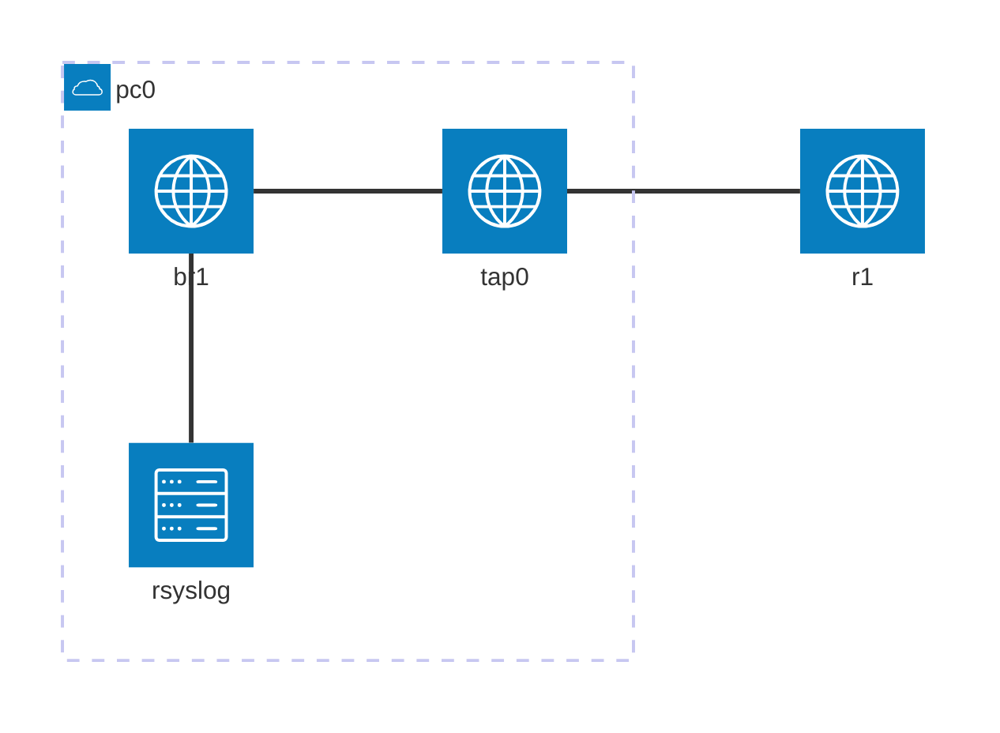

| device | interface | ip address | network address | comment |
| --- | ----  | ---           | --- | --- |
| pc0 | br1   | 10.2.0.1/24 | 10.2.0.0 | syslogサーバ |
| r1  | fe0/0 | 10.2.0.254/24 |^ |  |


# 本エントリについて

Dynagen、Dynamips、rsyslogd を使って、syslog 設定を練習します。
Dynagen、Dynamips の利用環境はすでに整っているものとします。

## 参考

https://www.infraexpert.com/study/syslog2.html

## 環境について

```
[syslog server] .1 (10.2.0.0/24) .254 f0/0 [r1]
```

```:Dynagen 設定ファイル抜粋
        [[ROUTER r1]]
                model = 3725
                console = 2001
                f0/0 = sw1 1

        [[ETHSW sw1]]
                1 = access 1
                3 = access 1 nio_tap:tap0
```

# 単体でのロギング設定

## ログメッセージの時刻表示

標準だと、下記のようにターミナルに出力される時刻のタイムスタンプがUTCとなっています。
ローカルタイムゾーンとずれがあり、直観的ではありません。
```
r1(config)#end
r1#
Dec 21 21:55:35.069: %SYS-5-CONFIG_I: Configured from console by console
r1#
r1#show clock detail
06:55:39.929 JST Thu Dec 22 2022
Time source is NTP
```

この設定を投入することで、ローカルタイムゾーンでの表示となります。
```
r1(config)#service timestamps log datetime msec localtime show-timezone
r1(config)#end
r1#
Dec 22 06:56:09.798 JST: %SYS-5-CONFIG_I: Configured from console by console
r1#
r1#show clock detail
06:56:14.950 JST Thu Dec 22 2022
Time source is NTP
```

## debug メッセージの時刻表示

debugメッセージも同様です。
```
Dec 21 21:49:26.325: NTP: xmit packet to 10.2.0.1:
Dec 21 21:49:26.329:  leap 0, mode 3, version 3, stratum 5, ppoll 128
Dec 21 21:49:26.329:  rtdel 0431 (16.373), rtdsp 05D0 (22.705), refid 0A020001 (10.2.0.1)
Dec 21 21:49:26.329:  ref E74DFDA6.573FB122 (06:48:22.340 JST Thu Dec 22 2022)
Dec 21 21:49:26.329:  org E74DFDA6.5837DE52 (06:48:22.344 JST Thu Dec 22 2022)
Dec 21 21:49:26.329:  rec E74DFDA6.573FB122 (06:48:22.340 JST Thu Dec 22 2022)
Dec 21 21:49:26.329:  xmt E74DFDE6.53588744 (06:49:26.325 JST Thu Dec 22 2022)
Dec 21 21:49:26.333: NTP: rcv packet from 10.2.0.1 to 10.2.0.254 on FastEthernet0/0:
Dec 21 21:49:26.333:  leap 0, mode 4, version 3, stratum 4, ppoll 128c
Dec 21 21:49:26.333:  rtdel 0014 (0.305), rtdsp 0022 (0.519), refid A9FEA97B (169.254.169.123)
Dec 21 21:49:26.333:  ref E74DFCF0.D7137251 (06:45:20.840 JST Thu Dec 22 2022)
Dec 21 21:49:26.333:  org E74DFDE6.53588744 (06:49:26.325 JST Thu Dec 22 2022)
Dec 21 21:49:26.333:  rec E74DFDE6.54CCF3DB (06:49:26.331 JST Thu Dec 22 2022)
Dec 21 21:49:26.333:  xmt E74DFDE6.54D0E60B (06:49:26.331 JST Thu Dec 22 2022)
Dec 21 21:49:26.333:  inp E74DFDE6.55748248 (06:49:26.333 JST Thu Dec 22 2022)

r1#show clock detail
06:49:36.185 JST Thu Dec 22 2022
Time source is NTP
```

下記設定を投入することで、ローカルタイムゾーンでの表示となります。
```
r1(config)#service timestamps debug datetime msec localtime show-timezone

Dec 22 06:51:34.325 JST: NTP: xmit packet to 10.2.0.1:
Dec 22 06:51:34.329 JST:  leap 0, mode 3, version 3, stratum 5, ppoll 128
Dec 22 06:51:34.329 JST:  rtdel 022C (8.484), rtdsp 0315 (12.039), refid 0A020001 (10.2.0.1)
Dec 22 06:51:34.333 JST:  ref E74DFDE6.55748248 (06:49:26.333 JST Thu Dec 22 2022)
Dec 22 06:51:34.333 JST:  org E74DFDE6.54D0E60B (06:49:26.331 JST Thu Dec 22 2022)
Dec 22 06:51:34.337 JST:  rec E74DFDE6.55748248 (06:49:26.333 JST Thu Dec 22 2022)
Dec 22 06:51:34.341 JST:  xmt E74DFE66.53622C4A (06:51:34.325 JST Thu Dec 22 2022)
Dec 22 06:51:34.345 JST: NTP: rcv packet from 10.2.0.1 to 10.2.0.254 on FastEthernet0/0:
Dec 22 06:51:34.345 JST:  leap 0, mode 4, version 3, stratum 4, ppoll 128
Dec 22 06:51:34.345 JST:  rtdel 0014 (0.305), rtdsp 002B (0.656), refid A9FEA97B (169.254.169.123)
Dec 22 06:51:34.345 JST:  ref E74DFCF0.D7137251 (06:45:20.840 JST Thu Dec 22 2022)
Dec 22 06:51:34.345 JST:  org E74DFE66.53622C4A (06:51:34.325 JST Thu Dec 22 2022)
Dec 22 06:51:34.345 JST:  rec E74DFE66.579F3939 (06:51:34.342 JST Thu Dec 22 2022)
Dec 22 06:51:34.345 JST:  xmt E74DFE66.57A3255D (06:51:34.342 JST Thu Dec 22 2022)
Dec 22 06:51:34.345 JST:  inp E74DFE66.5882067B (06:51:34.345 JST Thu Dec 22 2022)

r1#show clock detail
06:51:51.517 JST Thu Dec 22 2022
Time source is NTP
```

## シーケンス番号付与

Syslog転送する際、Syslogサーバ側で取りこぼされることがあります。
下記設定を投入することで、先頭にシーケンス番号が付くようになり、取りこぼしが起きたことが分かりやすくなります。
```
r1(config)#service sequence-numbers

r1(config)#end
r1#
000112: Dec 22 06:58:06.650 JST: %SYS-5-CONFIG_I: Configured from console by console
r1#
000113: Dec 22 07:00:06.326 JST: NTP: xmit packet to 10.2.0.1:
000114: Dec 22 07:00:06.330 JST:  leap 0, mode 3, version 3, stratum 5, ppoll 128
000115: Dec 22 07:00:06.330 JST:  rtdel 022C (8.484), rtdsp 04B8 (18.433), refid 0A020001 (10.2.0.1)
000116: Dec 22 07:00:06.334 JST:  ref E74DFFE6.59A4340F (06:57:58.350 JST Thu Dec 22 2022)
000117: Dec 22 07:00:06.338 JST:  org E74DFFE6.585F16B6 (06:57:58.345 JST Thu Dec 22 2022)
000118: Dec 22 07:00:06.338 JST:  rec E74DFFE6.59A4340F (06:57:58.350 JST Thu Dec 22 2022)
000119: Dec 22 07:00:06.342 JST:  xmt E74E0066.538C0390 (07:00:06.326 JST Thu Dec 22 2022)
000120: Dec 22 07:00:06.346 JST: NTP: rcv packet from 10.2.0.1 to 10.2.0.254 on FastEthernet0/0:
000121: Dec 22 07:00:06.346 JST:  leap 0, mode 4, version 3, stratum 4, ppoll 128
000122: Dec 22 07:00:06.346 JST:  rtdel 0014 (0.305), rtdsp 004D (1.175), refid A9FEA97B (169.254.169.123)
000123: Dec 22 07:00:06.346 JST:  ref E74DFCF0.D7137251 (06:45:20.840 JST Thu Dec 22 2022)
000124: Dec 22 07:00:06.346 JST:  org E74E0066.538C0390 (07:00:06.326 JST Thu Dec 22 2022)
000125: Dec 22 07:00:06.346 JST:  rec E74E0066.58257343 (07:00:06.344 JST Thu Dec 22 2022)
000126: Dec 22 07:00:06.346 JST:  xmt E74E0066.582A38A2 (07:00:06.344 JST Thu Dec 22 2022)
000127: Dec 22 07:00:06.346 JST:  inp E74E0066.58F59762 (07:00:06.347 JST Thu Dec 22 2022)
```

## ログの確認

標準ではローカルのバッファにログが保存されません。
```
r1#show logging
Syslog logging: enabled (12 messages dropped, 0 messages rate-limited,
                0 flushes, 0 overruns, xml disabled, filtering disabled)

No Active Message Discriminator.


No Inactive Message Discriminator.


    Console logging: level debugging, 130 messages logged, xml disabled,
                     filtering disabled
    Monitor logging: level debugging, 0 messages logged, xml disabled,
                     filtering disabled
    Buffer logging:  disabled, xml disabled,
                     filtering disabled
    Logging Exception size (4096 bytes)
    Count and timestamp logging messages: disabled
    Persistent logging: disabled

No active filter modules.

ESM: 0 messages dropped

    Trap logging: level informational, 29 message lines logged
```

下記設定でバッファにログを保存することができます。
ここでは最小限の4096バイトを指定しています。
```
r1(config)#logging buffered 4096

r1(config)#end
r1#
000143: Dec 22 07:03:26.703 JST: %SYS-5-CONFIG_I: Configured from console by consolegg
r1#show logging
Syslog logging: enabled (12 messages dropped, 0 messages rate-limited,
                0 flushes, 0 overruns, xml disabled, filtering disabled)

No Active Message Discriminator.


No Inactive Message Discriminator.


    Console logging: level debugging, 131 messages logged, xml disabled,
                     filtering disabled
    Monitor logging: level debugging, 0 messages logged, xml disabled,
                     filtering disabled
    Buffer logging:  level debugging, 1 messages logged, xml disabled,
                     filtering disabled
    Logging Exception size (4096 bytes)
    Count and timestamp logging messages: disabled
    Persistent logging: disabled

No active filter modules.

ESM: 0 messages dropped

    Trap logging: level informational, 30 message lines logged

Log Buffer (4096 bytes):
000143: Dec 22 07:03:26.703 JST: %SYS-5-CONFIG_I: Configured from console by console
```

## その他

コンソールへのログ出力を抑制します。
コンソールにDebug情報など短時間に多量のログが出力され、CPU負荷が高まるのを避けることができます。
```
r1(config)#no logging console
```

上記設定を入れたときは、作業は vty 接続で行うこととして、ログ情報を vtyターミナルに出力するようにします。
```
r1#show users
    Line       User       Host(s)              Idle       Location
   0 con 0                idle                 00:01:46
* 98 vty 0                idle                 00:00:00 10.2.0.1

  Interface    User               Mode         Idle     Peer Address

r1#terminal monitor
```

## 番外編

ロギングとは違いますが、show run 等の長い内容でもページごとに一時停止せず、最後まで一度に出力できるようにします。
```
r1#terminal length 0
```

# syslog 転送設定

## syslog サーバ基本設定

syslog サーバは、デフォルトでインストールされている rsyslog を利用しますので、追加でインストールが必要なパッケージはありません。
udp でシスログを受信する設定をします。また、local0 のメッセージの出力先ファイルを指定します。
local0 のメッセージの出力先として指定したファイルを作成し、rsyslog デーモンを再起動します。
```
$ sudo cp -pi /etc/rsyslog.conf{,.000}
$ sudo vi /etc/rsyslog.conf
$ diff -u /etc/rsyslog.conf{,.000}
@@ -13,8 +13,8 @@
 #module(load="immark")  # provides --MARK-- message capability

 # provides UDP syslog reception
-module(load="imudp")
-input(type="imudp" port="514")
+#module(load="imudp")
+#input(type="imudp" port="514")

 # provides TCP syslog reception
 #module(load="imtcp")
@@ -90,7 +90,3 @@
 # Emergencies are sent to everybody logged in.
 #
 *.emerg                                :omusrmsg:*
-
-
-
-local0.*                       -/var/log/local0.log

$ sudo touch /var/log/local0.log
$ sudo systemctl restart rsyslog
$ tail -f /var/log/local0.log
```

## Cisco デバイス側設定

syslog の送信先サーバ、送信する重要度、ファシリティを設定します。
ここでは notification 以上のメッセージを local0 として 10.2.0.1 へ送信する設定をしています。
```
r1(config)#logging host 10.2.0.1
r1(config)#logging trap notification
r1(config)#logging facility local0
```

## テスト

メッセージを出してみます。
```
r1(config)#end
r1#
r1#
000160: Dec 22 07:07:46.947 JST: %SYS-5-CONFIG_I: Configured from console by console
000161: Dec 22 07:07:47.951 JST: %SYS-6-LOGGINGHOST_STARTSTOP: Logging to host 10.2.0.1 port 514 started - CLI initiated
```

設定どおり、重要度5のメッセージは転送され、重要度6のメッセージは出力されませんでした。
```
$ tail -f /var/log/local0.log

Dec 22 07:07:47 ip-10-2-0-254.ap-northeast-1.compute.internal 32: 000160: Dec 22 07:07:46.947 JST: %SYS-5-CONFIG_I: Configured from console by console
```

## loglotate

このままでは syslog サーバ側のログが永遠に膨れ上がっていく一方なので、ログローテーションの設定をします。
```
$ grep include /etc/logrotate.conf
include /etc/logrotate.d

$ cat << END | sudo tee /etc/logrotate.d/cisco
/var/log/local0.log {
        daily
        rotate 12
        compress
        delaycompress
        missingok
        notifempty
        create 644 root root
}
END
```

設定を追加したら、設定内容をテストします。
```
$ /usr/sbin/logrotate -d /etc/logrotate.d/cisco

Handling 1 logs

rotating pattern: /var/log/local0.log  after 1 days (12 rotations)
empty log files are not rotated, old logs are removed
considering log /var/log/local0.log
Creating new state
  Now: 2022-12-23 05:32
  Last rotated at 2022-12-23 05:00
  log does not need rotating (log has been already rotated)

```

なお、この環境では logrotate は cron により毎日定時に実行されているようです。 
```
$ grep logrotate /etc/cron*/*
/etc/cron.daily/logrotate:if [ ! -x /usr/sbin/logrotate ]; then
/etc/cron.daily/logrotate:/usr/sbin/logrotate /etc/logrotate.conf
/etc/cron.daily/logrotate:    /usr/bin/logger -t logrotate "ALERT exited abnormally with [$EXITVALUE]"

$ grep daily /etc/crontab
25 6    * * *   root    test -x /usr/sbin/anacron || ( cd / && run-parts --report /etc/cron.daily )
```


# まとめ

簡単に syslog まわりの練習をしました。
通常だと syslog は udp を使用しますが、ここでは触れませんでしたが、rsyslog、cisco デバイスとも tcp による syslog 送受信に対応しています。