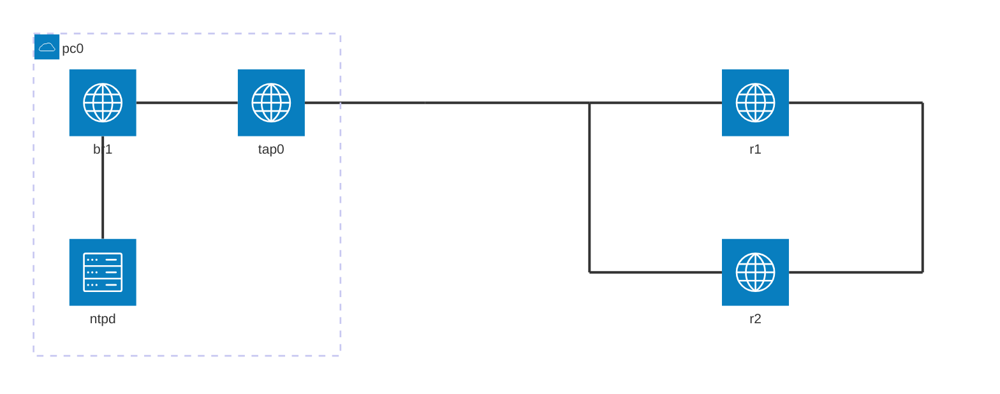

# 本エントリについて

Dynagen、Dynamips、chronyd を使って、ntp設定を練習します。
Dynagen、Dynamips の利用環境はすでに整っているものとします。

## 参考

https://www.cisco.com/c/dam/en/us/td/docs/ios-xml/ios/bsm/configuration/xe-3se/3650/bsm-xe-3se-3650-book.html
https://www.cisco.com/c/en/us/td/docs/switches/datacenter/nexus7000/sw/system-management/guide/b_Cisco_Nexus_7000_Series_NX-OS_System_Management_Configuration_Guide-RI/configuring_ntp.html
https://www.cisco.com/c/ja_jp/support/docs/ip/network-time-protocol-ntp/116161-trouble-ntp-00.html

## 環境について



| device | interface | ip address | network address | comment |
| --- | ----  | ---           | --- | --- |
| pc0 | br1   | 10.2.0.1/24 | 10.2.0.0 | ntpサーバ |
| r1  | fe0/0 | 10.2.0.254/24 |^ |  |
| r2  | fe0/0 | 10.2.0.253/24 |^ |  |

```:Dynagen 設定ファイル抜粋
        [[ROUTER r1]]
                model = 3725
                console = 2001
                f0/0 = sw1 1
                f0/1 = sw1 4

        [[ROUTER r2]]
                model = 3725
                console = 2002
                f0/0 = sw1 2
                f0/1 = sw1 5

        [[ETHSW sw1]]
                1 = access 1
                2 = access 1
                3 = access 1 nio_tap:tap0
                4 = access 2
                5 = access 2
```

## ntp サーバ基本設定

ntp サーバは、デフォルトでインストールされている chrony を利用しますので、追加でインストールが必要なパッケージはありません。
サーバとして動作するために必要な最低限の設定として、時刻提供を許可するアドレス帯の設定を追加し、デーモンを再起動します。
```
$ sudo cp -pi /etc/chrony/chrony.conf{,.000}
$ sudo vi /etc/chrony/chrony.conf
$ diff -u /etc/chrony/chrony.conf{,.000}

@@ -29,5 +29,3 @@
 # Step the system clock instead of slewing it if the adjustment is larger than
 # one second, but only in the first three clock updates.
 makestep 1 3
-
-allow 10.2.0.0/16

$ sudo systemctl restart chrony
```

しばらく待ってから時刻同期状況を確認します。
同期状況を示す行の、先頭から2文字目が `*` となっていることを確認します。
(時刻同期されていることを示してます)
```
$ chronyc sources
210 Number of sources = 1
MS Name/IP address         Stratum Poll Reach LastRx Last sample
===============================================================================
^* 169.254.169.123               3   6   377    39    -30us[  -28us] +/-  443us
```

# Cisco デバイス側単体設定

NTPのテストを始める前に、単体での時刻設定をしてみます。

## 時刻の確認

システムクロックを確認します。
```
r1#show clock
*00:05:24.127 UTC Fri Mar 1 2002

r1#show clock detail
*00:05:28.275 UTC Fri Mar 1 2002
No time source
```

時刻を設定していないと、時刻の先頭に `*` が表示されます。
各メッセージの出力の際にも表示されます。

```
*Mar  1 00:00:05.495: %LINEPROTO-5-UPDOWN: Line protocol on Interface FastEthernet0/1, changed state to up
```

## 時刻の設定

設定する時刻は `HH:MM:SS MMM DD YYYY` 形式で `UTC` で指定する必要があります。
```
r1#clock set 04:54:00 Dec 22 2022

r1#show clock detail
04:54:07.099 UTC Thu Dec 22 2022
Time source is user configuration
```

時刻を設定すると、時刻の先頭の `*` がなくなります。
メッセージの出力の際も同様です。

```
Dec 22 04:55:32.723: %SYS-5-CONFIG_I: Configured from console by console
```

## タイムゾーンの設定

下記でタイムゾーンをJSTに設定します。
```
r1(config)#clock timezone JST +9

r1#show clock detail
13:55:44.227 JST Thu Dec 22 2022
Time source is user configuration
```

# NTP による時刻同期

時刻同期先のNTPサーバのアドレスを指定します。
```
r1(config)#ntp server 10.2.0.1
```

少し待ってから同期状況を確認します。
同期状況を示す行の先頭に `*` が表示されていたら、正常に時刻が同期されています。

```
r1#show ntp associations

      address         ref clock     st  when  poll reach  delay  offset    disp
*~10.2.0.1         169.254.169.123   4     0    64    1    29.0    5.54     5.5
 * master (synced), # master (unsynced), + selected, - candidate, ~ configured

r1#show ntp status
Clock is synchronized, stratum 5, reference is 10.2.0.1
nominal freq is 250.0000 Hz, actual freq is 250.0000 Hz, precision is 2**18
reference time is E74C95FB.0C472F2E (05:13:47.047 JST Wed Dec 21 2022)
clock offset is -7.0836 msec, root delay is 1.83 msec
root dispersion is 16.75 msec, peer dispersion is 9.38 msec

r1#show clock detail
05:14:58.354 JST Wed Dec 21 2022
Time source is NTP
```

なお、`debug ntp events` を有効にすると、同期開始時に以下のメッセージが出力されます。
```
*Mar  1 00:02:37.035: NTP: 10.2.0.1 unreachable
*Dec 29 20:23:07.714: NTP: peer stratum change
*Dec 29 20:23:07.714: NTP: clock reset
```

このときは下記の状態になっています。
```
sw01#show ntp associations

      address         ref clock     st  when  poll reach  delay  offset    disp
 ~10.2.0.1         169.254.169.123   4    23    64    0    25.4  657404  16000.
 * master (synced), # master (unsynced), + selected, - candidate, ~ configured

sw01#show clock detail
.20:23:35.402 UTC Thu Dec 29 2022
Time source is NTP
```

その後、同期が完了すると以下の debug メッセージが出力されます。
```
Dec 29 20:24:11.714: NTP: 10.2.0.1 synced to new peer
Dec 29 20:24:11.714: NTP: sync change
Dec 29 20:24:11.714: NTP: peer stratum change
Dec 29 20:24:11.714: NTP: 10.2.0.1 reachable
```

# 鍵による認証

鍵による認証では、NTPクライアントが信頼できるNTPサーバに対してのみ時刻同期を限定します。
(NTPサーバが時刻同期を許可するクライアントを制限するようなものではありません)

## ntp サーバ設定

最初に、NTPサーバ側で keyfile に鍵を登録します。
```
$ grep keyfile /etc/chrony/chrony.conf
keyfile /etc/chrony/chrony.keys

$ sudo cp -pi /etc/chrony/chrony.keys{,.000}
$ sudo vi /etc/chrony/chrony.keys
$ sudo diff -u /etc/chrony/chrony.keys{,.000}

@@ -8,4 +8,3 @@
 #
 # A list of supported hash functions and output encoding can be found in
 # the "keyfile" section from the "/usr/share/doc/chrony/chrony.txt.gz" file.
-10 cisco

$ sudo systemctl restart chrony
```

## Ciscoデバイス設定

r1 の時刻同期元を ntp server とする設定をします。
```
r1(config)#ntp authenticate
r1(config)#ntp authentication-key 10 md5 cisco
r1(config)#ntp trusted-key 10
r1(config)#ntp server 10.2.0.1 key 10
```

同期状況を確認します。
また `show ntp associations detail` の1行目に `authenticated` が含まれることを確認します。
```
r1#show ntp associations

      address         ref clock     st  when  poll reach  delay  offset    disp
*~10.2.0.1         169.254.169.123   4     0    64  377    10.6   -2.54     3.5
 * master (synced), # master (unsynced), + selected, - candidate, ~ configured

r1#show ntp associations detail
10.2.0.1 configured, authenticated, our_master, sane, valid, stratum 4
ref ID 169.254.169.123, time E74D6CD1.860BC208 (20:30:25.523 JST Wed Dec 21 2022)
our mode client, peer mode server, our poll intvl 64, peer poll intvl 64
root delay 0.32 msec, root disp 0.31, reach 377, sync dist 7.843
delay 9.83 msec, offset 0.0250 msec, dispersion 2.47
precision 2**25, version 3
org time E74D6CD5.8E818541 (20:30:29.556 JST Wed Dec 21 2022)
rcv time E74D6CD5.91083C7F (20:30:29.566 JST Wed Dec 21 2022)
xmt time E74D6CD5.8CFACA9C (20:30:29.550 JST Wed Dec 21 2022)
filtdelay =    15.61   18.52    9.83   20.83   15.95   31.94   10.59   33.48
filtoffset =   -2.06    4.66    0.03    3.44    0.36    8.48   -2.54    8.42
filterror =     0.02    0.03    0.05    0.06    0.08    0.09    0.11    0.12
```

今度は r2 の時刻同期元を r1 とする設定をしてみます。
```
r2(config)#ntp authenticate
r2(config)#ntp authentication-key 10 md5 cisco
r2(config)#ntp trusted-key 10
r2(config)#ntp server 10.2.0.254 key 10
```

結果を確認します。
```
r2#show ntp associations

      address         ref clock     st  when  poll reach  delay  offset    disp
*~10.2.0.254       10.2.0.1          5     0    64    3    11.9    7.94  7878.1
 * master (synced), # master (unsynced), + selected, - candidate, ~ configured

r2#show ntp associations detail
10.2.0.254 configured, authenticated, our_master, sane, valid, stratum 5
ref ID 10.2.0.1, time E74D6F59.92BBA3FB (11:41:13.573 UTC Wed Dec 21 2022)
our mode client, peer mode server, our poll intvl 64, peer poll intvl 64
root delay 8.13 msec, root disp 10.22, reach 77, sync dist 406.281
delay 11.89 msec, offset 7.9434 msec, dispersion 386.05
precision 2**18, version 3
org time E74D6F8B.9A8EB4F3 (11:42:03.603 UTC Wed Dec 21 2022)
rcv time E74D6F8B.9E351098 (11:42:03.617 UTC Wed Dec 21 2022)
xmt time E74D6F8B.9A19202F (11:42:03.601 UTC Wed Dec 21 2022)
filtdelay =    12.12   35.69   31.98   23.90   31.91   11.89    0.00    0.00
filtoffset =   -8.19   16.00    1.88    1.94    1.81    7.94    0.00    0.00
filterror =     0.02    0.03    0.05    0.06    0.08    0.09 16000.0 16000.0
```

# ピア設定

r1 と r2を ntp server と同期させてる状況で、r1 と r2を ピア設定してみます。

まずは r1 の設定です。
```
r1#show ntp associations

      address         ref clock     st  when  poll reach  delay  offset    disp
*~10.2.0.1         169.254.169.123   4    80   128  377    12.1    2.90     3.3
 * master (synced), # master (unsynced), + selected, - candidate, ~ configured

r1(config)#ntp peer 10.2.0.253 key 10

r1#show ntp associations

      address         ref clock     st  when  poll reach  delay  offset    disp
*~10.2.0.1         169.254.169.123   4   116   128  377    12.1    2.90     3.3
+~10.2.0.253       10.2.0.1          5     0   128   77    19.8  -22.39   380.6
 * master (synced), # master (unsynced), + selected, - candidate, ~ configured
```

互いにピア設定を終えてから確認すると下記が表示されます。
```
r1#show ntp associations detail
10.2.0.1 configured, authenticated, our_master, sane, valid, stratum 4
ref ID 169.254.169.123, time E74D73A1.B662FE89 (20:59:29.712 JST Wed Dec 21 2022)
our mode client, peer mode server, our poll intvl 128, peer poll intvl 128
root delay 0.37 msec, root disp 0.46, reach 377, sync dist 17.365
delay 12.05 msec, offset 2.9012 msec, dispersion 10.70
precision 2**25, version 3
org time E74D7451.924EE6F8 (21:02:25.571 JST Wed Dec 21 2022)
rcv time E74D7451.93AA0671 (21:02:25.576 JST Wed Dec 21 2022)
xmt time E74D7451.8C7E9D46 (21:02:25.548 JST Wed Dec 21 2022)
filtdelay =    27.92   31.89   26.38   12.05   12.99   25.70    6.07   37.40
filtoffset =    8.67   10.82    6.27    2.90    1.23    8.15   -4.22   14.78
filterror =     0.02    1.97    3.92    5.87    7.83    9.78   11.73   13.69

10.2.0.253 configured, authenticated, selected, sane, valid, stratum 5
ref ID 10.2.0.1, time E74D746B.9F292967 (21:02:51.621 JST Wed Dec 21 2022)
our mode active, peer mode active, our poll intvl 256, peer poll intvl 64
root delay 8.18 msec, root disp 27.94, reach 346, sync dist 298.126
delay 12.13 msec, offset -30.2216 msec, dispersion 260.04
precision 2**18, version 3
org time E74D7479.9B4702B0 (21:03:05.606 JST Wed Dec 21 2022)
rcv time E74D7479.A615EB80 (21:03:05.648 JST Wed Dec 21 2022)
xmt time E74D747A.8C874990 (21:03:06.548 JST Wed Dec 21 2022)
filtdelay =    29.51   34.55    0.00   27.34   12.13   31.68   15.85   16.10
filtoffset =  -27.46  -31.60    0.00  -22.00  -30.22   -8.04  -24.32  -32.33
filterror =     0.98    1.95 16000.0    4.56    4.58    4.59    4.61    4.62
```

次に r2 の設定です。
```
r2#show ntp associations

      address         ref clock     st  when  poll reach  delay  offset    disp
*~10.2.0.1         169.254.169.123   4     7    64  377     7.8   18.06     4.6
 * master (synced), # master (unsynced), + selected, - candidate, ~ configured

r2(config)#ntp peer 10.2.0.254 key 10

r2#show ntp associations

      address         ref clock     st  when  poll reach  delay  offset    disp
*~10.2.0.1         169.254.169.123   4    61   128  377     7.8   16.22     4.6
+~10.2.0.254       10.2.0.1         16    45    64    6    33.9   18.70  7880.4
 * master (synced), # master (unsynced), + selected, - candidate, ~ configured
```

互いにピア設定を終えてから確認すると下記が表示されます。
```
r2#show ntp associations detail
10.2.0.1 configured, authenticated, our_master, sane, valid, stratum 4
ref ID 169.254.169.123, time E74D73A1.B662FE89 (11:59:29.712 UTC Wed Dec 21 2022)
our mode client, peer mode server, our poll intvl 64, peer poll intvl 64
root delay 0.37 msec, root disp 0.43, reach 377, sync dist 13.229
delay 7.81 msec, offset 16.2204 msec, dispersion 8.48
precision 2**25, version 3
org time E74D742B.A3C11C35 (12:01:47.639 UTC Wed Dec 21 2022)
rcv time E74D742B.A0903109 (12:01:47.627 UTC Wed Dec 21 2022)
xmt time E74D742B.9A6DF34B (12:01:47.603 UTC Wed Dec 21 2022)
filtdelay =    23.88   31.97   24.09    7.81   34.48   11.78   11.78    8.67
filtoffset =   24.41   24.04   24.19   16.22   30.97   22.37   21.59   22.03
filterror =     0.02    0.90    1.88    2.40    3.37    4.35    4.36    4.38

10.2.0.254 configured, authenticated, selected, sane, valid, stratum 5
ref ID 10.2.0.1, time E74D73D1.949B86B4 (12:00:17.580 UTC Wed Dec 21 2022)
our mode active, peer mode active, our poll intvl 64, peer poll intvl 128
root delay 12.42 msec, root disp 35.89, reach 17, sync dist 1934.418
delay -7.32 msec, offset 10.6713 msec, dispersion 1888.66
precision 2**18, version 3
org time E74D743A.8C7D97EA (12:02:02.548 UTC Wed Dec 21 2022)
rcv time E74D743A.893D3FA6 (12:02:02.536 UTC Wed Dec 21 2022)
xmt time E74D7439.9A9FF14D (12:02:01.604 UTC Wed Dec 21 2022)
filtdelay =    36.16   -7.32   49.03   33.94    0.00    0.00    0.00    0.00
filtoffset =   30.79   10.67   11.15   18.70    0.00    0.00    0.00    0.00
filterror =     0.03    1.54    3.49    3.49 16000.0 16000.0 16000.0 16000.0
```

自分が peer 設定していて、相手側が peer 設定していないとき、下記のように `our mode active, peer mode passive` となります。
```
r2#show ntp associations detail | inc our
10.2.0.1 configured, authenticated, our_master, sane, valid, stratum 4
our mode client, peer mode server, our poll intvl 64, peer poll intvl 64
our mode active, peer mode passive, our poll intvl 64, peer poll intvl 256
```

# ACL によるアクセス制御

以下のように r2 が r1 に同期している状態で、r1 側にアクセス制御を設定してみます。
```
r2#sho ntp assoc

      address         ref clock     st  when  poll reach  delay  offset    disp
*~10.2.0.254       10.2.0.1          5    22    64  377    24.1   -3.72     8.6
 * master (synced), # master (unsynced), + selected, - candidate, ~ configured
```

ホスト 10.2.0.253 からのアクセスは制御クエリのみ許可します。時刻提供はしない状態にします。
```
r1(config)#access-list 1 permit host 10.2.0.253
r1(config)#ntp access-group query-only 1
```

r2 で r1 と時刻同期できなくなり、reach の値が悪化していきます。
```
r2#sho ntp assoc

      address         ref clock     st  when  poll reach  delay  offset    disp
*~10.2.0.254       10.2.0.1          5   132    64  374    15.9  -13.71    11.3
 * master (synced), # master (unsynced), + selected, - candidate, ~ configured
```


`ntp access-group` により、以下の制限ができます。

| 引数       | 時刻提供 | 時刻同期 | 制御クエリ |
| ---- | ---- | ---- | ---- |
| peer       | o        | o        | o          |
| serve      | o        | -    　　| o    　　  |
| serve-only | o        | -    　　| -    　　  |
| query-only | -        | -    　　| o    　　  |


# まとめ

鍵による認証や、ACLによる制御が、考え方がめんどくさいところで、注意が必要です。
