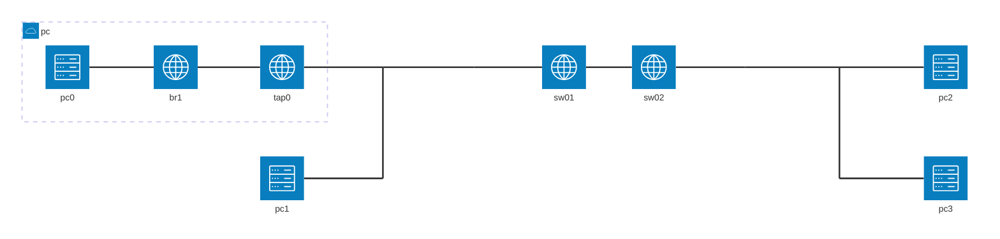

# 本エントリについて

Dynagen、Dynamips、vpcs を使って、EtherChannel を練習します。
Dynagen、Dynamips、vpcs の利用環境はすでに整っているものとします。

## 環境について

sw01 と sw02 間で、fa1/14、fa1/15 同士を使用して、EtherChannel を設定します。



```:Dynagen 設定ファイル抜粋
        [[ROUTER sw01]]
                model = 3725
                slot1 = NM-16ESW
                console = 2001
                f1/0 = nio_tap:tap0
                f1/4 = NIO_udp:30001:127.0.0.1:20001
                f1/14 = sw02 f1/14
                f1/15 = sw02 f1/15

        [[ROUTER sw02]]
                model = 3725
                slot1 = NM-16ESW
                console = 2002
                f1/0 = NIO_udp:30000:127.0.0.1:20000
                f1/4 = NIO_udp:30002:127.0.0.1:20002
```

追加するVLAN
| vlan | vlan name | nw address | default g/w |
| --- | --- | --- | --- |
| vlan10 | vlan0010 | 10.2.0.0/24 | 10.2.0.254 |
| vlan11 | vlan0011 | 10.2.1.0/24 | 10.2.1.254 |

sw01、sw02 とも下記の swithport 設定、ポートVLANの割り当てとする。

| port | mode | vlan |
| --- | --- | --- |
| fa1/0 | access | vlan 10 |
| fa1/1 | access | vlan 10 |
| fa1/2 | access | vlan 10 |
| fa1/3 | access | vlan 10 |
| fa1/4 | access | vlan 11 |
| fa1/5 | access | vlan 11 |
| fa1/6 | access | vlan 11 |
| fa1/7 | access | vlan 11 |

| PC | address | sw : port | 備考 |
| --- | --- | --- | --- |
| pc0 | 10.2.0.1/24 | sw01 : fa1/0 | tap0 |
| pc1 | 10.2.0.2/24 | sw02 : fa1/0 | vpcs 1 |
| pc2 | 10.2.1.1/24 | sw01 : fa1/4 | vpcs 2 |
| pc3 | 10.2.1.2/24 | sw02 : fa1/4 | vpcs 3 |

```:startup.vpc
1
ip 10.2.0.2 10.2.0.254 24
2
ip 10.2.1.1 10.2.1.254 24
3
ip 10.2.1.2 10.2.1.254 24
4
5
6
7
8
9
1
```

# 基本設定

sw01、sw02 とも所定のVLANを作成し、ポートをVLANに割り当てます。

## sw01 

```
conf t
hostname sw01
vlan 10
name vlan0010
vlan 11
vtp domain ccna
vtp password cisco
vtp pruning
int range fa1/0 - 3
switchport mode access
switchport access vlan 10
int range fa1/4 - 7
switchport mode access
switchport access vlan 11
```

```
sw01#show vlan-switch

VLAN Name                             Status    Ports
---- -------------------------------- --------- -------------------------------
1    default                          active    Fa1/8, Fa1/9, Fa1/10, Fa1/11
                                                Fa1/12, Fa1/13, Fa1/14, Fa1/15
10   vlan0010                         active    Fa1/0, Fa1/1, Fa1/2, Fa1/3
11   vlan0011                         active    Fa1/4, Fa1/5, Fa1/6, Fa1/7
1002 fddi-default                     act/unsup
1003 token-ring-default               act/unsup
1004 fddinet-default                  act/unsup
1005 trnet-default                    act/unsup

VLAN Type  SAID       MTU   Parent RingNo BridgeNo Stp  BrdgMode Trans1 Trans2
---- ----- ---------- ----- ------ ------ -------- ---- -------- ------ ------
1    enet  100001     1500  -      -      -        -    -        1002   1003
10   enet  100010     1500  -      -      -        -    -        0      0
11   enet  100011     1500  -      -      -        -    -        0      0
1002 fddi  101002     1500  -      -      -        -    -        1      1003
1003 tr    101003     1500  1005   0      -        -    srb      1      1002
1004 fdnet 101004     1500  -      -      1        ibm  -        0      0
1005 trnet 101005     1500  -      -      1        ibm  -        0      0

sw01#show int status

Port    Name               Status       Vlan       Duplex Speed Type
Fa1/0                      connected    10         a-full   a-100 10/100BaseTX
Fa1/1                      notconnect   10           auto    auto 10/100BaseTX
Fa1/2                      notconnect   10           auto    auto 10/100BaseTX
Fa1/3                      notconnect   10           auto    auto 10/100BaseTX
Fa1/4                      connected    11         a-full   a-100 10/100BaseTX
Fa1/5                      notconnect   11           auto    auto 10/100BaseTX
Fa1/6                      notconnect   11           auto    auto 10/100BaseTX
Fa1/7                      notconnect   11           auto    auto 10/100BaseTX
Fa1/8                      notconnect   1            auto    auto 10/100BaseTX
Fa1/9                      notconnect   1            auto    auto 10/100BaseTX
Fa1/10                     notconnect   1            auto    auto 10/100BaseTX
Fa1/11                     notconnect   1            auto    auto 10/100BaseTX
Fa1/12                     notconnect   1            auto    auto 10/100BaseTX
Fa1/13                     notconnect   1            auto    auto 10/100BaseTX
Fa1/14                     connected    1          a-full   a-100 10/100BaseTX
Fa1/15                     connected    1          a-full   a-100 10/100BaseTX
```

## sw02

vtp、アクセスポートの設定は、後続に記載しているトランクポートの設定を終えてから実施します。
```
conf t
hostname sw02
vtp mode client
vtp domain ccna
vtp password cisco
int range fa1/0 - 3
switchport mode access
switchport access vlan 10
int range fa1/4 - 7
switchport mode access
switchport access vlan 11
```

```
sw02#show vlan-switch

VLAN Name                             Status    Ports
---- -------------------------------- --------- -------------------------------
1    default                          active    Fa1/8, Fa1/9, Fa1/10, Fa1/11
                                                Fa1/12, Fa1/13, Fa1/14, Fa1/15
10   vlan0010                         active    Fa1/0, Fa1/1, Fa1/2, Fa1/3
11   vlan0011                         active    Fa1/4, Fa1/5, Fa1/6, Fa1/7
1002 fddi-default                     act/unsup
1003 token-ring-default               act/unsup
1004 fddinet-default                  act/unsup
1005 trnet-default                    act/unsup

VLAN Type  SAID       MTU   Parent RingNo BridgeNo Stp  BrdgMode Trans1 Trans2
---- ----- ---------- ----- ------ ------ -------- ---- -------- ------ ------
1    enet  100001     1500  -      -      -        -    -        1002   1003
10   enet  100010     1500  -      -      -        -    -        0      0
11   enet  100011     1500  -      -      -        -    -        0      0
1002 fddi  101002     1500  -      0      -        -    -        1      1003
1003 tr    101003     1500  1005   0      -        -    srb      1      1002
1004 fdnet 101004     1500  -      -      1        ibm  -        0      0
1005 trnet 101005     1500  -      -      1        ibm  -        0      0

sw02#show int status

Port    Name               Status       Vlan       Duplex Speed Type
Fa1/0                      connected    10         a-full   a-100 10/100BaseTX
Fa1/1                      notconnect   10           auto    auto 10/100BaseTX
Fa1/2                      notconnect   10           auto    auto 10/100BaseTX
Fa1/3                      notconnect   10           auto    auto 10/100BaseTX
Fa1/4                      connected    11         a-full   a-100 10/100BaseTX
Fa1/5                      notconnect   11           auto    auto 10/100BaseTX
Fa1/6                      notconnect   11           auto    auto 10/100BaseTX
Fa1/7                      notconnect   11           auto    auto 10/100BaseTX
Fa1/8                      notconnect   1            auto    auto 10/100BaseTX
Fa1/9                      notconnect   1            auto    auto 10/100BaseTX
Fa1/10                     notconnect   1            auto    auto 10/100BaseTX
Fa1/11                     notconnect   1            auto    auto 10/100BaseTX
Fa1/12                     notconnect   1            auto    auto 10/100BaseTX
Fa1/13                     notconnect   1            auto    auto 10/100BaseTX
Fa1/14                     connected    1          a-full   a-100 10/100BaseTX
Fa1/15                     connected    1          a-full   a-100 10/100BaseTX
```


# EtherChannel 設定

EtherChannel には L2 と L3 のものがあります。
ここでは L2 EtherChannel を作成します。

作成した EtherChannel は trunk ポートとして利用します。

# sw01

EtherChannel の設定をします。
```
sw01(config)#int range fa1/14 - 15
sw01(config-if-range)#switchport trunk encapsulation dot1q
sw01(config-if-range)#switchport mode trunk
sw01(config-if-range)#channel-group 1 mode on
```

作成した EtherChannel ポートを確認します。
```
sw01#show etherchannel summary
Flags:  D - down        P - in port-channel
        I - stand-alone s - suspended
        R - Layer3      S - Layer2
        U - in use
Group Port-channel  Ports
-----+------------+-----------------------------------------------------------
1     Po1(SU)     Fa1/14(P)  Fa1/15(P)

sw01#show etherchannel detail
                Channel-group listing:
                -----------------------

Group: 1
----------
Group state = L2
Ports: 2   Maxports = 8
Port-channels: 1 Max Port-channels = 1
                Ports in the group:
                -------------------
Port: Fa1/14
------------

Port state    = Up Mstr In-Bndl
Channel group = 1           Mode = On/FEC     Gcchange = 0
Port-channel  = Po1         GC   = 0x00010001    Pseudo port-channel = Po1
Port index    = 0
Age of the port in the current state: 00d:00h:00m:30s
Port: Fa1/15
------------

Port state    = Up Mstr In-Bndl
Channel group = 1           Mode = On/FEC     Gcchange = 0
Port-channel  = Po1         GC   = 0x00010001    Pseudo port-channel = Po1
Port index    = 1
Age of the port in the current state: 00d:00h:00m:30s
                Port-channels in the group:
                ----------------------

Port-channel: Po1
------------

Age of the Port-channel   = 00d:00h:00m:32s
Logical slot/port   = 8/0           Number of ports = 2
GC                  = 0x00010001      HotStandBy port = null
Port state          = Port-channel Ag-Inuse

Ports in the Port-channel:

Index   Port   EC state
------+------+------------
  0     Fa1/14   on
  1     Fa1/15   on

Time since last port bundled:    00d:00h:00m:32s    Fa1/15
```

設定したEtherChannel ポートについて、switch ポート、trunk ポート としての情報を確認します。
```
sw01#show int status

Port    Name               Status       Vlan       Duplex Speed Type
Fa1/0                      connected    10         a-full   a-100 10/100BaseTX
Fa1/1                      notconnect   10           auto    auto 10/100BaseTX
Fa1/2                      notconnect   10           auto    auto 10/100BaseTX
Fa1/3                      notconnect   10           auto    auto 10/100BaseTX
Fa1/4                      connected    11         a-full   a-100 10/100BaseTX
Fa1/5                      notconnect   11           auto    auto 10/100BaseTX
Fa1/6                      notconnect   11           auto    auto 10/100BaseTX
Fa1/7                      notconnect   11           auto    auto 10/100BaseTX
Fa1/8                      notconnect   1            auto    auto 10/100BaseTX
Fa1/9                      notconnect   1            auto    auto 10/100BaseTX
Fa1/10                     notconnect   1            auto    auto 10/100BaseTX
Fa1/11                     notconnect   1            auto    auto 10/100BaseTX
Fa1/12                     notconnect   1            auto    auto 10/100BaseTX
Fa1/13                     notconnect   1            auto    auto 10/100BaseTX
Fa1/14                     connected    trunk      a-full   a-100 10/100BaseTX
Fa1/15                     connected    trunk      a-full   a-100 10/100BaseTX
Po1                        connected    trunk      a-full   a-100 10/100BaseTX

sw01#show int trunk

Port      Mode         Encapsulation  Status        Native vlan
Po1       on           802.1q         trunking      1

Port      Vlans allowed on trunk
Po1       1-4094

Port      Vlans allowed and active in management domain
Po1       1,10-11

Port      Vlans in spanning tree forwarding state and not pruned
Po1       1,10-11

sw01#show int po1 switchport
Name: Po1
Switchport: Enabled
Administrative Mode: trunk
Operational Mode: trunk
Administrative Trunking Encapsulation: dot1q
Operational Trunking Encapsulation: dot1q
Negotiation of Trunking: Disabled
Access Mode VLAN: 0 ((Inactive))
Trunking Native Mode VLAN: 1 (default)
Trunking VLANs Enabled: ALL
Trunking VLANs Active: 1,10-11
Protected: false
Priority for untagged frames: 0
Override vlan tag priority: FALSE
Voice VLAN: none
Appliance trust: none
```

## sw02

EtherChannel の設定をします。
```
sw02(config)#int range fa1/14 - 15
sw02(config-if-range)#switchport trunk encapsulation dot1q
sw02(config-if-range)#switchport mode trunk
sw02(config-if-range)#channel-group 1 mode on
```

作成した EtherChannel ポートを確認します。

```
sw02#show etherchannel summary
Flags:  D - down        P - in port-channel
        I - stand-alone s - suspended
        R - Layer3      S - Layer2
        U - in use
Group Port-channel  Ports
-----+------------+-----------------------------------------------------------
1     Po1(SU)     Fa1/14(P)  Fa1/15(P)

sw02#show etherchannel detail
                Channel-group listing:
                -----------------------

Group: 1
----------
Group state = L2
Ports: 2   Maxports = 8
Port-channels: 1 Max Port-channels = 1
                Ports in the group:
                -------------------
Port: Fa1/14
------------

Port state    = Up Mstr In-Bndl
Channel group = 1           Mode = On/FEC     Gcchange = 0
Port-channel  = Po1         GC   = 0x00010001    Pseudo port-channel = Po1
Port index    = 0
Age of the port in the current state: 00d:00h:01m:12s
Port: Fa1/15
------------

Port state    = Up Mstr In-Bndl
Channel group = 1           Mode = On/FEC     Gcchange = 0
Port-channel  = Po1         GC   = 0x00010001    Pseudo port-channel = Po1
Port index    = 1
Age of the port in the current state: 00d:00h:01m:11s
                Port-channels in the group:
                ----------------------

Port-channel: Po1
------------

Age of the Port-channel   = 00d:00h:01m:13s
Logical slot/port   = 8/0           Number of ports = 2
GC                  = 0x00010001      HotStandBy port = null
Port state          = Port-channel Ag-Inuse

Ports in the Port-channel:

Index   Port   EC state
------+------+------------
  0     Fa1/14   on
  1     Fa1/15   on

Time since last port bundled:    00d:00h:01m:13s    Fa1/15
```

設定したEtherChannel ポートについて、switch ポート、trunk ポート としての情報を確認します。
```
sw02#show int status

Port    Name               Status       Vlan       Duplex Speed Type
Fa1/0                      connected    10         a-full   a-100 10/100BaseTX
Fa1/1                      notconnect   10           auto    auto 10/100BaseTX
Fa1/2                      notconnect   10           auto    auto 10/100BaseTX
Fa1/3                      notconnect   10           auto    auto 10/100BaseTX
Fa1/4                      connected    11         a-full   a-100 10/100BaseTX
Fa1/5                      notconnect   11           auto    auto 10/100BaseTX
Fa1/6                      notconnect   11           auto    auto 10/100BaseTX
Fa1/7                      notconnect   11           auto    auto 10/100BaseTX
Fa1/8                      notconnect   1            auto    auto 10/100BaseTX
Fa1/9                      notconnect   1            auto    auto 10/100BaseTX
Fa1/10                     notconnect   1            auto    auto 10/100BaseTX
Fa1/11                     notconnect   1            auto    auto 10/100BaseTX
Fa1/12                     notconnect   1            auto    auto 10/100BaseTX
Fa1/13                     notconnect   1            auto    auto 10/100BaseTX
Fa1/14                     connected    trunk      a-full   a-100 10/100BaseTX
Fa1/15                     connected    trunk      a-full   a-100 10/100BaseTX
Po1                        connected    trunk      a-full   a-100 10/100BaseTX

sw02#show int trunk

Port      Mode         Encapsulation  Status        Native vlan
Po1       on           802.1q         trunking      1

Port      Vlans allowed on trunk
Po1       1-4094

Port      Vlans allowed and active in management domain
Po1       1,10-11

Port      Vlans in spanning tree forwarding state and not pruned
Po1       1,10-11

sw02#show int po1 switchport
Name: Po1
Switchport: Enabled
Administrative Mode: trunk
Operational Mode: trunk
Administrative Trunking Encapsulation: dot1q
Operational Trunking Encapsulation: dot1q
Negotiation of Trunking: Disabled
Access Mode VLAN: 0 ((Inactive))
Trunking Native Mode VLAN: 1 (default)
Trunking VLANs Enabled: ALL
Trunking VLANs Active: 1,10-11
Protected: false
Priority for untagged frames: 0
Override vlan tag priority: FALSE
Voice VLAN: none
Appliance trust: none
```

## 疎通確認

trunk ポートを介して、異なるスイッチ上の同じVLANに属する端末同士で疎通可能なことを確認します。

```
VPCS[1]> ping 10.2.0.1
10.2.0.1 icmp_seq=1 ttl=64 time=0.340 ms
10.2.0.1 icmp_seq=2 ttl=64 time=0.143 ms
10.2.0.1 icmp_seq=3 ttl=64 time=0.150 ms
10.2.0.1 icmp_seq=4 ttl=64 time=0.145 ms
10.2.0.1 icmp_seq=5 ttl=64 time=0.210 ms

VPCS[3]> ping 10.2.1.1
10.2.1.1 icmp_seq=1 ttl=64 time=0.105 ms
10.2.1.1 icmp_seq=2 ttl=64 time=0.127 ms
10.2.1.1 icmp_seq=3 ttl=64 time=0.180 ms
10.2.1.1 icmp_seq=4 ttl=64 time=0.155 ms
10.2.1.1 icmp_seq=5 ttl=64 time=0.131 ms
```

# まとめ

Dynagen、Dynamips、vpcs を使って、EtherChannel を練習しました。
仮想環境のため、試せないことがいろいろあります。余裕があれば実機を購入して試したいところです。

