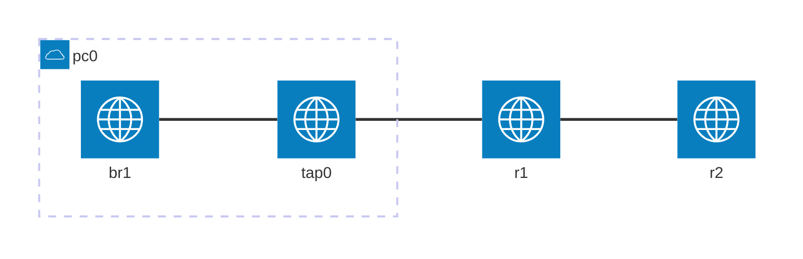

# 本エントリについて

Dynagen、Dynamips を使って、vty パスワード、コンソールパスワードの設定を練習します。
Dynagen、Dynamips の利用環境はすでに整っているものとします。

## 参考
https://www.infraexpert.com/study/ciscorouter6.html

# 環境について



| device | interface | ip address | network address | comment |
| --- | ----  | ---           | --- | --- |
| pc0 | br1   | 10.2.0.1/24 | 10.2.0.0 | 実機Linuxに設定した仮想ブリッジ |
| r1  | fe0/0 | 10.2.0.254/24 |^ |  | 
|^    | fe0/1 | 10.2.1.253/24 | 10.2.1.0 |  | 
| r2  | fe0/0 | 10.2.1.254/24 |^  |  |
|^    | fe0/1 | 10.2.2.253/24 | 10.2.2.0 |  |


```:Dynagen 設定ファイル抜粋
    [[ROUTER r1]]
        model = 3725
        console = 2001
        f0/0 = nio_tap:tap0
        #f0/0 = NIO_linux_eth:ens5
        f0/1 = r2 f0/0
    
    [[ROUTER r2]]
        model = 3725
        console = 2002
```

上記のように **nio_tap:tap0** を記載して dynagen を実行すると、tap0 デバイスが作成されます。
これを仮想ブリッジに接続して、実機と通信します。

(**NIO_linux_eth:ens5** のように記載すると、リアルNICと接続できます)

## 仮想ブリッジの作成

下記で、実機Linuxに仮想ブリッジを設定します
```
$ sudo brctl addbr br1
$ sudo brctl show
bridge name     bridge id               STP enabled     interfaces
br1             8000.000000000000       no

$ sudo ip addr add 10.2.0.1/24 dev br1
$ ip a show br1
3: br1: <BROADCAST,MULTICAST> mtu 1500 qdisc noop state DOWN group default qlen 1000
    link/ether e2:1b:3c:00:1b:87 brd ff:ff:ff:ff:ff:ff
    inet 10.2.0.1/24 scope global br1
       valid_lft forever preferred_lft forever
```

## tap デバイスの接続

dynagen を実行すると、tap0 が作成されるので、これを br1 に接続します。
```
$ sudo brctl addif br1 tap0
$ sudo brctl show
bridge name     bridge id               STP enabled     interfaces
br1             8000.9a22a8b110bb       no              tap0
```

インタフェースを up します
```
$ sudo ip link set br1 up
$ sudo ip link set tap0 up
```

## r1 基本設定

```
conf t
hostname r1
int fa0/0
ip address 10.2.0.254 255.255.255.0
no shut
int fa0/1
ip address 10.2.1.253 255.255.255.0
no shut
```

## r2 基本設定

```
conf t
hostname r2
int fa0/0
ip address 10.2.1.254 255.255.255.0
no shut
int fa0/1
ip address 10.2.2.253 255.255.255.0
no shut
```

# vty パスワードの設定

パスワードを設定していない状態です。

```
r1#show ip int bri
Interface                  IP-Address      OK? Method Status                Protocol
FastEthernet0/0            10.2.0.254      YES NVRAM  up                    up
FastEthernet0/1            10.2.1.253      YES NVRAM  up                    up

# show run | section vty
line vty 0 4
 login
r1#
```

このとき、telnet 接続後にすぐに切断されます。
パスワードが設定されていないため拒否されます。

```
$ telnet 10.2.0.254
Trying 10.2.0.254...
Connected to 10.2.0.254.
Escape character is '^]'.


Password required, but none set
Connection closed by foreign host.
```

パスワードを設定します。

```
(config)# line vty 0 4
(config-line)# password cisco

# show run | section vty
line vty 0 4
 password cisco
 login
```

telnet 接続できるようになりました。
ここで enable しようとすると、パスワードが設定されていないため拒否されます。

```
$ telnet 10.2.0.254
Trying 10.2.0.254...
Connected to 10.2.0.254.
Escape character is '^]'.


User Access Verification

Password:
r1>
r1>en
% No password set
r1>
```

enable パスワードを設定します。

```
(config)# enable secret cisco

# show run | section vty
line vty 0 4
 password cisco
 login

# show run | section enable
enable secret 5 $1$EKLJ$lQ7079xXjUmKrj2TCf6Mx1

```

telnet 後、enable できるようになりました。

```
$ telnet 10.2.0.254
Trying 10.2.0.254...
Connected to 10.2.0.254.
Escape character is '^]'.


User Access Verification

Password:
r1>
r1>en
Password:
r1#
```

# コンソールパスワード

パスワードを設定します。

```
#show run | section line con
line con 0

r1#conf t
r1(config)#line con 0
r1(config-line)#password cisco

r1#show run | section line con
line con 0
 password cisco
```

パスワードが要求されません。

```
Press RETURN to get started.


r1>
```

`login` を追加します。

```
r1(config)#line con 0
r1(config-line)#login

r1#show run | section line con
line con 0
 password cisco
 login
r1#
```

無事、パスワードが要求されるようになりました。

```
Press RETURN to get started.


User Access Verification

Password:
r1>
```

# パスワード暗号化

`service password-encryption` によって、平文で設定したパスワードが暗号化されます。

```
r1(config)#service password-encryption

r1#show run | section line
line con 0
 password 7 14141B180F0B
 login
line aux 0
line vty 0 4
 password 7 121A0C041104
 login
```

今後入力するパスワードも暗号化して保存されます。

```
r1(config)#line vty 0 4
r1(config-line)#password ccnp

r1#show run | section line vty
line vty 0 4
 password 7 1306141C1B
 login
```

`no service password-encryption` によって、以後のパスワードの暗号化はされなくなります。
一度暗号化したパスワードを平文に戻すことはできません。

```
r1(config)#no service password-encryption
r1(config)#line vty 0 4
r1(config-line)#password ccnp

r1#show run | section line
line con 0
 password 7 14141B180F0B
 login
line aux 0
line vty 0 4
 password ccnp
 login
```

# 暗号化タイプについて

コンフィグの暗号化されたパスワードの前に表示される数字が、暗号化タイプを示しています。

下記の `5` の場合、md5 で暗号化(ハッシュ化)されていることを示しています。

```
enable secret 5 $1$EKLJ$lQ7079xXjUmKrj2TCf6Mx1
```

下記の `7` の場合は、複合可能な暗号化です。

```
password 7 14141B180F0B
```

通常だと、コマンドでは平文のパスワードを入力しますが、暗号化タイプ、暗号化済み文字列を指定して入力することもできます。

ラインパスワードの例です。
```
r1(config)#line vty 0 4
r1(config-line)#password ?
  0     Specifies an UNENCRYPTED password will follow
  7     Specifies a HIDDEN password will follow
  LINE  The UNENCRYPTED (cleartext) line password

r1(config-line)#password 7 14141B180F0B

r1#show run | section line vty
line vty 0 4
 password 7 14141B180F0B
 login
```

enable secret の例です。
```
r1(config)#enable secret ?
  0      Specifies an UNENCRYPTED password will follow
  5      Specifies an ENCRYPTED secret will follow
  LINE   The UNENCRYPTED (cleartext) 'enable' secret
  level  Set exec level password

r1(config)#enable secret 5 $1$EKLJ$lQ7079xXjUmKrj2TCf6Mx1

r1#show run | section enable
enable secret 5 $1$EKLJ$lQ7079xXjUmKrj2TCf6Mx1
```

# access-class

`access-class` を利用して、アクセスを制限することができます。

## アクセス元の制限

10.2.1.254 のみを許可するACLを作成します。
```
r1(config)#access-list 1 permit 10.2.1.254 0.0.0.0

r1#show ip access-lists 1
Standard IP access list 1
    10 permit 10.2.1.254 (2 matches)
```

作成したACLを適用します
```
r1(config)#line vty 0 4
r1(config-line)#access-class 1 in

r1#show run | section line vty
line vty 0 4
 access-class 1 in
 password cisco
 login
```

許可されていないアドレスからのアクセスは拒否されます。

```
admin@ip-10-0-0-73:~$ telnet 10.2.0.254
Trying 10.2.0.254...
telnet: Unable to connect to remote host: Connection refused
```

r2 からのアクセスは拒否されていません。
```
r2#telnet 10.2.1.253
Trying 10.2.1.253 ... Open


User Access Verification

Password: 
r1>
```

## アクセス先の制限

先程作成したACLを利用します
```
r1#show access-lists 1
Standard IP access list 1
    10 permit 10.2.1.254 (3 matches)
```

こちらのようにすると、仮想端末から接続できる先を制限することができます。
```
r1(config)#line vty 0 4
r1(config-line)#access-class 1 out

r1#show run | section line vty
line vty 0 4
 access-class 1 out
 password cisco
 login
```

仮想端末に接続した後、許可されていないアドレスへのアクセスは拒否されます。

```
$ telnet 10.2.0.254
Trying 10.2.0.254...
Connected to 10.2.0.254.
Escape character is '^]'.


User Access Verification

Password:
r1>
r1>telnet 10.2.1.253
Trying 10.2.1.253 ...
% Connections to that host not permitted from this terminal
```

#  まとめ

- vty 接続は `line` が設定済みなので、`password` を追加するだけ。
- vty 接続では、enable パスワードが無いと、enable できない。
- コンソール接続でパスワードを要求するには `password` と `line` の設定が必要。
- `access-class` で接続を制限

ここではコンフィグのパスワードについての箇所を記載してますが、普通ですと公にしてはいけない情報です。
