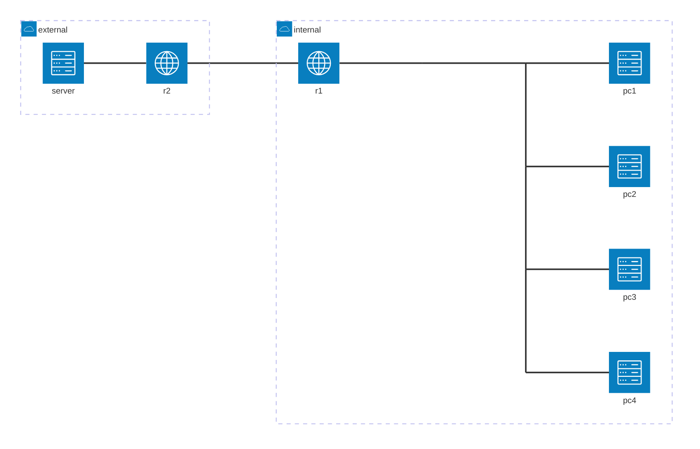

# 本エントリについて

Dynagen、Dynamips、vpcs を使って、NAT設定の練習をします。
Dynagen、Dynamips、vpcs の利用環境はすでに整っているものとします。

## 参考サイト

https://www.infraexpert.com/study/ip10.html

# 環境について

練習をする環境の基本的な構成は下記の通りです。



| device | interface | ip address | network address | comment |
| --- | ----  | ---           | --- | --- |
| pc1 | -     | 10.2.0.1/24   | 10.2.0.0 | NATクライアント |
| pc2 | -     | 10.2.0.65/24  |^ |^ |
| pc3 | -     | 10.2.0.129/24 |^ |^ |
| pc4 | -     | 10.2.0.193/24 |^ |^ |
| r1  | fe0/0 | 10.2.0.254/24 |^ | NATルータ(内部インタフェース) | 
|^    | fe0/1 | 10.2.1.253/24 | 10.2.1.0 | 同(外部インタフェース) | 
| r2  | fe0/0 | 10.2.1.254/24 |^ |  |
|^    | fe0/1 | 10.2.2.253/24 | 10.2.2.0 |  |
| server | -  | 10.2.2.1/24   |^  | 外部のサーバ |

Dynagen の設定ファイルの主要な部分は以下のようになります。

```:Dynagen 設定ファイル抜粋
autostart = False
[localhost:7200]
    [[3725]]
        ram = 160
        image = イメージ名
        idlepc = 0xxxxxxxxx
        sparsemem = True
        ghostios = True
    [[ROUTER r1]]
        model = 3725
        console = 2001
        f0/0 = sw1 5
        f0/1 = r2 f0/0
    [[ROUTER r2]]
        model = 3725
        console = 2002
        f0/1 = sw1 7
    [[ETHSW sw1]]
        1 = access 1 NIO_udp:30000:127.0.0.1:20000
        2 = access 1 NIO_udp:30001:127.0.0.1:20001
        3 = access 1 NIO_udp:30002:127.0.0.1:20002
        4 = access 1 NIO_udp:30003:127.0.0.1:20003
        5 = access 1
        6 = access 2 NIO_udp:30004:127.0.0.1:20004
        7 = access 2
```

## NAT ルータ

r1 を NAT ルータとします。
fe0/0 (10.2.0.254/24) が内部インタフェース、fe0/1 (10.2.1.253/24) が外部インタフェースです。
fe0/1 のアドレスのみ OSPF で伝播します。fe0/0 のアドレスは OSPF に流しません。

r1 基本設定

```
conf t
hostname r1
int fa0/0
ip addr 10.2.0.254 255.255.255.0
no shut
int fa0/1
ip addr 10.2.1.253 255.255.255.0
no shut
router ospf 1
network 10.2.1.0 0.0.0.255 area 0
```

設定後の状況

```
#show ip int bri
Interface                  IP-Address      OK? Method Status                Protocol
FastEthernet0/0            10.2.0.254      YES NVRAM  up                    up
FastEthernet0/1            10.2.1.253      YES manual up                    up

#show ip route
Codes: C - connected, S - static, R - RIP, M - mobile, B - BGP
       D - EIGRP, EX - EIGRP external, O - OSPF, IA - OSPF inter area
       N1 - OSPF NSSA external type 1, N2 - OSPF NSSA external type 2
       E1 - OSPF external type 1, E2 - OSPF external type 2
       i - IS-IS, su - IS-IS summary, L1 - IS-IS level-1, L2 - IS-IS level-2
       ia - IS-IS inter area, * - candidate default, U - per-user static route
       o - ODR, P - periodic downloaded static route

Gateway of last resort is not set

     10.0.0.0/24 is subnetted, 3 subnets
C       10.2.0.0 is directly connected, FastEthernet0/0
C       10.2.1.0 is directly connected, FastEthernet0/1
O       10.2.2.0 [110/20] via 10.2.1.254, 00:01:06, FastEthernet0/1
```

## 外部のルータ

r2 を外部のルータとします。
fe0/0 (10.2.1.254/24) を r1 の fe0/1 に接続します。
fe0/1 (10.2.2.253/24) はアドレスを設定し、NAT クライアントからの通信先とします。
fe0/0、fe0/1 両方のアドレスを、OSPFに流します。

r2 基本設定

```
conf t
hostname r2
int fa0/0
ip addr 10.2.1.254 255.255.255.0
no shut
int fa0/1
ip addr 10.2.2.253 255.255.255.0
no shut
router ospf 1
network 10.2.1.0 0.0.0.255 area 0
network 10.2.2.0 0.0.0.255 area 0
```

設定後の状況

```
#show ip int bri
Interface                  IP-Address      OK? Method Status                Protocol
FastEthernet0/0            10.2.1.254      YES manual up                    up
FastEthernet0/1            10.2.2.253      YES manual up                    up

#show ip route
Codes: C - connected, S - static, R - RIP, M - mobile, B - BGP
       D - EIGRP, EX - EIGRP external, O - OSPF, IA - OSPF inter area
       N1 - OSPF NSSA external type 1, N2 - OSPF NSSA external type 2
       E1 - OSPF external type 1, E2 - OSPF external type 2
       i - IS-IS, su - IS-IS summary, L1 - IS-IS level-1, L2 - IS-IS level-2
       ia - IS-IS inter area, * - candidate default, U - per-user static route
       o - ODR, P - periodic downloaded static route

Gateway of last resort is not set

     10.0.0.0/24 is subnetted, 2 subnets
C       10.2.1.0 is directly connected, FastEthernet0/0
C       10.2.2.0 is directly connected, FastEthernet0/1
```

## コンピュータ

ネットワークノードとしてvpcs を利用します。
仕組みなどの説明については割愛します。

VPC1−４をNAT 対象クライアントとします。ハブを介して、r1 の fe0/0 に接続します。
VPC5をサーバとし、r2 の fe0/1 に接続します。

| vpc | pc | addr/mask | gateway |
| --- | ---- | ---- | ---- |
| 1   | pc1 | 10.2.0.1/24 | 10.2.0.254 |
| 2   | pc2 | 10.2.0.65/24 | 10.2.0.254 |
| 3   | pc3 | 10.2.0.129/24 | 10.2.0.254 |
| 4   | pc4 | 10.2.0.193/24 | 10.2.0.254 |
| 5   | server | 10.2.2.1/24 | 10.2.2.253 |


```:startup.vpc
1
ip 10.2.0.1 10.2.0.254 24
2
ip 10.2.0.65 10.2.0.254 24
3
ip 10.2.0.129 10.2.0.254 24
4
ip 10.2.0.193 10.2.0.254 24
5
ip 10.2.2.1 10.2.2.253 24
6
7
8
9
1
```

上記の startup.vpc を用意したディレクトリに移動して、vpcs を起動します。

```
$ vpcs
```

## 設定内容まとめ

- NAT 対象クライアントから r2 fe0/1 のアドレスに対して、ping が通らない
(r2 は 10.2.0.0/24 の情報を知らない)
```
r1#ping
Protocol [ip]:
Target IP address: 10.2.2.253
Repeat count [5]:
Datagram size [100]:
Timeout in seconds [2]:
Extended commands [n]: y
Source address or interface: 10.2.0.254
Type of service [0]:
Set DF bit in IP header? [no]:
Validate reply data? [no]:
Data pattern [0xABCD]:
Loose, Strict, Record, Timestamp, Verbose[none]:
Sweep range of sizes [n]:
Type escape sequence to abort.
Sending 5, 100-byte ICMP Echos to 10.2.2.253, timeout is 2 seconds:
Packet sent with a source address of 10.2.0.254
.....
Success rate is 0 percent (0/5)
```

- NAT ルータ fe0/1 から r2 fe0/1 のアドレスに対して、ping が通る
```
r1#ping
Protocol [ip]:
Target IP address: 10.2.2.253
Repeat count [5]:
Datagram size [100]:
Timeout in seconds [2]:
Extended commands [n]: y
Source address or interface: 10.2.1.253
Type of service [0]:
Set DF bit in IP header? [no]:
Validate reply data? [no]:
Data pattern [0xABCD]:
Loose, Strict, Record, Timestamp, Verbose[none]:
Sweep range of sizes [n]:
Type escape sequence to abort.
Sending 5, 100-byte ICMP Echos to 10.2.2.253, timeout is 2 seconds:
Packet sent with a source address of 10.2.1.253
!!!!!
Success rate is 100 percent (5/5), round-trip min/avg/max = 4/15/20 ms
```

この状態から、NATを利用して、NAT 対象クライアントから r2 の fe0/1 に ping 到達できるようにしてみます。

# スタティックNAT

スタティックNATでは、NAT内部の一つのアドレスを、一つのグローバルアドレスへ、1対1で変換します。

https://community.cisco.com/t5/%E3%83%8D%E3%83%83%E3%83%88%E3%83%AF%E3%83%BC%E3%82%AF%E3%82%A4%E3%83%B3%E3%83%95%E3%83%A9%E3%82%B9%E3%83%88%E3%83%A9%E3%82%AF%E3%83%81%E3%83%A3-%E3%83%89%E3%82%AD%E3%83%A5%E3%83%A1%E3%83%B3%E3%83%88/static-nat-%E3%81%AE%E8%A8%AD%E5%AE%9A%E4%BE%8B/ta-p/3166358

## 10.2.0.1 を 10.2.1.1 に変換する

fa0/0 を内部、fa0/1 を外部インタフェースに設定します。
スタティック NAT の設定を追加します。

```
# conf t
(config)# int fa0/0
(config-if)# ip nat inside
(config-if)# int fa0/1
(config-if)# ip nat outside
(config-if)# exit
(config)# ip nat inside source static 10.2.0.1 10.2.1.1
(config)# end
```

設定を確認します。
スタティックNAT では設定した時点で NAT 変換テーブルに登録されます。

```
# show ip nat statistics
Total active translations: 1 (1 static, 0 dynamic; 0 extended)
Outside interfaces:
  FastEthernet0/1
Inside interfaces:
  FastEthernet0/0
Hits: 0  Misses: 0
CEF Translated packets: 0, CEF Punted packets: 0
Expired translations: 0
Dynamic mappings:
Appl doors: 0
Normal doors: 0
Queued Packets: 0

# show ip nat translations
Pro Inside global      Inside local       Outside local      Outside global
--- 10.2.1.1           10.2.0.1           ---                ---
```

ping で確認します。
設定どおり PC1からは ping 疎通がとれて、PC4 からは ping 疎通が取れない状況です。

```
VPCS[1]> ping 10.2.2.253
10.2.2.253 icmp_seq=1 timeout
10.2.2.253 icmp_seq=2 ttl=254 time=21.838 ms
10.2.2.253 icmp_seq=3 ttl=254 time=29.193 ms
10.2.2.253 icmp_seq=4 ttl=254 time=27.781 ms
10.2.2.253 icmp_seq=5 ttl=254 time=22.455 ms

VPCS[4]> ping 10.2.2.253
10.2.2.253 icmp_seq=1 timeout
10.2.2.253 icmp_seq=2 timeout
10.2.2.253 icmp_seq=3 timeout
10.2.2.253 icmp_seq=4 timeout
10.2.2.253 icmp_seq=5 timeout
```

デバッグ情報を出力すると、下記のような内容を見ることができます。

```
# debug ip nat
IP NAT debugging is on
*Mar  1 00:38:04.131: NAT*: s=10.2.0.1->10.2.1.1, d=10.2.2.253 [3242]
*Mar  1 00:38:04.147: NAT*: s=10.2.2.253, d=10.2.1.1->10.2.0.1 [3242]
*Mar  1 00:38:05.139: NAT*: s=10.2.0.1->10.2.1.1, d=10.2.2.253 [3243]
*Mar  1 00:38:05.171: NAT*: s=10.2.2.253, d=10.2.1.1->10.2.0.1 [3243]
*Mar  1 00:38:06.167: NAT*: s=10.2.0.1->10.2.1.1, d=10.2.2.253 [3244]
*Mar  1 00:38:06.195: NAT*: s=10.2.2.253, d=10.2.1.1->10.2.0.1 [3244]
*Mar  1 00:38:07.203: NAT*: s=10.2.0.1->10.2.1.1, d=10.2.2.253 [3245]
*Mar  1 00:38:07.223: NAT*: s=10.2.2.253, d=10.2.1.1->10.2.0.1 [3245]
*Mar  1 00:38:08.219: NAT*: s=10.2.0.1->10.2.1.1, d=10.2.2.253 [3246]
*Mar  1 00:38:08.247: NAT*: s=10.2.2.253, d=10.2.1.1->10.2.0.1 [3246]
```

NAT 変換テーブルを確認します。
NAT 通信直後に確認すると、外部ローカル、外部グローバルアドレスを見ることができます。

```
# show ip nat translations
Pro Inside global      Inside local       Outside local      Outside global
icmp 10.2.1.1:13576    10.2.0.1:13576     10.2.2.253:13576   10.2.2.253:13576
icmp 10.2.1.1:14088    10.2.0.1:14088     10.2.2.253:14088   10.2.2.253:14088
icmp 10.2.1.1:14344    10.2.0.1:14344     10.2.2.253:14344   10.2.2.253:14344
icmp 10.2.1.1:14600    10.2.0.1:14600     10.2.2.253:14600   10.2.2.253:14600
icmp 10.2.1.1:14856    10.2.0.1:14856     10.2.2.253:14856   10.2.2.253:14856
--- 10.2.1.1           10.2.0.1           ---                ---
```

NAT外部から内部グローバルアドレスに対して ping してみます。
スタティック NAT では、NAT 外部から内部グローバルアドレスに対するアクセスは、NAT 変換されて内部ローカルへ到達します。

```
r2#ping
Protocol [ip]:
Target IP address: 10.2.1.1
Repeat count [5]:
Datagram size [100]:
Timeout in seconds [2]:
Extended commands [n]: y
Source address or interface: 10.2.2.253
Type of service [0]:
Set DF bit in IP header? [no]:
Validate reply data? [no]:
Data pattern [0xABCD]:
Loose, Strict, Record, Timestamp, Verbose[none]:
Sweep range of sizes [n]:
Type escape sequence to abort.
Sending 5, 100-byte ICMP Echos to 10.2.1.1, timeout is 2 seconds:
Packet sent with a source address of 10.2.2.253
!!!!!
Success rate is 100 percent (5/5), round-trip min/avg/max = 24/28/32 ms
```

# ダイナミックNAT

ダイナミックNATでは、許可された範囲のNATクライアントのアドレスを、プールしたグローバルアドレスに動的に割り当てます。
https://community.cisco.com/t5/%E3%83%8D%E3%83%83%E3%83%88%E3%83%AF%E3%83%BC%E3%82%AF%E3%82%A4%E3%83%B3%E3%83%95%E3%83%A9%E3%82%B9%E3%83%88%E3%83%A9%E3%82%AF%E3%83%81%E3%83%A3-%E3%83%89%E3%82%AD%E3%83%A5%E3%83%A1%E3%83%B3%E3%83%88/dynamic-nat-%E3%81%AE%E8%A8%AD%E5%AE%9A%E4%BE%8B/ta-p/3166381

## 10.2.0.1 - 254 を 10.2.1.1, 10.2.1.2 に変換する

NAT クライアントとして許可するアドレスの範囲をACLで定義します。

```
# conf t
(config)# access-list 1 permit 10.2.0.0 0.0.0.255
```

NATの内部・外部のインタフェースを定義します。

```
(config)# int fa0/0
(config-if)# ip nat inside
(config-if)# int fa0/1
(config-if)# ip nat outside
(config-if)# exit
```

内部グローバルアドレスのプールを定義します。
また、ACLとプールを関連づけます。

```
(config)# ip nat pool POOL1 10.2.1.1 10.2.1.2 netmask 255.255.255.0
(config)# ip nat inside source list 1 pool POOL1
(config)# end
```

作成したアクセスリストと、NAT の設定を確認します。
ダイナミック NAT では、NAT 変換テーブルには事前に定義された内容はありません。

```
# show ip access-lists 1
Standard IP access list 1
    10 permit 10.2.0.0, wildcard bits 0.0.0.255

# show ip nat statistics
Total active translations: 0 (0 static, 0 dynamic; 0 extended)
Outside interfaces:
  FastEthernet0/1
Inside interfaces:
  FastEthernet0/0
Hits: 0  Misses: 0
CEF Translated packets: 0, CEF Punted packets: 0
Expired translations: 0
Dynamic mappings:
-- Inside Source
[Id: 1] access-list 1 pool POOL1 refcount 0
 pool POOL1: netmask 255.255.255.0
        start 10.2.1.1 end 10.2.1.2
        type generic, total addresses 2, allocated 0 (0%), misses 0
Appl doors: 0
Normal doors: 0
Queued Packets: 0

# show ip nat translations

```

NAT クライアントから ping してみます。
動的アドレスが2つしかありませんので、最初の2つのクライアントからは通信ができますが、3つ目のクライアントからの通信は NAT 変換できずに失敗します。

```
VPCS[1]> ping 10.2.2.253
10.2.2.253 icmp_seq=1 ttl=254 time=22.604 ms
10.2.2.253 icmp_seq=2 ttl=254 time=26.894 ms
10.2.2.253 icmp_seq=3 ttl=254 time=29.344 ms
10.2.2.253 icmp_seq=4 ttl=254 time=24.161 ms
10.2.2.253 icmp_seq=5 ttl=254 time=21.384 ms

VPCS[4]> ping 10.2.2.253
10.2.2.253 icmp_seq=1 ttl=254 time=29.479 ms
10.2.2.253 icmp_seq=2 ttl=254 time=28.189 ms
10.2.2.253 icmp_seq=3 ttl=254 time=26.304 ms
10.2.2.253 icmp_seq=4 ttl=254 time=27.765 ms
10.2.2.253 icmp_seq=5 ttl=254 time=23.054 ms

VPCS[2]> ping 10.2.2.253
10.2.2.253 icmp_seq=1 timeout
10.2.2.253 icmp_seq=2 timeout
10.2.2.253 icmp_seq=3 timeout
10.2.2.253 icmp_seq=4 timeout
10.2.2.253 icmp_seq=5 timeout
```

ping 実行したときの debug 情報です

```
# debug ip nat
*Mar  1 00:19:40.675: NAT*: s=10.2.0.1->10.2.1.1, d=10.2.2.253 [13440]
*Mar  1 00:19:40.687: NAT*: s=10.2.2.253, d=10.2.1.1->10.2.0.1 [13440]
*Mar  1 00:19:41.683: NAT*: s=10.2.0.1->10.2.1.1, d=10.2.2.253 [13441]
*Mar  1 00:19:41.715: NAT*: s=10.2.2.253, d=10.2.1.1->10.2.0.1 [13441]
*Mar  1 00:19:42.707: NAT*: s=10.2.0.1->10.2.1.1, d=10.2.2.253 [13442]
*Mar  1 00:19:42.743: NAT*: s=10.2.2.253, d=10.2.1.1->10.2.0.1 [13442]
*Mar  1 00:19:43.735: NAT*: s=10.2.0.1->10.2.1.1, d=10.2.2.253 [13443]
*Mar  1 00:19:43.771: NAT*: s=10.2.2.253, d=10.2.1.1->10.2.0.1 [13443]
*Mar  1 00:19:44.759: NAT*: s=10.2.0.1->10.2.1.1, d=10.2.2.253 [13444]
*Mar  1 00:19:44.795: NAT*: s=10.2.2.253, d=10.2.1.1->10.2.0.1 [13444]
*Mar  1 00:19:50.659: NAT*: s=10.2.0.193->10.2.1.2, d=10.2.2.253 [13450]
*Mar  1 00:19:50.671: NAT*: s=10.2.2.253, d=10.2.1.2->10.2.0.193 [13450]
*Mar  1 00:19:51.663: NAT*: s=10.2.0.193->10.2.1.2, d=10.2.2.253 [13451]
*Mar  1 00:19:51.699: NAT*: s=10.2.2.253, d=10.2.1.2->10.2.0.193 [13451]
*Mar  1 00:19:52.715: NAT*: s=10.2.0.193->10.2.1.2, d=10.2.2.253 [13452]
*Mar  1 00:19:52.727: NAT*: s=10.2.2.253, d=10.2.1.2->10.2.0.193 [13452]
*Mar  1 00:19:53.727: NAT*: s=10.2.0.193->10.2.1.2, d=10.2.2.253 [13453]
*Mar  1 00:19:53.755: NAT*: s=10.2.2.253, d=10.2.1.2->10.2.0.193 [13453]
*Mar  1 00:19:54.747: NAT*: s=10.2.0.193->10.2.1.2, d=10.2.2.253 [13454]
*Mar  1 00:19:54.779: NAT*: s=10.2.2.253, d=10.2.1.2->10.2.0.193 [13454]
```

NAT 変換テーブルを確認します。

```
# show ip nat translations
Pro Inside global      Inside local       Outside local      Outside global
icmp 10.2.1.1:32820    10.2.0.1:32820     10.2.2.253:32820   10.2.2.253:32820
icmp 10.2.1.1:33076    10.2.0.1:33076     10.2.2.253:33076   10.2.2.253:33076
icmp 10.2.1.1:33332    10.2.0.1:33332     10.2.2.253:33332   10.2.2.253:33332
icmp 10.2.1.1:33588    10.2.0.1:33588     10.2.2.253:33588   10.2.2.253:33588
icmp 10.2.1.1:33844    10.2.0.1:33844     10.2.2.253:33844   10.2.2.253:33844
--- 10.2.1.1           10.2.0.1           ---                ---
icmp 10.2.1.2:35380    10.2.0.193:35380   10.2.2.253:35380   10.2.2.253:35380
icmp 10.2.1.2:35636    10.2.0.193:35636   10.2.2.253:35636   10.2.2.253:35636
icmp 10.2.1.2:35892    10.2.0.193:35892   10.2.2.253:35892   10.2.2.253:35892
icmp 10.2.1.2:36148    10.2.0.193:36148   10.2.2.253:36148   10.2.2.253:36148
icmp 10.2.1.2:36404    10.2.0.193:36404   10.2.2.253:36404   10.2.2.253:36404
--- 10.2.1.2           10.2.0.193         ---                ---

# show ip nat statistics
Total active translations: 12 (0 static, 12 dynamic; 10 extended)
Outside interfaces:
  FastEthernet0/1
Inside interfaces:
  FastEthernet0/0
Hits: 66  Misses: 0
CEF Translated packets: 66, CEF Punted packets: 0
Expired translations: 25
Dynamic mappings:
-- Inside Source
[Id: 1] access-list 1 pool POOL1 refcount 12
 pool POOL1: netmask 255.255.255.0
        start 10.2.1.1 end 10.2.1.2
        type generic, total addresses 2, allocated 2 (100%), misses 5
Appl doors: 0
Normal doors: 0
Queued Packets: 0
```

ダイナミックNATでは、外部から内部グローバルアドレスへの ping は通りません。

```
r2#ping
Protocol [ip]:
Target IP address: 10.2.0.1
Repeat count [5]:
Datagram size [100]:
Timeout in seconds [2]:
Extended commands [n]: y
Source address or interface: 10.2.2.253
Type of service [0]:
Set DF bit in IP header? [no]:
Validate reply data? [no]:
Data pattern [0xABCD]:
Loose, Strict, Record, Timestamp, Verbose[none]:
Sweep range of sizes [n]:
Type escape sequence to abort.
Sending 5, 100-byte ICMP Echos to 10.2.0.1, timeout is 2 seconds:
Packet sent with a source address of 10.2.2.253
.....
Success rate is 0 percent (0/5)
```

下記で、NAT 変換テーブルを削除することができます。

```
# show ip nat translations
Pro Inside global      Inside local       Outside local      Outside global
--- 10.2.1.1           10.2.0.1           ---                ---
--- 10.2.1.2           10.2.0.193         ---                ---

#clear ip nat translation *
```

# ポート変換

ポート変換では、許可された範囲の複数のNATクライアントのアドレスを、単一つのグローバルアドレスに変換することができます。

https://community.cisco.com/t5/%E3%83%8D%E3%83%83%E3%83%88%E3%83%AF%E3%83%BC%E3%82%AF%E3%82%A4%E3%83%B3%E3%83%95%E3%83%A9%E3%82%B9%E3%83%88%E3%83%A9%E3%82%AF%E3%83%81%E3%83%A3-%E3%83%89%E3%82%AD%E3%83%A5%E3%83%A1%E3%83%B3%E3%83%88/nat-overload-%E3%81%AE%E8%A8%AD%E5%AE%9A%E4%BE%8B/ta-p/3166386

## 10.2.0.1 - 129 を 10.2.1.1 に変換する

NAT クライアントとして許可するアドレスの範囲をACLで定義します。

```
# conf t
(config)# access-list 2 permit 10.2.0.0 0.0.0.127
```

NATの内部・外部のインタフェースを定義します。

```
(config)# int fa0/0
(config-if)# ip nat inside
(config-if)# int fa0/1
(config-if)# ip nat outside
(config-if)# exit
```

内部グローバルアドレスのプールを定義します。
ACLとプールを関連づけるときに、overload を指定します。

```
(config)# ip nat pool POOL2 10.2.1.1 10.2.1.1 netmask 255.255.255.0
(config)# ip nat inside source list 2 pool POOL2 overload
(config)# end
```

作成したアクセスリストと、NAT の設定を確認します。
PATにおいても、NAT 変換テーブルには事前に定義された内容はありません。

```
# show ip access-lists 2
Standard IP access list 2
    10 permit 10.2.0.0, wildcard bits 0.0.0.127

# show ip nat statistics
Total active translations: 0 (0 static, 0 dynamic; 0 extended)
Outside interfaces:
  FastEthernet0/1
Inside interfaces:
  FastEthernet0/0
Hits: 95  Misses: 0
CEF Translated packets: 95, CEF Punted packets: 0
Expired translations: 50
Dynamic mappings:
-- Inside Source
[Id: 2] access-list 2 pool POOL2 refcount 0
 pool POOL2: netmask 255.255.255.0
        start 10.2.1.1 end 10.2.1.1
        type generic, total addresses 1, allocated 0 (0%), misses 0
Appl doors: 0
Normal doors: 0
Queued Packets: 0

# show ip nat translations

```

NAT クライアントから ping してみます。
vpcs の ping では下記のオプションが使えます。
ここでは 22/tcp へ ping してみたいと思います。

```
VPCS[1]> ping

ping <host> [-options]
  Ping the network <host>. <host> can be an ip address or name
    options:
     -1             ICMP mode, default
     -2             UDP mode
     -3             TCP mode
     -P <protocol>  Same as above, setting ip protocol
                    1 - icmp, 17 - udp, 6 - tcp
     -c <count>     packet count, default 5
     -l <size>      data size
     -T <ttl>       set TTL, default 64
     -s <port>      source port
     -p <port>      destination port
     -f <flag>      tcp head flag, |C|E|U|A|P|R|S|F|
                              bits |7 6 5 4 3 2 1 0|
     -t             send packet until interrupt by Ctrl+C
     -i <ms>        wait <ms> milliseconds between sending each packet
     -w <ms>        wait <ms> milliseconds to receive the response

  Note: 1. Using names requires DNS to be set.
        2. Use Ctrl+C to stop the command.
```

ACLで許可された範囲のクライアントからは通信ができますが、範囲外のクライアントからの通信は NAT 変換できずに失敗します。

```
VPCS[1]> ping 10.2.2.253 -P 6 -p 22
Connect   22@10.2.2.253 RST returned
Connect   22@10.2.2.253 RST returned
Connect   22@10.2.2.253 RST returned
Connect   22@10.2.2.253 RST returned
Connect   22@10.2.2.253 RST returned

VPCS[2]> ping 10.2.2.253 -P 6 -p 22
Connect   22@10.2.2.253 RST returned
Connect   22@10.2.2.253 RST returned
Connect   22@10.2.2.253 RST returned
Connect   22@10.2.2.253 RST returned
Connect   22@10.2.2.253 RST returned

VPCS[3]> ping 10.2.2.253 -P 6 -p 22
Connect   22@10.2.2.253 timeout
Connect   22@10.2.2.253 timeout
Connect   22@10.2.2.253 timeout
Connect   22@10.2.2.253 timeout
Connect   22@10.2.2.253 timeout

```

ping 実行したときの debug 情報です
複数の内部ローカルアドレスが、単一の内部グローバルアドレスにNAT変換されて、外部グローバルアドレスと通信していることが分かります。

```
r1#debug ip nat
IP NAT debugging is on
*Mar  1 01:55:53.655: NAT*: s=10.2.0.1->10.2.1.1, d=10.2.2.253 [22307]
*Mar  1 01:55:54.635: NAT*: s=10.2.0.1->10.2.1.1, d=10.2.2.253 [22308]
*Mar  1 01:55:54.671: NAT*: s=10.2.2.253, d=10.2.1.1->10.2.0.1 [42925]
*Mar  1 01:55:55.663: NAT*: s=10.2.0.1->10.2.1.1, d=10.2.2.253 [22309]
*Mar  1 01:55:55.695: NAT*: s=10.2.2.253, d=10.2.1.1->10.2.0.1 [59152]
*Mar  1 01:55:56.687: NAT*: s=10.2.0.1->10.2.1.1, d=10.2.2.253 [22310]
*Mar  1 01:55:56.723: NAT*: s=10.2.2.253, d=10.2.1.1->10.2.0.1 [15252]
*Mar  1 01:55:57.719: NAT*: s=10.2.0.1->10.2.1.1, d=10.2.2.253 [22311]
*Mar  1 01:55:57.751: NAT*: s=10.2.2.253, d=10.2.1.1->10.2.0.1 [58811]
*Mar  1 01:55:58.747: NAT*: s=10.2.0.1->10.2.1.1, d=10.2.2.253 [22312]
*Mar  1 01:55:58.779: NAT*: s=10.2.2.253, d=10.2.1.1->10.2.0.1 [63120]
*Mar  1 01:56:07.135: NAT*: s=10.2.0.65->10.2.1.1, d=10.2.2.253 [22320]
*Mar  1 01:56:08.111: NAT*: s=10.2.0.65->10.2.1.1, d=10.2.2.253 [22321]
*Mar  1 01:56:08.151: NAT*: s=10.2.2.253, d=10.2.1.1->10.2.0.65 [40865]
*Mar  1 01:56:09.159: NAT*: s=10.2.0.65->10.2.1.1, d=10.2.2.253 [22322]
*Mar  1 01:56:09.179: NAT*: s=10.2.2.253, d=10.2.1.1->10.2.0.65 [33067]
*Mar  1 01:56:10.175: NAT*: s=10.2.0.65->10.2.1.1, d=10.2.2.253 [22323]
*Mar  1 01:56:10.215: NAT*: s=10.2.2.253, d=10.2.1.1->10.2.0.65 [18963]
*Mar  1 01:56:11.227: NAT*: s=10.2.0.65->10.2.1.1, d=10.2.2.253 [22324]
*Mar  1 01:56:11.239: NAT*: s=10.2.2.253, d=10.2.1.1->10.2.0.65 [7669]
*Mar  1 01:56:12.235: NAT*: s=10.2.0.65->10.2.1.1, d=10.2.2.253 [22325]
*Mar  1 01:56:12.271: NAT*: s=10.2.2.253, d=10.2.1.1->10.2.0.65 [17451]
```

NAT 変換テーブルを確認します。
内部グローバルアドレスのポート番号が、内部ローカルアドレスごとに異なっていることが分かります。

```
# show ip nat translations
Pro Inside global      Inside local       Outside local      Outside global
tcp 10.2.1.1:1593      10.2.0.1:1593      10.2.2.253:22      10.2.2.253:22
tcp 10.2.1.1:6338      10.2.0.65:6338     10.2.2.253:22      10.2.2.253:22

# show ip nat statistics
Total active translations: 2 (0 static, 2 dynamic; 2 extended)
Outside interfaces:
  FastEthernet0/1
Inside interfaces:
  FastEthernet0/0
Hits: 167  Misses: 0
CEF Translated packets: 136, CEF Punted packets: 22
Expired translations: 55
Dynamic mappings:
-- Inside Source
[Id: 3] access-list 2 pool POOL2 refcount 2
 pool POOL2: netmask 255.255.255.0
        start 10.2.1.1 end 10.2.1.1
        type generic, total addresses 1, allocated 1 (100%), misses 0
Appl doors: 0
Normal doors: 0
Queued Packets: 0
```

# まとめ

以上、Dynagen、Dynamips、vpcs を使った NAT設定の練習について記載しました。
NAT はファイアウォールの基本的な機能の一つで、身近なネットワーク技術の一つです。
ネットワークに興味を持ち勉強を始めるための手がかりになると思います。
