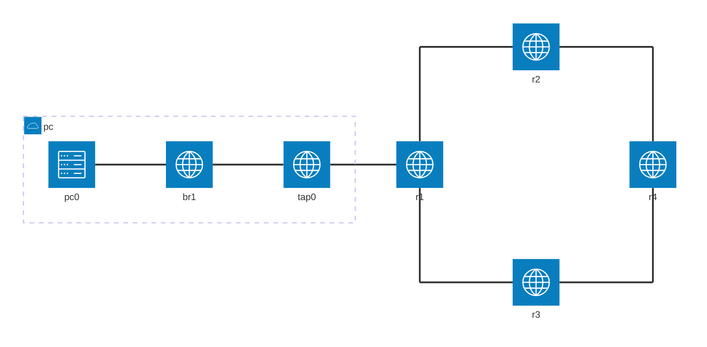

# 本エントリについて

Dynagen、Dynamips を使って、RIPv2 を練習します。
Dynagen、Dynamips の利用環境はすでに整っているものとします。

# 基本設定 





| device | interface | ip address | network address | comment |
| --- | ---  | ---             | ---      | --- |
| pc0 | -    | 10.2.0.1/24     | 10.2.0.0     |  |
| r1  | f0/0 | 10.2.0.254/24   | 10.2.0.0     |  |
|^    | s1/0 | 172.16.0.253/30 | 172.16.0.252 |  |
|^    | s1/1 | 172.16.1.254/30 | 172.16.1.252 |  |
| r2  | f0/0 | 10.2.1.254/24   | 10.2.1.0     |  |
|^    | s1/0 | 172.16.2.253/30 | 172.16.2.252 |  |
|^    | s1/1 | 172.16.0.254/30 | 172.16.0.252 |  |
| r3  | f0/0 | 10.2.2.254/24   | 10.2.2.0     |  |
|^    | s1/0 | 172.16.1.253/30 | 172.16.1.252 |  |
|^    | s1/1 | 172.16.3.254/30 | 172.16.3.252 |  |
| r4  | f0/0 | 10.2.3.254/24   | 10.2.3.0     |  |
|^    | s1/0 | 172.16.3.253/30 | 172.16.3.252 |  |
|^    | s1/1 | 172.16.2.254/30 | 172.16.2.252 |  |


```
    [[ROUTER r1]]
        model = 3725
        slot1 = NM-4T
        console = 2001
        f0/0 = nio_tap:tap0
        s1/0 = r2 s1/1
        s1/1 = r3 s1/0

    [[ROUTER r2]]
        model = 3725
        slot1 = NM-4T
        console = 2002
        s1/0 = r4 s1/1

    [[ROUTER r3]]
        model = 3725
        slot1 = NM-4T
        console = 2003
        s1/1 = r4 s1/0

    [[ROUTER r4]]
        model = 3725
        slot1 = NM-4T
        console = 2004
```


図は、いずれ書き直したいとは思ってはいますが、現状はテキストで。
```
　　　　　　　　　                                              f0/0 .254 10.2.1.0/24
10.2.0.0/24 .254 fa0/0[r1]s1/0 .253 172.16.0.252/30 .254 s1/1 [r2] s1/0 .253 172.16.2.252/30 .254 s1/1 [r4] f0/0 .254 10.2.3.0/24
                          s1/1 .254 172.16.1.252/30 .253 s1/0 [r3] s1/1 .254 172.16.3.252/30 .253 s1/0
                　　　　　　　　　                              f0/0 .254 10.2.2.0/24
```

r1
```
conf t
hostname r1
int f0/0
ip addr 10.2.0.254 255.255.255.0
no shut
int s1/0
ip addr 172.16.0.253 255.255.255.252
no shut
int s1/1
ip addr 172.16.1.254 255.255.255.252
no shut
```


各ルータの接続とアドレス設定は以下の通りです。
```
r1#show ip int bri
Interface                  IP-Address      OK? Method Status                Protocol
FastEthernet0/0            10.2.0.254      YES NVRAM  up                    up
FastEthernet0/1            unassigned      YES NVRAM  administratively down down
Serial1/0                  172.16.0.253    YES NVRAM  up                    up
Serial1/1                  172.16.1.254    YES NVRAM  up                    up
Serial1/2                  unassigned      YES NVRAM  administratively down down
Serial1/3                  unassigned      YES NVRAM  administratively down down

r1#show cdp neigh
Capability Codes: R - Router, T - Trans Bridge, B - Source Route Bridge
                  S - Switch, H - Host, I - IGMP, r - Repeater

Device ID        Local Intrfce     Holdtme    Capability  Platform  Port ID
r2               Ser 1/0            149         R S I     3725      Ser 1/1
r3               Ser 1/1            146         R S I     3725      Ser 1/0
```

r2
```
conf t
hostname r2
int f0/0
ip addr 10.2.1.254 255.255.255.0
no shut
int s1/0
ip addr 172.16.2.253 255.255.255.252
no shut
int s1/1
ip addr 172.16.0.254 255.255.255.252
no shut
```


```
r2#
r2#show ip int bri
Interface                  IP-Address      OK? Method Status                Protocol
FastEthernet0/0            10.2.1.254      YES NVRAM  up                    up
FastEthernet0/1            unassigned      YES NVRAM  administratively down down
Serial1/0                  172.16.2.253    YES NVRAM  up                    up
Serial1/1                  172.16.0.254    YES NVRAM  up                    up
Serial1/2                  unassigned      YES NVRAM  administratively down down
Serial1/3                  unassigned      YES NVRAM  administratively down down

r2#show cdp neigh
Capability Codes: R - Router, T - Trans Bridge, B - Source Route Bridge
                  S - Switch, H - Host, I - IGMP, r - Repeater

Device ID        Local Intrfce     Holdtme    Capability  Platform  Port ID
r1               Ser 1/1            174         R S I     3725      Ser 1/0
r4               Ser 1/0            145         R S I     3725      Ser 1/1
```

r3
```
conf t
hostname r3
int f0/0
ip addr 10.2.2.254 255.255.255.0
no shut
int s1/0
ip addr 172.16.1.253 255.255.255.252
no shut
int s1/1
ip addr 172.16.3.254 255.255.255.252
no shut
```

```
r3#show ip int bri
Interface                  IP-Address      OK? Method Status                Protocol
FastEthernet0/0            10.2.2.254      YES NVRAM  up                    up
FastEthernet0/1            unassigned      YES NVRAM  administratively down down
Serial1/0                  172.16.1.253    YES NVRAM  up                    up
Serial1/1                  172.16.3.254    YES NVRAM  up                    up
Serial1/2                  unassigned      YES NVRAM  administratively down down
Serial1/3                  unassigned      YES NVRAM  administratively down down

r3#show cdp neigh
Capability Codes: R - Router, T - Trans Bridge, B - Source Route Bridge
                  S - Switch, H - Host, I - IGMP, r - Repeater

Device ID        Local Intrfce     Holdtme    Capability  Platform  Port ID
r1               Ser 1/0            142         R S I     3725      Ser 1/1
r4               Ser 1/1            172         R S I     3725      Ser 1/0
```

r4
```
conf t
hostname r4
int f0/0
ip addr 10.2.3.254 255.255.255.0
no shut
int s1/0
ip addr 172.16.3.253 255.255.255.252
no shut
int s1/1
ip addr 172.16.2.254 255.255.255.252
no shut
```

```
r4#show ip int bri
Interface                  IP-Address      OK? Method Status                Protocol
FastEthernet0/0            10.2.3.254      YES NVRAM  up                    up
FastEthernet0/1            unassigned      YES NVRAM  administratively down down
Serial1/0                  172.16.3.253    YES NVRAM  up                    up
Serial1/1                  172.16.2.254    YES NVRAM  up                    up
Serial1/2                  unassigned      YES NVRAM  administratively down down
Serial1/3                  unassigned      YES NVRAM  administratively down down

r4#show cdp neigh
Capability Codes: R - Router, T - Trans Bridge, B - Source Route Bridge
                  S - Switch, H - Host, I - IGMP, r - Repeater

Device ID        Local Intrfce     Holdtme    Capability  Platform  Port ID
r2               Ser 1/1            151         R S I     3725      Ser 1/0
r3               Ser 1/0            148         R S I     3725      Ser 1/1
```

# RIP について

RIP はディスタンス・ベクタ型のルーティングプロトコルです。

## RIPv1 RIPv2 の主な違い

version 1 と 2 がありますが、下記のような違いがあります。本エントリでは RIPv2 を扱います。

|  | RIPv1 | RIPv2 |
| --- | --- | --- |
| アップデート | ブロードキャスト | マルチキャスト(224.0.0.9) |
| 経路集約 | 自動(クラス境界)のみ | 自動・手動とも |
| クラス | クラスフル | クラスレス |
| VLSM | 非対応 | 対応 |
| 認証 | 非対応 | 対応 |

# RIPv2 の有効化

ここでは RIPv2 について練習します。

## r1 で有効化

まずは r1 で RIPv2 を有効化します。

- `version 2` コマンドを入力しないと、version 1 起動します。
- `network` コマンドで、アドバタイズしたいネットワークアドレスを指定します。
- RIP のパケットを送信したくないインタフェースを `passive-interface` コマンドで指定します。

```
r1(config)#router rip
r1(config-router)#version 2
r1(config-router)#passive-interface fa0/0
r1(config-router)#no auto-summary
r1(config-router)#network 10.2.0.0
r1(config-router)#network 172.16.0.0
```

状態を確認します。
他のルータでは RIP を起動しておらず、RIP経路は何も学習していないため、 `show ip route rip` の結果は空になります。
```
r1#show ip rip database
10.0.0.0/8    auto-summary
10.2.0.0/24    directly connected, FastEthernet0/0
172.16.0.0/16    auto-summary
172.16.0.0/24    directly connected, Serial1/0
172.16.1.0/24    directly connected, Serial1/1

r1#show ip protocols
Routing Protocol is "rip"
  Outgoing update filter list for all interfaces is not set
  Incoming update filter list for all interfaces is not set
  Sending updates every 30 seconds, next due in 27 seconds
  Invalid after 180 seconds, hold down 180, flushed after 240
  Redistributing: rip
  Default version control: send version 2, receive version 2
    Interface             Send  Recv  Triggered RIP  Key-chain
    Serial1/0             2     2
    Serial1/1             2     2
  Automatic network summarization is not in effect
  Maximum path: 4
  Routing for Networks:
    10.0.0.0
    172.16.0.0
  Passive Interface(s):
    FastEthernet0/0
  Routing Information Sources:
    Gateway         Distance      Last Update
  Distance: (default is 120)

r1#
r1#show ip route rip

```

## r2 で有効化

r2 で RIPv2 を有効化します。
```
r2(config)#router rip
r2(config-router)#version 2
r2(config-router)#passive-interface fa0/0
r2(config-router)#no auto-summary
r2(config-router)#network 10.2.1.0
r2(config-router)#network 172.16.0.0
```

状態を確認します。
r1 からアドバタイズされた経路が学習され rip データベースに登録されています。
また、学習した経路が、ルーティングテーブルに登録されています。

なお、`スプリットホライズン` により、学習した経路を、その経路が送られてきたインタフェースから発信することはありません。
ここでは 10.2.0.0/24 と 172.16.1.0/24 を Serial1/1 から学んでいますので、これらの経路を Serial1/1 から発信はしません。
スプリットホライズンにより、ルーティングループを防いでいます。

```
r2#show ip rip database
10.0.0.0/8    auto-summary
10.2.0.0/24
    [1] via 172.16.0.253, 00:00:03, Serial1/1
10.2.1.0/24    directly connected, FastEthernet0/0
172.16.0.0/16    auto-summary
172.16.0.0/24    directly connected, Serial1/1
172.16.1.0/24
    [1] via 172.16.0.253, 00:00:03, Serial1/1
172.16.2.0/24    directly connected, Serial1/0

r2#show ip protocols
Routing Protocol is "rip"
  Outgoing update filter list for all interfaces is not set
  Incoming update filter list for all interfaces is not set
  Sending updates every 30 seconds, next due in 2 seconds
  Invalid after 180 seconds, hold down 180, flushed after 240
  Redistributing: rip
  Default version control: send version 2, receive version 2
    Interface             Send  Recv  Triggered RIP  Key-chain
    Serial1/0             2     2
    Serial1/1             2     2
  Automatic network summarization is not in effect
  Maximum path: 4
  Routing for Networks:
    10.0.0.0
    172.16.0.0
  Passive Interface(s):
    FastEthernet0/0
  Routing Information Sources:
    Gateway         Distance      Last Update
    172.16.0.253         120      00:00:25
  Distance: (default is 120)

r2#show ip route rip
     172.16.0.0/24 is subnetted, 3 subnets
R       172.16.1.0 [120/1] via 172.16.0.253, 00:00:10, Serial1/1
     10.0.0.0/24 is subnetted, 2 subnets
R       10.2.0.0 [120/1] via 172.16.0.253, 00:00:10, Serial1/1
```

r1 でも状態を確認します。
r2 からアドバタイズされた経路が学習され rip データベースに登録されており、経路が ルーティングテーブルに登録されています。

```
r1#show ip rip database
10.0.0.0/8    auto-summary
10.2.0.0/24    directly connected, FastEthernet0/0
10.2.1.0/24
    [1] via 172.16.0.254, 00:00:26, Serial1/0
172.16.0.0/16    auto-summary
172.16.0.0/24    directly connected, Serial1/0
172.16.1.0/24    directly connected, Serial1/1
172.16.2.0/24
    [1] via 172.16.0.254, 00:00:26, Serial1/0

r1#show ip route rip
     172.16.0.0/24 is subnetted, 3 subnets
R       172.16.2.0 [120/1] via 172.16.0.254, 00:00:05, Serial1/0
     10.0.0.0/24 is subnetted, 2 subnets
R       10.2.1.0 [120/1] via 172.16.0.254, 00:00:05, Serial1/0
r1#
```

## r3 で有効化

r3 で RIPv2 を有効化します。
```
r3(config)#router rip
r3(config-router)#version 2
r3(config-router)#passive-interface fa0/0
r3(config-router)#no auto-summary
r3(config-router)#network 10.2.2.0
r3(config-router)#network 172.16.1.0
```

状態を確認します。2ホップ先の、r2 が発信している経路も学習しています。
```
r3#show ip rip database
10.0.0.0/8    auto-summary
10.2.0.0/24
    [1] via 172.16.1.254, 00:00:04, Serial1/0
10.2.1.0/24
    [2] via 172.16.1.254, 00:00:04, Serial1/0
10.2.2.0/24    directly connected, FastEthernet0/0
172.16.0.0/16    auto-summary
172.16.0.0/24
    [1] via 172.16.1.254, 00:00:04, Serial1/0
172.16.1.0/24    directly connected, Serial1/0
172.16.2.0/24
    [2] via 172.16.1.254, 00:00:04, Serial1/0
172.16.3.0/24    directly connected, Serial1/1

r3#show ip protocols
Routing Protocol is "rip"
  Outgoing update filter list for all interfaces is not set
  Incoming update filter list for all interfaces is not set
  Sending updates every 30 seconds, next due in 19 seconds
  Invalid after 180 seconds, hold down 180, flushed after 240
  Redistributing: rip
  Default version control: send version 2, receive version 2
    Interface             Send  Recv  Triggered RIP  Key-chain
    Serial1/0             2     2
    Serial1/1             2     2
  Automatic network summarization is not in effect
  Maximum path: 4
  Routing for Networks:
    10.0.0.0
    172.16.0.0
  Passive Interface(s):
    FastEthernet0/0
  Routing Information Sources:
    Gateway         Distance      Last Update
    172.16.1.254         120      00:00:21
  Distance: (default is 120)

r3#show ip route rip
     172.16.0.0/24 is subnetted, 4 subnets
R       172.16.0.0 [120/1] via 172.16.1.254, 00:00:07, Serial1/0
R       172.16.2.0 [120/2] via 172.16.1.254, 00:00:07, Serial1/0
     10.0.0.0/24 is subnetted, 3 subnets
R       10.2.0.0 [120/1] via 172.16.1.254, 00:00:07, Serial1/0
R       10.2.1.0 [120/2] via 172.16.1.254, 00:00:07, Serial1/0
```

r1 で状態を確認します。
```
r1#show ip rip database
10.0.0.0/8    auto-summary
10.2.0.0/24    directly connected, FastEthernet0/0
10.2.1.0/24
    [1] via 172.16.0.254, 00:00:11, Serial1/0
172.16.0.0/16    auto-summary
172.16.0.0/24    directly connected, Serial1/0
172.16.1.0/24    directly connected, Serial1/1
172.16.2.0/24
    [1] via 172.16.0.254, 00:00:11, Serial1/0
172.16.3.0/24
    [1] via 172.16.1.253, 00:00:21, Serial1/1


r1#show ip route rip
     172.16.0.0/24 is subnetted, 4 subnets
R       172.16.2.0 [120/1] via 172.16.0.254, 00:00:20, Serial1/0
R       172.16.3.0 [120/1] via 172.16.1.253, 00:00:01, Serial1/1
     10.0.0.0/24 is subnetted, 3 subnets
R       10.2.1.0 [120/1] via 172.16.0.254, 00:00:20, Serial1/0
R       10.2.2.0 [120/1] via 172.16.1.253, 00:00:01, Serial1/1
```

r2 で状態を確認します。2ホップ先の、r3 が発信している経路も学習しています。
```
r2#show ip rip database
10.0.0.0/8    auto-summary
10.2.0.0/24
    [1] via 172.16.0.253, 00:00:19, Serial1/1
10.2.1.0/24    directly connected, FastEthernet0/0
10.2.2.0/24
    [2] via 172.16.0.253, 00:00:19, Serial1/1
172.16.0.0/16    auto-summary
172.16.0.0/24    directly connected, Serial1/1
172.16.1.0/24
    [1] via 172.16.0.253, 00:00:19, Serial1/1
172.16.2.0/24    directly connected, Serial1/0
172.16.3.0/24
    [2] via 172.16.0.253, 00:00:19, Serial1/1

r2#show ip route rip
     172.16.0.0/24 is subnetted, 4 subnets
R       172.16.1.0 [120/1] via 172.16.0.253, 00:00:25, Serial1/1
R       172.16.3.0 [120/2] via 172.16.0.253, 00:00:25, Serial1/1
     10.0.0.0/24 is subnetted, 3 subnets
R       10.2.0.0 [120/1] via 172.16.0.253, 00:00:25, Serial1/1
R       10.2.2.0 [120/2] via 172.16.0.253, 00:00:25, Serial1/1
```

# ポイズニング

RIP のパケットを解析するために、dynagen でパケットキャプチャを取得します。
作業開始前に `capture` コマンドでパケットキャプチャを開始します。
作業が終了したら `no capture` コマンドでキャプチャを終了します。

```
=> capture r3 s1/0 rip_r3_s1_0.cap HDLC
=>
=> no capture r3 s1/0
```

r3 で RIP 経路広告しているアドレスを割り当てている f0/0 を shutdown してみます。
```
r3(config)#int f0/0
r3(config-if)#shut

r3#sho ip int bri
Interface                  IP-Address      OK? Method Status                Protocol
FastEthernet0/0            10.2.2.254      YES NVRAM  administratively down down
FastEthernet0/1            unassigned      YES NVRAM  administratively down down
Serial1/0                  172.16.1.253    YES NVRAM  up                    up
Serial1/1                  172.16.3.254    YES NVRAM  up                    up
Serial1/2                  unassigned      YES NVRAM  administratively down down
Serial1/3                  unassigned      YES NVRAM  administratively down down
```

状態を確認します。
```
r3#show ip rip database
10.0.0.0/8    auto-summary
10.2.0.0/24
    [1] via 172.16.1.254, 00:00:19, Serial1/0
10.2.1.0/24
    [2] via 172.16.1.254, 00:00:19, Serial1/0
10.2.2.0/24 is possibly down
172.16.0.0/16    auto-summary
172.16.0.0/24
    [1] via 172.16.1.254, 00:00:19, Serial1/0
172.16.1.0/24    directly connected, Serial1/0
172.16.2.0/24
    [2] via 172.16.1.254, 00:00:19, Serial1/0
172.16.3.0/24    directly connected, Serial1/1
```

r1 で状態を確認します。10.2.2.0/24 の経路が削除されています。
```
r1#show ip rip database
10.0.0.0/8    auto-summary
10.2.0.0/24    directly connected, FastEthernet0/0
10.2.1.0/24
    [1] via 172.16.0.254, 00:00:01, Serial1/0
172.16.0.0/16    auto-summary
172.16.0.0/24    directly connected, Serial1/0
172.16.1.0/24    directly connected, Serial1/1
172.16.2.0/24
    [1] via 172.16.0.254, 00:00:01, Serial1/0
172.16.3.0/24
    [1] via 172.16.1.253, 00:00:07, Serial1/1

r1#show ip route rip
     172.16.0.0/24 is subnetted, 4 subnets
R       172.16.2.0 [120/1] via 172.16.0.254, 00:00:11, Serial1/0
R       172.16.3.0 [120/1] via 172.16.1.253, 00:00:17, Serial1/1
     10.0.0.0/24 is subnetted, 2 subnets
R       10.2.1.0 [120/1] via 172.16.0.254, 00:00:11, Serial1/0
```

r2 で状態を確認します。やはり 10.2.2.0/24 の経路が削除されています。
```
r2#show ip rip database
10.0.0.0/8    auto-summary
10.2.0.0/24
    [1] via 172.16.0.253, 00:00:10, Serial1/1
10.2.1.0/24    directly connected, FastEthernet0/0
172.16.0.0/16    auto-summary
172.16.0.0/24    directly connected, Serial1/1
172.16.1.0/24
    [1] via 172.16.0.253, 00:00:10, Serial1/1
172.16.2.0/24    directly connected, Serial1/0
172.16.3.0/24
    [2] via 172.16.0.253, 00:00:10, Serial1/1

r2#show ip route rip
     172.16.0.0/24 is subnetted, 4 subnets
R       172.16.1.0 [120/1] via 172.16.0.253, 00:00:15, Serial1/1
R       172.16.3.0 [120/2] via 172.16.0.253, 00:00:15, Serial1/1
     10.0.0.0/24 is subnetted, 2 subnets
R       10.2.0.0 [120/1] via 172.16.0.253, 00:00:15, Serial1/1
```

先ほど shutdown した r3 の f0/0 を no shutdown します。
```
r3(config)#int f0/0
r3(config-if)#no shut
```

状態を確認します。
```
r3#show ip rip database
*Mar  1 00:32:09.939: %SYS-5-CONFIG_I: Configured from cw ip rip database
10.0.0.0/8    auto-summary
10.2.0.0/24
    [1] via 172.16.1.254, 00:00:02, Serial1/0
10.2.1.0/24
    [2] via 172.16.1.254, 00:00:02, Serial1/0
10.2.2.0/24    directly connected, FastEthernet0/0
172.16.0.0/16    auto-summary
172.16.0.0/24
    [1] via 172.16.1.254, 00:00:02, Serial1/0
172.16.1.0/24    directly connected, Serial1/0
172.16.2.0/24
    [2] via 172.16.1.254, 00:00:02, Serial1/0
172.16.3.0/24    directly connected, Serial1/1
```

r1 でも状態を確認します。10.2.2.0/24 の経路が回復しました。
```
r1#show ip rip database
10.0.0.0/8    auto-summary
10.2.0.0/24    directly connected, FastEthernet0/0
10.2.1.0/24
    [1] via 172.16.0.254, 00:00:24, Serial1/0
10.2.2.0/24
    [1] via 172.16.1.253, 00:00:25, Serial1/1
172.16.0.0/16    auto-summary
172.16.0.0/24    directly connected, Serial1/0
172.16.1.0/24    directly connected, Serial1/1
172.16.2.0/24
    [1] via 172.16.0.254, 00:00:24, Serial1/0
172.16.3.0/24
    [1] via 172.16.1.253, 00:00:25, Serial1/1

r1#show ip route rip
     172.16.0.0/24 is subnetted, 4 subnets
R       172.16.2.0 [120/1] via 172.16.0.254, 00:00:00, Serial1/0
R       172.16.3.0 [120/1] via 172.16.1.253, 00:00:00, Serial1/1
     10.0.0.0/24 is subnetted, 3 subnets
R       10.2.1.0 [120/1] via 172.16.0.254, 00:00:00, Serial1/0
R       10.2.2.0 [120/1] via 172.16.1.253, 00:00:00, Serial1/1
```

r2 で状態を確認します。こちらも 10.2.2.0/24 の経路が回復しています。
```
r2#show ip rip database
10.0.0.0/8    auto-summary
10.2.0.0/24
    [1] via 172.16.0.253, 00:00:11, Serial1/1
10.2.1.0/24    directly connected, FastEthernet0/0
10.2.2.0/24
    [2] via 172.16.0.253, 00:00:11, Serial1/1
172.16.0.0/16    auto-summary
172.16.0.0/24    directly connected, Serial1/1
172.16.1.0/24
    [1] via 172.16.0.253, 00:00:11, Serial1/1
172.16.2.0/24    directly connected, Serial1/0
172.16.3.0/24
    [2] via 172.16.0.253, 00:00:11, Serial1/1

r2#show ip route rip
     172.16.0.0/24 is subnetted, 4 subnets
R       172.16.1.0 [120/1] via 172.16.0.253, 00:00:14, Serial1/1
R       172.16.3.0 [120/2] via 172.16.0.253, 00:00:14, Serial1/1
     10.0.0.0/24 is subnetted, 3 subnets
R       10.2.0.0 [120/1] via 172.16.0.253, 00:00:14, Serial1/1
R       10.2.2.0 [120/2] via 172.16.0.253, 00:00:14, Serial1/1
```

dynagen で取得したパケットキャプチャの内容を解析します。
`tcpdump` で IP パケットを見ると、下記の metric 16 (無効な経路) のアドバタイズが見られます。
172.16.1.253 から発信されているものが、無効になった経路をアドバタイズする `ルートポイズニング` のパケットです。
また、172.16.1.254 から受信しているものが、ルートポイズニングを受信したことを伝える `ポイズンリバース` のパケットです。

`トリガードアップデート` を利用したポイズニングの仕組みにより、速やかな経路削除とルーティングループの防止を実現しています。

```
admin@ip-10-0-0-73:~/zenn$ sudo tcpdump -r rip_r3_s1_0.cap -v -n ip | less

05:18:45.090385 IP (tos 0xc0, ttl 2, id 0, offset 0, flags [none], proto UDP (17), length 52)
    172.16.1.253.520 > 224.0.0.9.520:
        RIPv2, Response, length: 24, routes: 1 or less
          AFI IPv4,        10.2.2.0/24, tag 0x0000, metric: 16, next-hop: self

05:18:47.103397 IP (tos 0xc0, ttl 2, id 0, offset 0, flags [none], proto UDP (17), length 52)
    172.16.1.254.520 > 224.0.0.9.520:
        RIPv2, Response, length: 24, routes: 1 or less
          AFI IPv4,        10.2.2.0/24, tag 0x0000, metric: 16, next-hop: self
```

# 認証

RIPv2 の認証は、インタフェースごとに設定します。
まずは r1 の s1/1 にて認証設定を有効にします。
```
r1(config)#key chain ccna
r1(config-keychain)#key 9
r1(config-keychain-key)#key-string cisco
r1(config-keychain-key)#interface s1/1
r1(config-if)#ip rip authentication mode md5
r1(config-if)#ip rip authentication key-chain ccna
```

このまましばらく待つと、認証の不一致により、学習した経路が消えます。
(認証不一致による経路削除は、通常のタイマーによるアップデートによって削除されるようです)

r3 の s1/0 でも認証設定を有効にします。
```
r3(config)#key chain ccna
r3(config-keychain)#key 9
r3(config-keychain-key)#key-string cisco
r3(config-if)#int s1/0
r3(config-if)#ip rip authentication mode md5
r3(config-if)#ip rip authentication key-chain ccna
```

認証が通るようになり、再び経路が学習されるようになります。

# ロードバランス

デフォルトで4つの経路の等コストパスロードバランスに対応。それ以上でロードバランスするには `maximum-paths` コマンドによる設定が必要になります。
ここでは2つのパスしか使わないので、設定変更はしません。

r4 で RIPv2 を有効化します。
```
r4(config)#router rip
r4(config-router)#version 2
r4(config-router)#passive-interface fa0/0
r4(config-router)#no auto-summary
r4(config-router)#network 10.2.3.0
r4(config-router)#network 172.16.0.0
```

状態を確認します。
10.2.0.0/24 の経路は、Serial1/0 経由、Serial1/1 経由の2つの経路を学習し、どちらも同じホップ数(等コストパス)であるため、両方ともルーティングテーブルに乗りました。
通信をする際は、これらを使ってロードバランスが行われます。
```
r4#show ip rip database
10.0.0.0/8    auto-summary
10.2.0.0/24
    [2] via 172.16.2.253, 00:00:02, Serial1/1
    [2] via 172.16.3.254, 00:00:00, Serial1/0
10.2.1.0/24
    [1] via 172.16.2.253, 00:00:02, Serial1/1
10.2.2.0/24
    [1] via 172.16.3.254, 00:00:00, Serial1/0
10.2.3.0/24    directly connected, FastEthernet0/0
172.16.0.0/16    auto-summary
172.16.0.0/24
    [1] via 172.16.2.253, 00:00:02, Serial1/1
172.16.1.0/24
    [1] via 172.16.3.254, 00:00:00, Serial1/0
172.16.2.0/24    directly connected, Serial1/1
172.16.3.0/24    directly connected, Serial1/0

r4#show ip protocols
Routing Protocol is "rip"
  Outgoing update filter list for all interfaces is not set
  Incoming update filter list for all interfaces is not set
  Sending updates every 30 seconds, next due in 13 seconds
  Invalid after 180 seconds, hold down 180, flushed after 240
  Redistributing: rip
  Default version control: send version 2, receive version 2
    Interface             Send  Recv  Triggered RIP  Key-chain
    Serial1/0             2     2
    Serial1/1             2     2
  Automatic network summarization is not in effect
  Maximum path: 4
  Routing for Networks:
    10.0.0.0
    172.16.0.0
  Passive Interface(s):
    FastEthernet0/0
  Routing Information Sources:
    Gateway         Distance      Last Update
    172.16.3.254         120      00:00:13
    172.16.2.253         120      00:00:15
  Distance: (default is 120)

r4#show ip route rip
     172.16.0.0/24 is subnetted, 4 subnets
R       172.16.0.0 [120/1] via 172.16.2.253, 00:00:04, Serial1/1
R       172.16.1.0 [120/1] via 172.16.3.254, 00:00:28, Serial1/0
     10.0.0.0/24 is subnetted, 4 subnets
R       10.2.0.0 [120/2] via 172.16.3.254, 00:00:28, Serial1/0
                 [120/2] via 172.16.2.253, 00:00:04, Serial1/1
R       10.2.1.0 [120/1] via 172.16.2.253, 00:00:04, Serial1/1
R       10.2.2.0 [120/1] via 172.16.3.254, 00:00:28, Serial1/0
```


r1 でも状態を確認してみます。
```
r1#show ip rip database
10.0.0.0/8    auto-summary
10.2.0.0/24    directly connected, FastEthernet0/0
10.2.1.0/24
    [1] via 172.16.0.254, 00:00:27, Serial1/0
10.2.2.0/24
    [1] via 172.16.1.253, 00:00:23, Serial1/1
10.2.3.0/24
    [2] via 172.16.0.254, 00:00:27, Serial1/0
    [2] via 172.16.1.253, 00:00:23, Serial1/1
172.16.0.0/16    auto-summary
172.16.0.0/24    directly connected, Serial1/0
172.16.1.0/24    directly connected, Serial1/1
172.16.2.0/24
    [1] via 172.16.0.254, 00:00:27, Serial1/0
172.16.3.0/24
    [1] via 172.16.1.253, 00:00:23, Serial1/1

r1#show ip route rip
     172.16.0.0/24 is subnetted, 4 subnets
R       172.16.2.0 [120/1] via 172.16.0.254, 00:00:05, Serial1/0
R       172.16.3.0 [120/1] via 172.16.1.253, 00:00:03, Serial1/1
     10.0.0.0/24 is subnetted, 4 subnets
R       10.2.1.0 [120/1] via 172.16.0.254, 00:00:05, Serial1/0
R       10.2.2.0 [120/1] via 172.16.1.253, 00:00:03, Serial1/1
R       10.2.3.0 [120/2] via 172.16.1.253, 00:00:03, Serial1/1
                 [120/2] via 172.16.0.254, 00:00:05, Serial1/0
```

r4 から 10.0.0.0/24 の機器に対して traceroute を実行してみると、ロードバランスされているのが分かります。
```
r4#traceroute
Protocol [ip]:
Target IP address: 10.2.0.1
Source address: 10.2.3.254
Numeric display [n]:
Timeout in seconds [3]:
Probe count [3]:
Minimum Time to Live [1]:
Maximum Time to Live [30]:
Port Number [33434]:
Loose, Strict, Record, Timestamp, Verbose[none]:
Type escape sequence to abort.
Tracing the route to 10.2.0.1

  1 172.16.3.254 24 msec
    172.16.2.253 28 msec
    172.16.3.254 12 msec
  2 172.16.0.253 48 msec
    172.16.1.254 36 msec
    172.16.0.253 32 msec
  3 10.2.0.1 44 msec 44 msec 40 msec
```

10.2.0.1 から r4 に対して ping を実行した結果をみても、2つの経路が使われてロードバランスされているのが分かります。
```
admin@ip-10-0-0-73:~/zenn$ ping -R 10.2.3.254 -c 2
PING 10.2.3.254 (10.2.3.254) 56(124) bytes of data.
64 bytes from 10.2.3.254: icmp_seq=1 ttl=253 time=44.1 ms
NOP
RR:     10.2.0.1
        172.16.1.254
        172.16.3.254
        10.2.3.254
        172.16.3.253
        172.16.1.253
        10.2.0.254
        10.2.0.1

64 bytes from 10.2.3.254: icmp_seq=2 ttl=253 time=45.4 ms
NOP
RR:     10.2.0.1
        172.16.0.253
        172.16.2.253
        10.2.3.254
        172.16.2.254
        172.16.0.254
        10.2.0.254
        10.2.0.1


--- 10.2.3.254 ping statistics ---
2 packets transmitted, 2 received, 0% packet loss, time 2ms
rtt min/avg/max/mdev = 44.094/44.722/45.350/0.628 ms
```


# まとめ

Dynagen、Dynamips を使って、RIPv2 を練習しました。
スプリットホライズン、ルートポイズニング、ポイズンリバースなど、独特の用語がでてきますが、実際に設定してみて、
debug 情報をみたり、パケットキャプチャをみると理解が進むのではないでしょうか。
