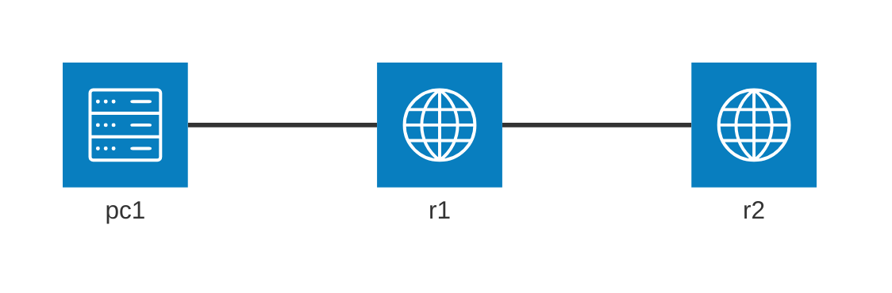

---     
title: "DHCPの練習"
emoji: "🎱"
type: "tech"
topics: ["Cisco","ccna","dynamips","dynagen","vpcs"]
published: true
---

# 本エントリについて

Dynagen、Dynamips、vpcs を使って、DHCP の動作を観察します。
Dynagen、Dynamips、vpcs の利用環境はすでに整っているものとします。

## 参考サイト

https://www.cisco.com/c/en/us/td/docs/ios-xml/ios/ipaddr_dhcp/configuration/xe-3se/3850/dhcp-xe-3se-3850-book/config-dhcp-server.html


# 環境について

練習をする環境の基本的な構成は下記の通りです。



| device | interface | ip address | network address | comment |
| --- | ----  | ---           | --- | --- |
| pc1 | -     | <dhcp>/24 | 10.2.0.0 |  |
| r1  | fe0/0 | 10.2.0.254/24 |^ |  |
|^    | fe0/1 | <dhcp>/24 | 10.2.1.0 |  |
| r2  | fe0/0 | 10.2.1.254/24 |^  |  |
|^    | fe0/1 | 10.2.2.253/24 | 10.2.2.0 |  |
| pc2 | -     | <dhcp>/24 |^ |  |


Dynagen の設定ファイルの主要な部分は以下のようになります。

```:Dynagen 設定ファイル抜粋
    [[ROUTER r1]]
        model = 3725
        console = 2001
        f0/1 = r2 f0/0
        f0/0 = sw1 1

    [[ROUTER r2]]
        model = 3725
        console = 2002
        f0/1 = sw1 3

    [[ETHSW sw1]]
        1 = access 1
        2 = access 1 NIO_udp:30000:127.0.0.1:20000
        3 = access 2
        4 = access 2 NIO_udp:30001:127.0.0.1:20001
```

## r2 基本設定

あとからDHCP サーバの機能を設定します。

```
conf t
hostname r2
int fa0/0
ip addr 10.2.1.254 255.255.255.0
no shut
int fa0/1
ip addr 10.2.2.253 255.255.255.0
no shut
```

## r1 基本設定

あとからDHCP クライアントの設定をします。
その後、リレーエージェントの設定をします。

```
conf t
hostname r1
int fa0/0
ip addr 10.2.0.254 255.255.255.0
no shut
```


# DHCP サーバの設定

https://www.infraexpert.com/study/dhcpz1.html

## 設定

r2 をDHCPサーバとして設定します。
リース対象外としたいアドレスを ip dhcp excluded-address で指定します。
DHCPプールを作成し、リースするアドレス帯等を指定します。
service dhcp により、DHCPのサービスを起動します。

```
(config)# ip dhcp excluded-address 10.2.2.253 10.2.2.254
(config)# ip dhcp pool dhcp-pool
(dhcp-config)# network 10.2.2.0 255.255.255.0
(dhcp-config)# dns-server 10.2.2.254
(dhcp-config)# default-router 10.2.2.253
(config)# exit
(config)# service dhcp 
```

設定内容を確認します。

```
# show ip dhcp pool

Pool dhcp-pool :
 Utilization mark (high/low)    : 100 / 0
 Subnet size (first/next)       : 0 / 0
 Total addresses                : 254
 Leased addresses               : 0
 Pending event                  : none
 1 subnet is currently in the pool :
 Current index        IP address range                    Leased addresses
 10.2.2.1             10.2.2.1         - 10.2.2.254        0

# show ip dhcp binding
Bindings from all pools not associated with VRF:
IP address          Client-ID/              Lease expiration        Type
                    Hardware address/
                    User name

# show ip dhcp server statistics
Memory usage         23558
Address pools        1
Database agents      0
Automatic bindings   0
Manual bindings      0
Expired bindings     0
Malformed messages   0
Secure arp entries   0

Message              Received
BOOTREQUEST          0
DHCPDISCOVER         6
DHCPREQUEST          0
DHCPDECLINE          0
DHCPRELEASE          0
DHCPINFORM           0

Message              Sent
BOOTREPLY            0
DHCPOFFER            0
DHCPACK              0
DHCPNAK              0
```

## dhcp でアドレスを割り当てる

デバッグ情報を出しつつ、dhcp で vpcs にアドレスを割り当てます。
Discover → Offer → Request → Ack の流れが見て取れます。

```
VPCS[2]> ip dhcp -d                                                                                                                                                                                                                  [10/260]
Opcode: 1 (REQUEST)
Client IP Address: 0.0.0.0
Your IP Address: 0.0.0.0
Server IP Address: 0.0.0.0
Gateway IP Address: 0.0.0.0
Client MAC Address: 00:50:79:66:68:01
Option 53: Message Type = Discover
Option 12: Host Name = VPCS2
Option 61: Client Identifier = Hardware Type=Ethernet MAC Address = 00:50:79:66:68:01

Opcode: 1 (REQUEST)
Client IP Address: 0.0.0.0
Your IP Address: 0.0.0.0
Server IP Address: 0.0.0.0
Gateway IP Address: 0.0.0.0
Client MAC Address: 00:50:79:66:68:01
Option 53: Message Type = Discover
Option 12: Host Name = VPCS2
Option 61: Client Identifier = Hardware Type=Ethernet MAC Address = 00:50:79:66:68:01

Opcode: 2 (REPLY)
Client IP Address: 0.0.0.0
Your IP Address: 10.2.2.2
Server IP Address: 0.0.0.0
Gateway IP Address: 0.0.0.0
Client MAC Address: 00:50:79:66:68:01
Option 53: Message Type = Offer
Option 54: DHCP Server = 10.2.2.253
Option 51: Lease Time = 86400
Option 58: Renewal Time = 43200
Option 59: Rebinding Time = 75600
Option 1: Subnet Mask = 255.255.255.0
Option 6: DNS Server = 10.2.2.254
Option 3: Router = 10.2.2.253

Opcode: 1 (REQUEST)
Client IP Address: 10.2.2.2
Your IP Address: 0.0.0.0
Server IP Address: 0.0.0.0
Gateway IP Address: 0.0.0.0
Client MAC Address: 00:50:79:66:68:01
Option 53: Message Type = Request
Option 54: DHCP Server = 10.2.2.253
Option 50: Requested IP Address = 10.2.2.2
Option 61: Client Identifier = Hardware Type=Ethernet MAC Address = 00:50:79:66:68:01
Option 12: Host Name = VPCS2

Opcode: 2 (REPLY)
Client IP Address: 10.2.2.2
Your IP Address: 10.2.2.2
Server IP Address: 0.0.0.0
Gateway IP Address: 0.0.0.0
Client MAC Address: 00:50:79:66:68:01
Option 53: Message Type = Ack
Option 54: DHCP Server = 10.2.2.253
Option 51: Lease Time = 86400
Option 58: Renewal Time = 43200
Option 59: Rebinding Time = 75600
Option 1: Subnet Mask = 255.255.255.0
Option 6: DNS Server = 10.2.2.254
Option 3: Router = 10.2.2.253

 IP 10.2.2.2/24 GW 10.2.2.253

VPCS[2]> show ip

NAME        : VPCS[2]
IP/MASK     : 10.2.2.2/24
GATEWAY     : 10.2.2.253
DNS         : 10.2.2.254
DHCP SERVER : 10.2.2.253
MAC         : 00:50:79:66:68:01
LPORT       : 20001
RHOST:PORT  : 127.0.0.1:30001
MTU:        : 1500
```

DHCPサーバ側のデバッグ情報です。
こちらも DHCPDISCOVER → DHCPOFFER → DHCPREQUEST → DHCPACK の流れが見て取れると思います。

```
# debug ip dhcp server packet

*Mar  1 00:21:56.551: DHCPD: DHCPDISCOVER received from client 0100.5079.6668.01 on interface FastEthernet0/1.
*Mar  1 00:21:56.555: DHCPD: Allocate an address without class information (10.2.2.0)
*Mar  1 00:21:57.591: %DHCPD-4-PING_CONFLICT: DHCP address conflict:  server pinged 10.2.2.1.
*Mar  1 00:21:59.611: DHCPD: Sending DHCPOFFER to client 0100.5079.6668.01 (10.2.2.2).
*Mar  1 00:21:59.615: DHCPD: creating ARP entry (10.2.2.2, 0050.7966.6801, vrf 0).
*Mar  1 00:21:59.619: DHCPD: unicasting BOOTREPLY to client 0050.7966.6801 (10.2.2.2).
*Mar  1 00:21:59.627: DHCPD: DHCPDISCOVER received from client 0100.5079.6668.01 on interface FastEthernet0/1.
*Mar  1 00:21:59.627: DHCPD: Sending DHCPOFFER to client 0100.5079.6668.01 (10.2.2.2).
*Mar  1 00:21:59.627: DHCPD: creating ARP entry (10.2.2.2, 0050.7966.6801, vrf 0).
*Mar  1 00:21:59.627: DHCPD: unicasting BOOTREPLY to client 0050.7966.6801 (10.2.2.2).
*Mar  1 00:22:00.555: DHCPD: DHCPREQUEST received from client 0100.5079.6668.01.
*Mar  1 00:22:00.559: DHCPD: No default domain to append - abort update
*Mar  1 00:22:00.559: DHCPD: Sending DHCPACK to client 0100.5079.6668.01 (10.2.2.2).
*Mar  1 00:22:00.559: DHCPD: unicasting BOOTREPLY to client 0050.7966.6801 (10.2.2.2).
```

アドレスを一つ割り当てた後の、DHCPサーバの情報です。

```
# show ip dhcp pool

Pool dhcp-pool :
 Utilization mark (high/low)    : 100 / 0
 Subnet size (first/next)       : 0 / 0
 Total addresses                : 254
 Leased addresses               : 1
 Pending event                  : none
 1 subnet is currently in the pool :
 Current index        IP address range                    Leased addresses
 10.2.2.3             10.2.2.1         - 10.2.2.254        1

# show ip dhcp binding
Bindings from all pools not associated with VRF:
IP address          Client-ID/              Lease expiration        Type
                    Hardware address/
                    User name
10.2.2.2            0100.5079.6668.01       Mar 02 2002 12:22 AM    Automatic

# show ip dhcp server statistics
Memory usage         32041
Address pools        1
Database agents      0
Automatic bindings   1
Manual bindings      0
Expired bindings     0
Malformed messages   0
Secure arp entries   0

Message              Received
BOOTREQUEST          0
DHCPDISCOVER         8
DHCPREQUEST          1
DHCPDECLINE          0
DHCPRELEASE          0
DHCPINFORM           0

Message              Sent
BOOTREPLY            0
DHCPOFFER            2
DHCPACK              1
DHCPNAK              0
```

# DHCP client

CiscoルータはDHCPクライアントとしても動作します。
r1 を DHCPクライアントとして設定してみます。

https://www.infraexpert.com/study/dhcpz3.html


## DHCPアドレスプールを追加

r2 に、10.2.1.0/24 セグメントのための DHCPアドレスプールを追加します。
```
# conf t
(config)#ip dhcp excluded-address 10.2.1.253 10.2.1.254
(config)#ip dhcp pool dhcp-pool-1
(dhcp-config)#network 10.2.1.0 255.255.255.0
```

## DHCPによるアドレス割り当て

r1 の fa0/1 にDHCPでIPアドレスを割り当てます。
```
(config)# int fa0/1
(config-if)# no shut
(config-if)# ip address dhcp
*Mar  1 00:03:07.891: %DHCP-6-ADDRESS_ASSIGN: Interface FastEthernet0/1 assigned DHCP address 10.2.2.3, mask 255.255.255.0, hostname r1

# show ip int bri
Interface                  IP-Address      OK? Method Status                Protocol
FastEthernet0/0            10.2.0.254      YES NVRAM  up                    up
FastEthernet0/1            10.2.2.3        YES DHCP   up                    up
```

DHCPサーバ側のデバッグ情報です。
MACアドレスではなく、クライアントID が表示されています。
`ip address dhcp` コマンドを実行するときに、MACアドレスをクライアントIDとして使用するように指定することもできるようです。

```
*Mar  1 00:32:46.739: DHCPD: DHCPDISCOVER received from client 0063.6973.636f.2d63.3230.302e.3034.6332.2e30.3030.312d.4661.302f.31 on interface FastEthernet0/1.
*Mar  1 00:32:46.739: DHCPD: Allocate an address without class information (10.2.2.0)
*Mar  1 00:32:48.739: DHCPD: Sending DHCPOFFER to client 0063.6973.636f.2d63.3230.302e.3034.6332.2e30.3030.312d.4661.302f.31 (10.2.2.3).
*Mar  1 00:32:48.743: DHCPD: broadcasting BOOTREPLY to client c200.04c2.0001.
*Mar  1 00:32:48.775: DHCPD: DHCPREQUEST received from client 0063.6973.636f.2d63.3230.302e.3034.6332.2e30.3030.312d.4661.302f.31.
*Mar  1 00:32:48.779: DHCPD: No default domain to append - abort update
*Mar  1 00:32:48.779: DHCPD: Sending DHCPACK to client 0063.6973.636f.2d63.3230.302e.3034.6332.2e30.3030.312d.4661.302f.31 (10.2.2.3).
*Mar  1 00:32:48.779: DHCPD: broadcasting BOOTREPLY to client c200.04c2.0001.
```

アドレスを割り当てた後の、DHCPサーバの情報です。

```
# show ip dhcp binding
Bindings from all pools not associated with VRF:
IP address          Client-ID/              Lease expiration        Type
                    Hardware address/
                    User name
10.2.2.2            0100.5079.6668.01       Mar 02 2002 12:22 AM    Automatic
10.2.2.3            0063.6973.636f.2d63.    Mar 02 2002 12:32 AM    Automatic
                    3230.302e.3034.6332.
                    2e30.3030.312d.4661.
                    302f.31
```

# DHCPリレーエージェント

DHCPはブロードキャストを利用するので、基本的にルータを超えることができません。
DHCPリレーエージェントの機能を利用することで、ブロードキャストを指定したアドレスへユニキャスト転送することができるようになります。

r1 をDHCPリレーエージェントとして設定します。

## ルーティング設定

DHCP クライアントのセグメントと、DHCPサーバの間でのルーティングが必要です。
r1 にOSPF の設定を投入します。

```
# show run | section router ospf
router ospf 1
 log-adjacency-changes
 network 10.2.0.0 0.0.0.255 area 0
 network 10.2.１.0 0.0.0.255 area 0

#show ip route
Codes: C - connected, S - static, R - RIP, M - mobile, B - BGP
       D - EIGRP, EX - EIGRP external, O - OSPF, IA - OSPF inter area
       N1 - OSPF NSSA external type 1, N2 - OSPF NSSA external type 2
       E1 - OSPF external type 1, E2 - OSPF external type 2
       i - IS-IS, su - IS-IS summary, L1 - IS-IS level-1, L2 - IS-IS level-2
       ia - IS-IS inter area, * - candidate default, U - per-user static route
       o - ODR, P - periodic downloaded static route

Gateway of last resort is not set

     10.0.0.0/24 is subnetted, 3 subnets
C       10.2.0.0 is directly connected, FastEthernet0/0
C       10.2.1.0 is directly connected, FastEthernet0/1
O       10.2.2.0 [110/20] via 10.2.1.254, 00:02:32, FastEthernet0/1
```

r2 にも OSPF の設定を投入します。

```
# show run | section router ospf
router ospf 1
 log-adjacency-changes
 network 10.2.1.0 0.0.0.255 area 0
 network 10.2.2.0 0.0.0.255 area 0

#show ip int bri
Interface                  IP-Address      OK? Method Status                Protocol
FastEthernet0/0            10.2.1.254      YES manual up                    up
FastEthernet0/1            10.2.2.253      YES manual up                    up

#show ip route
Codes: C - connected, S - static, R - RIP, M - mobile, B - BGP
       D - EIGRP, EX - EIGRP external, O - OSPF, IA - OSPF inter area
       N1 - OSPF NSSA external type 1, N2 - OSPF NSSA external type 2
       E1 - OSPF external type 1, E2 - OSPF external type 2
       i - IS-IS, su - IS-IS summary, L1 - IS-IS level-1, L2 - IS-IS level-2
       ia - IS-IS inter area, * - candidate default, U - per-user static route
       o - ODR, P - periodic downloaded static route

Gateway of last resort is not set

     10.0.0.0/24 is subnetted, 3 subnets
O       10.2.0.0 [110/20] via 10.2.1.1, 00:00:34, FastEthernet0/0
C       10.2.1.0 is directly connected, FastEthernet0/0
C       10.2.2.0 is directly connected, FastEthernet0/1
```
G
## DHCPアドレスプールを追加

r2 に、10.2.0.0/24 セグメントのための DHCPアドレスプールを追加します。

```
(config)# ip dhcp excluded-address 10.2.0.253 10.2.0.254
(config)# ip dhcp pool dhcp-pool-0
(dhcp-config)# network 10.2.0.0 255.255.255.0
(dhcp-config)# dns-server 10.2.2.254
(dhcp-config)# default-router 10.2.0.254
```

作成したアドレスプールを確認します。

```
# show ip dhcp pool dhcp-pool-0

Pool dhcp-pool-0 :
 Utilization mark (high/low)    : 100 / 0
 Subnet size (first/next)       : 0 / 0
 Total addresses                : 254
 Leased addresses               : 0
 Pending event                  : none
 1 subnet is currently in the pool :
 Current index        IP address range                    Leased addresses
 10.2.0.1             10.2.0.1         - 10.2.0.254        0
```

## DHCPリレーエージェント設定

r1 にDHCPリレーエージェントとしての設定を入れます。
DHCPリレーエージェントによって、ブロードキャストがユニキャストに変換されます。
ユニキャストですので、隣接していないDHCPサーバまで転送することができます。

```
(config)# int fa0/0
(config-if)# ip helper-address 10.2.1.254
```

##  dhcp でアドレスを割り当てる

vpcs に dhcp でアドレスを割り当ててみます。

```
VPCS[1]> ip dhcp -d
Opcode: 1 (REQUEST)
Client IP Address: 0.0.0.0
Your IP Address: 0.0.0.0
Server IP Address: 0.0.0.0
Gateway IP Address: 0.0.0.0
Client MAC Address: 00:50:79:66:68:00
Option 53: Message Type = Discover
Option 12: Host Name = VPCS1
Option 61: Client Identifier = Hardware Type=Ethernet MAC Address = 00:50:79:66:68:00

Opcode: 1 (REQUEST)
Client IP Address: 0.0.0.0
Your IP Address: 0.0.0.0
Server IP Address: 0.0.0.0
Gateway IP Address: 0.0.0.0
Client MAC Address: 00:50:79:66:68:00
Option 53: Message Type = Discover
Option 12: Host Name = VPCS1
Option 61: Client Identifier = Hardware Type=Ethernet MAC Address = 00:50:79:66:68:00

Opcode: 2 (REPLY)
Client IP Address: 0.0.0.0
Your IP Address: 10.2.0.2
Server IP Address: 0.0.0.0
Gateway IP Address: 10.2.0.254
Client MAC Address: 00:50:79:66:68:00
Option 53: Message Type = Offer
Option 54: DHCP Server = 10.2.2.253
Option 51: Lease Time = 86400
Option 58: Renewal Time = 43200
Option 59: Rebinding Time = 75600
Option 1: Subnet Mask = 255.255.255.0
Option 6: DNS Server = 10.2.2.254
Option 3: Router = 10.2.0.254

Opcode: 1 (REQUEST)
Client IP Address: 10.2.0.2
Your IP Address: 0.0.0.0
Server IP Address: 0.0.0.0
Gateway IP Address: 0.0.0.0
Client MAC Address: 00:50:79:66:68:00
Option 53: Message Type = Request
Option 54: DHCP Server = 10.2.2.253
Option 50: Requested IP Address = 10.2.0.2
Option 61: Client Identifier = Hardware Type=Ethernet MAC Address = 00:50:79:66:68:00
Option 12: Host Name = VPCS1

Opcode: 2 (REPLY)
Client IP Address: 10.2.0.2
Your IP Address: 10.2.0.2
Server IP Address: 0.0.0.0
Gateway IP Address: 10.2.0.254
Client MAC Address: 00:50:79:66:68:00
Option 53: Message Type = Ack
Option 54: DHCP Server = 10.2.2.253
Option 51: Lease Time = 86400
Option 58: Renewal Time = 43200
Option 59: Rebinding Time = 75600
Option 1: Subnet Mask = 255.255.255.0
Option 6: DNS Server = 10.2.2.254
Option 3: Router = 10.2.0.254

 IP 10.2.0.2/24 GW 10.2.0.254


VPCS[1]> show ip

NAME        : VPCS[1]
IP/MASK     : 10.2.0.2/24
GATEWAY     : 10.2.0.254
DNS         : 10.2.2.254
DHCP SERVER : 10.2.0.254
MAC         : 00:50:79:66:68:00
LPORT       : 20000
RHOST:PORT  : 127.0.0.1:30000
MTU:        : 1500

```

リレーエージェントのデバッグ情報です。

```
*Mar  1 00:52:31.207: DHCPD: setting giaddr to 10.2.0.254.
*Mar  1 00:52:31.211: DHCPD: BOOTREQUEST from 0100.5079.6668.00 forwarded to 10.2.1.254.
*Mar  1 00:52:32.195: DHCPD: setting giaddr to 10.2.0.254.
*Mar  1 00:52:32.199: DHCPD: BOOTREQUEST from 0100.5079.6668.00 forwarded to 10.2.1.254.
*Mar  1 00:52:33.251: DHCPD: forwarding BOOTREPLY to client 0050.7966.6800.
*Mar  1 00:52:33.251: DHCPD: creating ARP entry (10.2.0.2, 0050.7966.6800, vrf 0).
*Mar  1 00:52:33.251: DHCPD: unicasting BOOTREPLY to client 0050.7966.6800 (10.2.0.2).
*Mar  1 00:52:33.263: DHCPD: forwarding BOOTREPLY to client 0050.7966.6800.
*Mar  1 00:52:33.263: DHCPD: creating ARP entry (10.2.0.2, 0050.7966.6800, vrf 0).
*Mar  1 00:52:33.263: DHCPD: unicasting BOOTREPLY to client 0050.7966.6800 (10.2.0.2).
*Mar  1 00:52:35.195: DHCPD: Finding a relay for client 0100.5079.6668.00 on interface FastEthernet0/0.
*Mar  1 00:52:35.199: DHCPD: setting giaddr to 10.2.0.254.
*Mar  1 00:52:35.203: DHCPD: BOOTREQUEST from 0100.5079.6668.00 forwarded to 10.2.1.254.
*Mar  1 00:52:35.215: DHCPD: forwarding BOOTREPLY to client 0050.7966.6800.
*Mar  1 00:52:35.219: DHCPD: unicasting BOOTREPLY to client 0050.7966.6800 (10.2.0.2).
```

DHCPサーバ側のデバッグ情報です。

```
*Mar  1 01:22:16.183: DHCPD: DHCPDISCOVER received from client 0100.5079.6668.00 through relay 10.2.0.254.
*Mar  1 01:22:16.187: DHCPD: Allocate an address without class information (10.2.0.0)
*Mar  1 01:22:18.191: DHCPD: Sending DHCPOFFER to client 0100.5079.6668.00 (10.2.0.2).
*Mar  1 01:22:18.195: DHCPD: unicasting BOOTREPLY for client 0050.7966.6800 to relay 10.2.0.254.
*Mar  1 01:22:18.199: DHCPD: DHCPDISCOVER received from client 0100.5079.6668.00 through relay 10.2.0.254.
*Mar  1 01:22:18.203: DHCPD: Sending DHCPOFFER to client 0100.5079.6668.00 (10.2.0.2).
*Mar  1 01:22:18.207: DHCPD: unicasting BOOTREPLY for client 0050.7966.6800 to relay 10.2.0.254.
*Mar  1 01:22:20.159: DHCPD: DHCPREQUEST received from client 0100.5079.6668.00.
*Mar  1 01:22:20.163: DHCPD: No default domain to append - abort update
*Mar  1 01:22:20.163: DHCPD: Sending DHCPACK to client 0100.5079.6668.00 (10.2.0.2).
*Mar  1 01:22:20.167: DHCPD: unicasting BOOTREPLY for client 0050.7966.6800 to relay 10.2.0.254.
```

割り当てた後のDHCPアドレスプールの情報です。

```
# show ip dhcp pool dhcp-pool-0

Pool dhcp-pool-0 :
 Utilization mark (high/low)    : 100 / 0
 Subnet size (first/next)       : 0 / 0
 Total addresses                : 254
 Leased addresses               : 1
 Pending event                  : none
 1 subnet is currently in the pool :
 Current index        IP address range                    Leased addresses
 10.2.0.3             10.2.0.1         - 10.2.0.254        1

```

# まとめ

以上、Dynagen、Dynamips、vpcs を使った DHCP設定の練習について記載しました。
show dhcp lease コマンドの出力結果を取らなかったのが心残りです。折を見て記事を書き直したいと思います。
