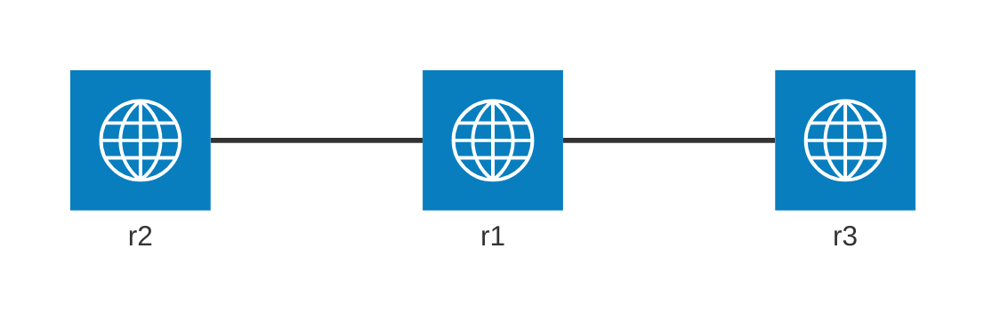

# 本エントリについて

Dynagen、Dynamips を使って、 GRE over IPSecを練習します。
Dynagen、Dynamips の利用環境はすでに整っているものとします。

## 基本設定



設定コマンドは割愛します。
r1を挟んで、r2 と r3の間でトンネリングの設定をしていきます。

r1
```
conf t
hostname r1
int f0/0
ip addr 10.2.0.254 255.255.255.0
no shut
int s1/0
ip addr 172.16.0.253 255.255.255.252
no shut
int s1/1
ip addr 172.16.1.254 255.255.255.252
no shut
router bgp 65001
neigh 172.16.0.254 remote-as 65002
neigh 172.16.1.253 remote-as 65003
network 172.16.0.252 mask 255.255.255.252
network 172.16.1.252 mask 255.255.255.252
```

r2
```
conf t
hostname r2
int f0/0
ip addr 10.2.1.254 255.255.255.0
no shut
int s1/1
ip addr 172.16.0.254 255.255.255.252
no shut
router bgp 65002
neigh 172.16.0.253 remote-as 65001
network 172.16.0.252 mask 255.255.255.252
```

r3
```
conf t
hostname r3
int f0/0
ip addr 10.2.2.254 255.255.255.0
no shut
int s1/0
ip addr 172.16.1.253 255.255.255.252
no shut
router bgp 65003
neigh 172.16.1.254 remote-as 65001
network 172.16.1.252 mask 255.255.255.252
```


```
r1#show ip int bri
Interface                  IP-Address      OK? Method Status                Protocol
FastEthernet0/0            10.2.0.254      YES NVRAM  up                    up
FastEthernet0/1            unassigned      YES NVRAM  administratively down down
Serial1/0                  172.16.0.253    YES NVRAM  up                    up
Serial1/1                  172.16.1.254    YES NVRAM  up                    up
Serial1/2                  unassigned      YES NVRAM  administratively down down
Serial1/3                  unassigned      YES NVRAM  administratively down down

r1#show cdp neigh
Capability Codes: R - Router, T - Trans Bridge, B - Source Route Bridge
                  S - Switch, H - Host, I - IGMP, r - Repeater

Device ID        Local Intrfce     Holdtme    Capability  Platform  Port ID
r2               Ser 1/0            136         R S I     3725      Ser 1/1
r3               Ser 1/1            138         R S I     3725      Ser 1/0

r1#show ip proto
Routing Protocol is "bgp 65001"
  Outgoing update filter list for all interfaces is not set
  Incoming update filter list for all interfaces is not set
  IGP synchronization is disabled
  Automatic route summarization is disabled
  Neighbor(s):
    Address          FiltIn FiltOut DistIn DistOut Weight RouteMap
    172.16.0.254
    172.16.1.253
  Maximum path: 1
  Routing Information Sources:
    Gateway         Distance      Last Update
    172.16.1.253          20      00:01:26
  Distance: external 20 internal 200 local 200
```

```
r2#show ip int bri
Interface                  IP-Address      OK? Method Status                Protocol
FastEthernet0/0            10.2.1.254      YES NVRAM  up                    up
FastEthernet0/1            unassigned      YES NVRAM  administratively down down
Serial1/0                  172.16.2.253    YES NVRAM  up                    down
Serial1/1                  172.16.0.254    YES NVRAM  up                    up
Serial1/2                  unassigned      YES NVRAM  administratively down down
Serial1/3                  unassigned      YES NVRAM  administratively down down

r2#show cdp nei
Capability Codes: R - Router, T - Trans Bridge, B - Source Route Bridge
                  S - Switch, H - Host, I - IGMP, r - Repeater

Device ID        Local Intrfce     Holdtme    Capability  Platform  Port ID
r1               Ser 1/1            123         R S I     3725      Ser 1/0

r2#show ip proto
Routing Protocol is "bgp 65002"
  Outgoing update filter list for all interfaces is not set
  Incoming update filter list for all interfaces is not set
  IGP synchronization is disabled
  Automatic route summarization is disabled
  Neighbor(s):
    Address          FiltIn FiltOut DistIn DistOut Weight RouteMap
    172.16.0.253
  Maximum path: 1
  Routing Information Sources:
    Gateway         Distance      Last Update
    172.16.0.253          20      00:03:34
  Distance: external 20 internal 200 local 200

```
```
r3#show ip int bri
Interface                  IP-Address      OK? Method Status                Protocol
FastEthernet0/0            10.2.2.254      YES NVRAM  up                    up
FastEthernet0/1            unassigned      YES NVRAM  administratively down down
Serial1/0                  172.16.1.253    YES NVRAM  up                    up
Serial1/1                  172.16.3.254    YES NVRAM  up                    down
Serial1/2                  unassigned      YES NVRAM  administratively down down
Serial1/3                  unassigned      YES NVRAM  administratively down down

r3#show cdp nei
Capability Codes: R - Router, T - Trans Bridge, B - Source Route Bridge
                  S - Switch, H - Host, I - IGMP, r - Repeater

Device ID        Local Intrfce     Holdtme    Capability  Platform  Port ID
r1               Ser 1/0            173         R S I     3725      Ser 1/1

r3#show ip proto
Routing Protocol is "bgp 65003"
  Outgoing update filter list for all interfaces is not set
  Incoming update filter list for all interfaces is not set
  IGP synchronization is disabled
  Automatic route summarization is disabled
  Neighbor(s):
    Address          FiltIn FiltOut DistIn DistOut Weight RouteMap
    172.16.1.254
  Maximum path: 1
  Routing Information Sources:
    Gateway         Distance      Last Update
    172.16.1.254          20      00:04:50
  Distance: external 20 internal 200 local 200

```

# GRE トンネリング

まず、GRE トンネリング単体の練習をします。
r2 で GRE トンネリングの設定をします。
```
r2(config)#int tun0
r2(config-if)#ip address 192.168.0.2 255.255.255.0
r2(config-if)#tunnel mode gre ip
r2(config-if)#tunnel source 172.16.0.254
r2(config-if)#tunnel destination 172.16.1.253

r2(config-if)#ip route 10.2.2.0 255.255.255.0 tunnel 0
```

```
r2#show ip int bri
Interface                  IP-Address      OK? Method Status                Protocol
FastEthernet0/0            10.2.1.254      YES NVRAM  up                    up
FastEthernet0/1            unassigned      YES NVRAM  administratively down down
Serial1/0                  172.16.2.253    YES NVRAM  up                    down
Serial1/1                  172.16.0.254    YES NVRAM  up                    up
Serial1/2                  unassigned      YES NVRAM  administratively down down
Serial1/3                  unassigned      YES NVRAM  administratively down down
Tunnel0                    192.168.0.2     YES manual up                    up
```

r3 でも GRE トンネリングの設定をします。
```
r3(config)#int tun0
r3(config-if)#ip address 192.168.0.3 255.255.255.0
r3(config-if)#tunnel mode gre ip
r3(config-if)#tunnel source 172.16.1.253
r3(config-if)#tunnel destination 172.16.0.254

r3(config-if)#ip route 10.2.1.0 255.255.255.0 tunnel 0
```

```
r3#show ip int bri
Interface                  IP-Address      OK? Method Status                Protocol
FastEthernet0/0            10.2.2.254      YES NVRAM  up                    up
FastEthernet0/1            unassigned      YES NVRAM  administratively down down
Serial1/0                  172.16.1.253    YES NVRAM  up                    up
Serial1/1                  172.16.3.254    YES NVRAM  up                    down
Serial1/2                  unassigned      YES NVRAM  administratively down down
Serial1/3                  unassigned      YES NVRAM  administratively down down
Tunnel0                    192.168.0.3     YES manual up                    up
```

疎通を確認します。
```
r3#ping 192.168.0.2

Type escape sequence to abort.
Sending 5, 100-byte ICMP Echos to 192.168.0.2, timeout is 2 seconds:
!!!!!
Success rate is 100 percent (5/5), round-trip min/avg/max = 16/36/44 ms

r3#ping 10.2.1.254

Type escape sequence to abort.
Sending 5, 100-byte ICMP Echos to 10.2.1.254, timeout is 2 seconds:
!!!!!
Success rate is 100 percent (5/5), round-trip min/avg/max = 16/32/40 ms
```

```
r2#ping 192.168.0.3

Type escape sequence to abort.
Sending 5, 100-byte ICMP Echos to 192.168.0.3, timeout is 2 seconds:
!!!!!
Success rate is 100 percent (5/5), round-trip min/avg/max = 16/32/40 ms

r2#ping 10.2.2.254

Type escape sequence to abort.
Sending 5, 100-byte ICMP Echos to 10.2.2.254, timeout is 2 seconds:
!!!!!
Success rate is 100 percent (5/5), round-trip min/avg/max = 16/33/44 ms
```

## OSPF に寄り道

スタティックルート設定を削除して、OSPFの設定を試します。
```
r2(config)#no ip route 10.2.2.0 255.255.255.0

r2(config)#router ospf 1
r2(config-router)#network 192.168.0.0 0.0.0.255 area 0
r2(config-router)#network 10.2.1.0 0.0.0.255 area 0
r2(config-router)#passive-interface fa0/0
```
```
r3(config)#no ip route 10.2.1.0 255.255.255.0

r3(config)#router ospf 1
r3(config-router)#network 192.168.0.0 0.0.0.255 area 0
r3(config-router)#network 10.2.2.0 0.0.0.255 area 0
r3(config-router)#passive-interface fa0/0
```

状態を確認します。
```
r3#show ip ospf neigh

Neighbor ID     Pri   State           Dead Time   Address         Interface
192.168.0.2       0   FULL/  -        00:00:35    192.168.0.2     Tunnel0

r3#show ip ospf int tun0
Tunnel0 is up, line protocol is up
  Internet Address 192.168.0.3/24, Area 0
  Process ID 1, Router ID 192.168.0.3, Network Type POINT_TO_POINT, Cost: 11111
  Transmit Delay is 1 sec, State POINT_TO_POINT
  Timer intervals configured, Hello 10, Dead 40, Wait 40, Retransmit 5
    oob-resync timeout 40
    Hello due in 00:00:00
  Supports Link-local Signaling (LLS)
  Cisco NSF helper support enabled
  IETF NSF helper support enabled
  Index 1/1, flood queue length 0
  Next 0x0(0)/0x0(0)
  Last flood scan length is 1, maximum is 1
  Last flood scan time is 0 msec, maximum is 0 msec
  Neighbor Count is 1, Adjacent neighbor count is 1
    Adjacent with neighbor 192.168.0.2
  Suppress hello for 0 neighbor(s)

r3#show ip ospf datab

            OSPF Router with ID (192.168.0.3) (Process ID 1)

                Router Link States (Area 0)

Link ID         ADV Router      Age         Seq#       Checksum Link count
192.168.0.2     192.168.0.2     63          0x80000003 0x004A74 3
192.168.0.3     192.168.0.3     49          0x80000002 0x004973 3

r3#show ip route ospf
     10.0.0.0/24 is subnetted, 2 subnets
O       10.2.1.0 [110/11121] via 192.168.0.2, 00:00:43, Tunnel0
```

疎通を確認します。
```
r3#ping 10.2.1.254

Type escape sequence to abort.
Sending 5, 100-byte ICMP Echos to 10.2.1.254, timeout is 2 seconds:
!!!!!
Success rate is 100 percent (5/5), round-trip min/avg/max = 28/35/40 ms
```

r2 でも状態を確認します。
```
r2#show ip ospf neigh

Neighbor ID     Pri   State           Dead Time   Address         Interface
192.168.0.3       0   FULL/  -        00:00:35    192.168.0.3     Tunnel0

r2#show ip ospf int tun0
Tunnel0 is up, line protocol is up
  Internet Address 192.168.0.2/24, Area 0
  Process ID 1, Router ID 192.168.0.2, Network Type POINT_TO_POINT, Cost: 11111
  Transmit Delay is 1 sec, State POINT_TO_POINT
  Timer intervals configured, Hello 10, Dead 40, Wait 40, Retransmit 5
    oob-resync timeout 40
    Hello due in 00:00:06
  Supports Link-local Signaling (LLS)
  Cisco NSF helper support enabled
  IETF NSF helper support enabled
  Index 1/1, flood queue length 0
  Next 0x0(0)/0x0(0)
  Last flood scan length is 1, maximum is 1
  Last flood scan time is 0 msec, maximum is 0 msec
  Neighbor Count is 1, Adjacent neighbor count is 1
    Adjacent with neighbor 192.168.0.3
  Suppress hello for 0 neighbor(s)

r2#show ip ospf datab

            OSPF Router with ID (192.168.0.2) (Process ID 1)

                Router Link States (Area 0)

Link ID         ADV Router      Age         Seq#       Checksum Link count
192.168.0.2     192.168.0.2     109         0x80000003 0x004A74 3
192.168.0.3     192.168.0.3     98          0x80000002 0x004973 3

r2#show ip route ospf
     10.0.0.0/24 is subnetted, 2 subnets
O       10.2.2.0 [110/11121] via 192.168.0.3, 00:01:43, Tunnel0
```

疎通を確認します。
```
r2#ping 10.2.2.254

Type escape sequence to abort.
Sending 5, 100-byte ICMP Echos to 10.2.2.254, timeout is 2 seconds:
!!!!!
Success rate is 100 percent (5/5), round-trip min/avg/max = 16/34/40 ms
```

# IPSec

つぎに、IPSec単体の練習をします。
OSPFの設定、GREトンネリングの設定を削除して、スタティックルートの設定を追加します。

```
r3(config)#no router ospf 1
r3(config)#no int tun 0
r3(config)#ip route 10.2.1.0 255.255.255.0 172.16.1.254
```

```
r2(config)#no router ospf 1
r2(config)#no int tun0
r2(config)#ip route 10.2.2.0 255.255.255.0 172.16.0.253
```

## Phase1

r2 で設定します。
```
r2(config)#crypto isakmp policy 1
r2(config-isakmp)#encryption des
r2(config-isakmp)#hash md5
r2(config-isakmp)#authentication pre-share
r2(config-isakmp)#group 2
r2(config-isakmp)#crypto isakmp key cisco address 172.16.1.253
```

状態を確認します。
```
r2#show crypto isakmp policy

Global IKE policy
Protection suite of priority 1
        encryption algorithm:   DES - Data Encryption Standard (56 bit keys).
        hash algorithm:         Message Digest 5
        authentication method:  Pre-Shared Key
        Diffie-Hellman group:   #2 (1024 bit)
        lifetime:               86400 seconds, no volume limit
Default protection suite
        encryption algorithm:   DES - Data Encryption Standard (56 bit keys).
        hash algorithm:         Secure Hash Standard
        authentication method:  Rivest-Shamir-Adleman Signature
        Diffie-Hellman group:   #1 (768 bit)
        lifetime:               86400 seconds, no volume limit
```

r3 で設定します。
```
r3(config)#crypto isakmp policy 1
r3(config-isakmp)#encryption des
r3(config-isakmp)#hash md5
r3(config-isakmp)#authentication pre-share
r3(config-isakmp)#group 2
r3(config-isakmp)#crypto isakmp key cisco address 172.16.0.254
```

状態を確認します。
```
r3#show crypto isakmp policy

Global IKE policy
Protection suite of priority 1
        encryption algorithm:   DES - Data Encryption Standard (56 bit keys).
        hash algorithm:         Message Digest 5
        authentication method:  Pre-Shared Key
        Diffie-Hellman group:   #2 (1024 bit)
        lifetime:               86400 seconds, no volume limit
Default protection suite
        encryption algorithm:   DES - Data Encryption Standard (56 bit keys).
        hash algorithm:         Secure Hash Standard
        authentication method:  Rivest-Shamir-Adleman Signature
        Diffie-Hellman group:   #1 (768 bit)
        lifetime:               86400 seconds, no volume limit
```


## Phase 2

r2 で設定を追加します。
```
r2(config)#crypto ipsec transform-set IPSEC esp-des esp-md5-hmac
r2(cfg-crypto-trans)#access-list 101 permit ip 10.2.1.0 0.0.0.255 10.2.2.0 0.0.0.255
r2(config)#crypto map MAP-IPSEC 1 ipsec-isakmp
r2(config-crypto-map)#match address 101
r2(config-crypto-map)#set peer 172.16.1.253
r2(config-crypto-map)#set transform-set IPSEC
r2(config-crypto-map)#interface s1/1
r2(config-if)#crypto map MAP-IPSEC
```

r3 で設定を追加します。
```
r3(config)#crypto ipsec transform-set IPSEC esp-des esp-md5-hmac
r3(cfg-crypto-trans)#access-list 101 permit ip 10.2.2.0 0.0.0.255 10.2.1.0 0.0.0.255
r3(config)#crypto map MAP-IPSEC 1 ipsec-isakmp
r3(config-crypto-map)#match address 101
r3(config-crypto-map)#set peer 172.16.0.254
r3(config-crypto-map)#set transform-set IPSEC
r3(config-crypto-map)#interface s1/0
r3(config-if)#crypto map MAP-IPSEC
```

疎通を確認します。
```
r3#ping
Protocol [ip]:
Target IP address: 10.2.1.254
Repeat count [5]:
Datagram size [100]:
Timeout in seconds [2]:
Extended commands [n]: y
Source address or interface: 10.2.2.254
Type of service [0]:
Set DF bit in IP header? [no]:
Validate reply data? [no]:
Data pattern [0xABCD]:
Loose, Strict, Record, Timestamp, Verbose[none]:
Sweep range of sizes [n]:
Type escape sequence to abort.
Sending 5, 100-byte ICMP Echos to 10.2.1.254, timeout is 2 seconds:
Packet sent with a source address of 10.2.2.254
!!!!!
Success rate is 100 percent (5/5), round-trip min/avg/max = 36/44/64 ms
```

状態を確認します。
```
r3#show crypto isakmp sa
IPv4 Crypto ISAKMP SA
dst             src             state          conn-id slot status
172.16.1.253    172.16.0.254    QM_IDLE           1001    0 ACTIVE

IPv6 Crypto ISAKMP SA
```

```
r3#show crypto ipsec sa

interface: Serial1/0
    Crypto map tag: MAP-IPSEC, local addr 172.16.1.253

   protected vrf: (none)
   local  ident (addr/mask/prot/port): (10.2.2.0/255.255.255.0/0/0)
   remote ident (addr/mask/prot/port): (10.2.1.0/255.255.255.0/0/0)
   current_peer 172.16.0.254 port 500
     PERMIT, flags={origin_is_acl,}
    #pkts encaps: 9, #pkts encrypt: 9, #pkts digest: 9
    #pkts decaps: 9, #pkts decrypt: 9, #pkts verify: 9
    #pkts compressed: 0, #pkts decompressed: 0
    #pkts not compressed: 0, #pkts compr. failed: 0
    #pkts not decompressed: 0, #pkts decompress failed: 0
    #send errors 0, #recv errors 0

     local crypto endpt.: 172.16.1.253, remote crypto endpt.: 172.16.0.254
     path mtu 1500, ip mtu 1500, ip mtu idb Serial1/0
     current outbound spi: 0xE1983530(3784848688)

     inbound esp sas:
      spi: 0xBE34AE01(3191123457)
        transform: esp-des esp-md5-hmac ,
        in use settings ={Tunnel, }
        conn id: 1, flow_id: SW:1, crypto map: MAP-IPSEC
        sa timing: remaining key lifetime (k/sec): (4542266/3479)
        IV size: 8 bytes
        replay detection support: Y
        Status: ACTIVE

     inbound ah sas:

     inbound pcp sas:

     outbound esp sas:
      spi: 0xE1983530(3784848688)
        transform: esp-des esp-md5-hmac ,
        in use settings ={Tunnel, }
        conn id: 2, flow_id: SW:2, crypto map: MAP-IPSEC
        sa timing: remaining key lifetime (k/sec): (4542266/3479)
        IV size: 8 bytes
        replay detection support: Y
        Status: ACTIVE

     outbound ah sas:

     outbound pcp sas:
```
```
r3#show crypto ipsec transform-set
Transform set IPSEC: { esp-des esp-md5-hmac  }
   will negotiate = { Tunnel,  },


```
```
r3#show crypto session detail
Crypto session current status

Code: C - IKE Configuration mode, D - Dead Peer Detection
K - Keepalives, N - NAT-traversal, X - IKE Extended Authentication
F - IKE Fragmentation

Interface: Serial1/0
Uptime: 00:03:00
Session status: UP-ACTIVE
Peer: 172.16.0.254 port 500 fvrf: (none) ivrf: (none)
      Phase1_id: 172.16.0.254
      Desc: (none)
  IKE SA: local 172.16.1.253/500 remote 172.16.0.254/500 Active
          Capabilities:D connid:1001 lifetime:23:56:58
  IPSEC FLOW: permit ip 10.2.2.0/255.255.255.0 10.2.1.0/255.255.255.0
        Active SAs: 2, origin: crypto map
        Inbound:  #pkts dec'ed 9 drop 0 life (KB/Sec) 4542266/3419
        Outbound: #pkts enc'ed 9 drop 0 life (KB/Sec) 4542266/3419
```


r2 から疎通を確認します。
```
r2#ping
Protocol [ip]:
Target IP address: 10.2.2.254
Repeat count [5]:
Datagram size [100]:
Timeout in seconds [2]:
Extended commands [n]: y
Source address or interface: 10.2.1.254
Type of service [0]:
Set DF bit in IP header? [no]:
Validate reply data? [no]:
Data pattern [0xABCD]:
Loose, Strict, Record, Timestamp, Verbose[none]:
Sweep range of sizes [n]:
Type escape sequence to abort.
Sending 5, 100-byte ICMP Echos to 10.2.2.254, timeout is 2 seconds:
Packet sent with a source address of 10.2.1.254
.!!!!
Success rate is 80 percent (4/5), round-trip min/avg/max = 40/43/48 ms
```

状態を確認します。
```
r2#show crypto isakmp sa
IPv4 Crypto ISAKMP SA
dst             src             state          conn-id slot status
172.16.1.253    172.16.0.254    QM_IDLE           1001    0 ACTIVE

IPv6 Crypto ISAKMP SA

```

```
r2#show crypto ipsec sa

interface: Serial1/1
    Crypto map tag: MAP-IPSEC, local addr 172.16.0.254

   protected vrf: (none)
   local  ident (addr/mask/prot/port): (10.2.1.0/255.255.255.0/0/0)
   remote ident (addr/mask/prot/port): (10.2.2.0/255.255.255.0/0/0)
   current_peer 172.16.1.253 port 500
     PERMIT, flags={origin_is_acl,}
    #pkts encaps: 9, #pkts encrypt: 9, #pkts digest: 9
    #pkts decaps: 9, #pkts decrypt: 9, #pkts verify: 9
    #pkts compressed: 0, #pkts decompressed: 0
    #pkts not compressed: 0, #pkts compr. failed: 0
    #pkts not decompressed: 0, #pkts decompress failed: 0
    #send errors 1, #recv errors 0

     local crypto endpt.: 172.16.0.254, remote crypto endpt.: 172.16.1.253
     path mtu 1500, ip mtu 1500, ip mtu idb Serial1/1
     current outbound spi: 0xBE34AE01(3191123457)

     inbound esp sas:
      spi: 0xE1983530(3784848688)
        transform: esp-des esp-md5-hmac ,
        in use settings ={Tunnel, }
        conn id: 1, flow_id: SW:1, crypto map: MAP-IPSEC
        sa timing: remaining key lifetime (k/sec): (4497406/3324)
        IV size: 8 bytes
        replay detection support: Y
        Status: ACTIVE

     inbound ah sas:

     inbound pcp sas:

     outbound esp sas:
      spi: 0xBE34AE01(3191123457)
        transform: esp-des esp-md5-hmac ,
        in use settings ={Tunnel, }
        conn id: 2, flow_id: SW:2, crypto map: MAP-IPSEC
        sa timing: remaining key lifetime (k/sec): (4497406/3324)
        IV size: 8 bytes
        replay detection support: Y
        Status: ACTIVE

     outbound ah sas:

     outbound pcp sas:

r2#show crypto ipsec transform-set
Transform set IPSEC: { esp-des esp-md5-hmac  }
   will negotiate = { Tunnel,  },


r2#show crypto session detail
Crypto session current status

Code: C - IKE Configuration mode, D - Dead Peer Detection
K - Keepalives, N - NAT-traversal, X - IKE Extended Authentication
F - IKE Fragmentation

Interface: Serial1/1
Uptime: 00:05:02
Session status: UP-ACTIVE
Peer: 172.16.1.253 port 500 fvrf: (none) ivrf: (none)
      Phase1_id: 172.16.1.253
      Desc: (none)
  IKE SA: local 172.16.0.254/500 remote 172.16.1.253/500 Active
          Capabilities:(none) connid:1001 lifetime:23:54:57
  IPSEC FLOW: permit ip 10.2.1.0/255.255.255.0 10.2.2.0/255.255.255.0
        Active SAs: 2, origin: crypto map
        Inbound:  #pkts dec'ed 9 drop 0 life (KB/Sec) 4497406/3297
        Outbound: #pkts enc'ed 9 drop 1 life (KB/Sec) 4497406/3297
```

# GRE over IPSec

あらためてGRE over IPSecの練習をします。
いったん IPSec の設定を削除します。

```
r3(config)#interface s1/0
r3(config-if)#no crypto map MAP-IPSEC
r3(config-if)#no crypto map MAP-IPSEC 1 ipsec-isakmp
r3(config-if)#no access-list 101 permit ip 10.2.2.0 0.0.0.255 10.2.1.0 0.0.0.255
r3(config)#no crypto map MAP-IPSEC 1
r3(config)#no crypto ipsec transform-set IPSEC esp-des esp-md5-hmac
r3(config)#no crypto isakmp policy 1

r3(config)#no ip route 10.2.1.0 255.255.255.0 172.16.1.254
```

```
r2(config)#interface s1/1
r2(config-if)#no crypto map MAP-IPSEC
r2(config-if)#no crypto map MAP-IPSEC 1 ipsec-isakmp
r2(config-if)#no access-list 101 permit ip 10.2.1.0 0.0.0.255 10.2.2.0 0.0.0.255
r2(config)#no crypto map MAP-IPSEC 1
r2(config)#no crypto ipsec transform-set IPSEC esp-des esp-md5-hmac
r2(config)#no crypto isakmp policy 1

r2(config)#no ip route 10.2.2.0 255.255.255.0 172.16.0.253
```

## GRE tunnel

GRE tunnel の設定をします。
```
r2(config)#int tun0
r2(config-if)#ip address 192.168.0.2 255.255.255.0
r2(config-if)#tunnel mode gre ip
r2(config-if)#tunnel source 172.16.0.254
r2(config-if)#tunnel destination 172.16.1.253

r2(config-if)#ip route 10.2.2.0 255.255.255.0 tunnel 0
```
```
r3(config)#int tun0
r3(config-if)#ip address 192.168.0.3 255.255.255.0
r3(config-if)#tunnel mode gre ip
r3(config-if)#tunnel source 172.16.1.253
r3(config-if)#tunnel destination 172.16.0.254

r3(config-if)#ip route 10.2.1.0 255.255.255.0 tunnel 0
```

疎通を確認します。
```
r3#ping
Protocol [ip]:
Target IP address: 10.2.1.254
Repeat count [5]:
Datagram size [100]:
Timeout in seconds [2]:
Extended commands [n]: y
Source address or interface: 10.2.2.254
Type of service [0]:
Set DF bit in IP header? [no]:
Validate reply data? [no]:
Data pattern [0xABCD]:
Loose, Strict, Record, Timestamp, Verbose[none]:
Sweep range of sizes [n]:
Type escape sequence to abort.
Sending 5, 100-byte ICMP Echos to 10.2.1.254, timeout is 2 seconds:
Packet sent with a source address of 10.2.2.254
!!!!!
Success rate is 100 percent (5/5), round-trip min/avg/max = 36/41/52 ms

r3#show int tun0
Tunnel0 is up, line protocol is up
  Hardware is Tunnel
  Internet address is 192.168.0.3/24
  MTU 1514 bytes, BW 9 Kbit/sec, DLY 500000 usec,
     reliability 255/255, txload 1/255, rxload 1/255
  Encapsulation TUNNEL, loopback not set
  Keepalive not set
  Tunnel source 172.16.1.253, destination 172.16.0.254
  Tunnel protocol/transport GRE/IP
    Key disabled, sequencing disabled
    Checksumming of packets disabled
  Tunnel TTL 255
  Fast tunneling enabled
  Tunnel transmit bandwidth 8000 (kbps)
  Tunnel receive bandwidth 8000 (kbps)
  Last input 00:00:55, output 00:00:55, output hang never
  Last clearing of "show interface" counters never
  Input queue: 0/75/0/0 (size/max/drops/flushes); Total output drops: 0
  Queueing strategy: fifo
  Output queue: 0/0 (size/max)
  5 minute input rate 0 bits/sec, 0 packets/sec
  5 minute output rate 0 bits/sec, 0 packets/sec
     5 packets input, 620 bytes, 0 no buffer
     Received 0 broadcasts, 0 runts, 0 giants, 0 throttles
     0 input errors, 0 CRC, 0 frame, 0 overrun, 0 ignored, 0 abort
     5 packets output, 620 bytes, 0 underruns
     0 output errors, 0 collisions, 0 interface resets
     0 unknown protocol drops
     0 output buffer failures, 0 output buffers swapped out
```

r2 からも疎通を確認します。
```
r2#ping
Protocol [ip]:
Target IP address: 10.2.2.254
Repeat count [5]:
Datagram size [100]:
Timeout in seconds [2]:
Extended commands [n]: y
Source address or interface: 10.2.1.254
Type of service [0]:
Set DF bit in IP header? [no]:
Validate reply data? [no]:
Data pattern [0xABCD]:
Loose, Strict, Record, Timestamp, Verbose[none]:
Sweep range of sizes [n]:
Type escape sequence to abort.
Sending 5, 100-byte ICMP Echos to 10.2.2.254, timeout is 2 seconds:
Packet sent with a source address of 10.2.1.254
!!!!!
Success rate is 100 percent (5/5), round-trip min/avg/max = 36/39/44 ms

r2#show int tun 0
Tunnel0 is up, line protocol is up
  Hardware is Tunnel
  Internet address is 192.168.0.2/24
  MTU 1514 bytes, BW 9 Kbit/sec, DLY 500000 usec,
     reliability 255/255, txload 1/255, rxload 1/255
  Encapsulation TUNNEL, loopback not set
  Keepalive not set
  Tunnel source 172.16.0.254, destination 172.16.1.253
  Tunnel protocol/transport GRE/IP
    Key disabled, sequencing disabled
    Checksumming of packets disabled
  Tunnel TTL 255
  Fast tunneling enabled
  Tunnel transmit bandwidth 8000 (kbps)
  Tunnel receive bandwidth 8000 (kbps)
  Last input 00:00:04, output 00:00:04, output hang never
  Last clearing of "show interface" counters never
  Input queue: 0/75/0/0 (size/max/drops/flushes); Total output drops: 0
  Queueing strategy: fifo
  Output queue: 0/0 (size/max)
  5 minute input rate 0 bits/sec, 1 packets/sec
  5 minute output rate 0 bits/sec, 1 packets/sec
     10 packets input, 1240 bytes, 0 no buffer
     Received 0 broadcasts, 0 runts, 0 giants, 0 throttles
     0 input errors, 0 CRC, 0 frame, 0 overrun, 0 ignored, 0 abort
     10 packets output, 1240 bytes, 0 underruns
     0 output errors, 0 collisions, 0 interface resets
     0 unknown protocol drops
     0 output buffer failures, 0 output buffers swapped out
```

## IPSec

### Phase1

r2 で設定をします。
```
r2(config)#crypto isakmp policy 1
r2(config-isakmp)#encryption des
r2(config-isakmp)#hash md5
r2(config-isakmp)#authentication pre-share
r2(config-isakmp)#group 2
r2(config-isakmp)#crypto isakmp key cisco address 192.168.0.3
```

状態を確認します。
```
r2#show crypto isakmp policy

Global IKE policy
Protection suite of priority 1
        encryption algorithm:   DES - Data Encryption Standard (56 bit keys).
        hash algorithm:         Message Digest 5
        authentication method:  Pre-Shared Key
        Diffie-Hellman group:   #2 (1024 bit)
        lifetime:               86400 seconds, no volume limit
Default protection suite
        encryption algorithm:   DES - Data Encryption Standard (56 bit keys).
        hash algorithm:         Secure Hash Standard
        authentication method:  Rivest-Shamir-Adleman Signature
        Diffie-Hellman group:   #1 (768 bit)
        lifetime:               86400 seconds, no volume limit
```

r3 で設定をします。
```
r3(config)#crypto isakmp policy 1
r3(config-isakmp)#encryption des
r3(config-isakmp)#hash md5
r3(config-isakmp)#authentication pre-share
r3(config-isakmp)#group 2
r3(config-isakmp)#crypto isakmp key cisco address 192.168.0.2
```

状態を確認します。
```
r3#show crypto isakmp policy

Global IKE policy
Protection suite of priority 1
        encryption algorithm:   DES - Data Encryption Standard (56 bit keys).
        hash algorithm:         Message Digest 5
        authentication method:  Pre-Shared Key
        Diffie-Hellman group:   #2 (1024 bit)
        lifetime:               86400 seconds, no volume limit
Default protection suite
        encryption algorithm:   DES - Data Encryption Standard (56 bit keys).
        hash algorithm:         Secure Hash Standard
        authentication method:  Rivest-Shamir-Adleman Signature
        Diffie-Hellman group:   #1 (768 bit)
        lifetime:               86400 seconds, no volume limit
```


### Phase2

r2 で設定をします。
```
r2(config)#crypto ipsec transform-set IPSEC esp-des esp-md5-hmac
r2(cfg-crypto-trans)#access-list 101 permit ip 10.2.1.0 0.0.0.255 10.2.2.0 0.0.0.255
r2(config)#crypto map MAP-IPSEC 1 ipsec-isakmp
r2(config-crypto-map)#match address 101
r2(config-crypto-map)#set peer 192.168.0.3
r2(config-crypto-map)#set transform-set IPSEC
r2(config-crypto-map)#interface tun0
r2(config-if)#crypto map MAP-IPSEC
```

r3 で設定をします。
```
r3(config)#crypto ipsec transform-set IPSEC esp-des esp-md5-hmac
r3(cfg-crypto-trans)#access-list 101 permit ip 10.2.2.0 0.0.0.255 10.2.1.0 0.0.0.255
r3(config)#crypto map MAP-IPSEC 1 ipsec-isakmp
r3(config-crypto-map)#match address 101
r3(config-crypto-map)#set peer 192.168.0.2
r3(config-crypto-map)#set transform-set IPSEC
r3(config-crypto-map)#interface tun0
r3(config-if)#crypto map MAP-IPSEC
```

状態を確認します。
```
r3#show crypto ipsec sa

interface: Tunnel0
    Crypto map tag: MAP-IPSEC, local addr 172.16.1.253

   protected vrf: (none)
   local  ident (addr/mask/prot/port): (10.2.2.0/255.255.255.0/0/0)
   remote ident (addr/mask/prot/port): (10.2.1.0/255.255.255.0/0/0)
   current_peer 192.168.0.2 port 500
     PERMIT, flags={origin_is_acl,}
    #pkts encaps: 0, #pkts encrypt: 0, #pkts digest: 0
    #pkts decaps: 0, #pkts decrypt: 0, #pkts verify: 0
    #pkts compressed: 0, #pkts decompressed: 0
    #pkts not compressed: 0, #pkts compr. failed: 0
    #pkts not decompressed: 0, #pkts decompress failed: 0
    #send errors 0, #recv errors 0

     local crypto endpt.: 172.16.1.253, remote crypto endpt.: 192.168.0.2
     path mtu 1476, ip mtu 1476, ip mtu idb Tunnel0
     current outbound spi: 0x0(0)

     inbound esp sas:

     inbound ah sas:

     inbound pcp sas:

     outbound esp sas:

     outbound ah sas:

     outbound pcp sas:
```

疎通を確認します。
```
r3#ping
Protocol [ip]:
Target IP address: 10.2.1.254
Repeat count [5]:
Datagram size [100]:
Timeout in seconds [2]:
Extended commands [n]: y
Source address or interface: 10.2.2.254
Type of service [0]:
Set DF bit in IP header? [no]:
Validate reply data? [no]:
Data pattern [0xABCD]:
Loose, Strict, Record, Timestamp, Verbose[none]:
Sweep range of sizes [n]:
Type escape sequence to abort.
Sending 5, 100-byte ICMP Echos to 10.2.1.254, timeout is 2 seconds:
Packet sent with a source address of 10.2.2.254
.....
Success rate is 0 percent (0/5)

r3#show crypto isakmp sa
IPv4 Crypto ISAKMP SA
dst             src             state          conn-id slot status
192.168.0.2     172.16.1.253    QM_IDLE           1002    0 ACTIVE

IPv6 Crypto ISAKMP SA

```

設定を修正します。
```
r2(config)#interface tun0
r2(config-if)#no crypto map MAP-IPSEC

r2(config-if)#interface s1/1
r2(config-if)#crypto map MAP-IPSEC
```
```
r3(config)#interface tun0
r3(config-if)#no crypto map MAP-IPSEC

r3(config-if)#interface s1/0
r3(config-if)#crypto map MAP-IPSEC
```

再度、疎通を確認します。
```
r3#ping
Protocol [ip]:
Target IP address: 10.2.1.254
Repeat count [5]:
Datagram size [100]:
Timeout in seconds [2]:
Extended commands [n]: y
Source address or interface: 10.2.2.254
Type of service [0]:
Set DF bit in IP header? [no]:
Validate reply data? [no]:
Data pattern [0xABCD]:
Loose, Strict, Record, Timestamp, Verbose[none]:
Sweep range of sizes [n]:
Type escape sequence to abort.
Sending 5, 100-byte ICMP Echos to 10.2.1.254, timeout is 2 seconds:
Packet sent with a source address of 10.2.2.254
!!!!!
Success rate is 100 percent (5/5), round-trip min/avg/max = 24/34/40 ms
r3#
r3#show crypto isakmp sa
IPv4 Crypto ISAKMP SA
dst             src             state          conn-id slot status
192.168.0.2     172.16.1.253    QM_IDLE           1002    0 ACTIVE

IPv6 Crypto ISAKMP SA

```

状態を確認します。
```
r3#show crypto isakmp sa
IPv4 Crypto ISAKMP SA
dst             src             state          conn-id slot status
192.168.0.2     172.16.1.253    QM_IDLE           1002    0 ACTIVE

IPv6 Crypto ISAKMP SA


r3#show crypto ipsec sa

interface: Serial1/0
    Crypto map tag: MAP-IPSEC, local addr 172.16.1.253

   protected vrf: (none)
   local  ident (addr/mask/prot/port): (10.2.2.0/255.255.255.0/0/0)
   remote ident (addr/mask/prot/port): (10.2.1.0/255.255.255.0/0/0)
   current_peer 192.168.0.2 port 500
     PERMIT, flags={origin_is_acl,}
    #pkts encaps: 0, #pkts encrypt: 0, #pkts digest: 0
    #pkts decaps: 0, #pkts decrypt: 0, #pkts verify: 0
    #pkts compressed: 0, #pkts decompressed: 0
    #pkts not compressed: 0, #pkts compr. failed: 0
    #pkts not decompressed: 0, #pkts decompress failed: 0
    #send errors 0, #recv errors 0

     local crypto endpt.: 172.16.1.253, remote crypto endpt.: 192.168.0.2
     path mtu 1500, ip mtu 1500, ip mtu idb Serial1/0
     current outbound spi: 0x0(0)

     inbound esp sas:

     inbound ah sas:

     inbound pcp sas:

     outbound esp sas:

     outbound ah sas:

     outbound pcp sas:
```
```
r3#show crypto ipsec transform-set
Transform set IPSEC: { esp-des esp-md5-hmac  }
   will negotiate = { Tunnel,  },


r3#
r3#show crypto session detail
Crypto session current status

Code: C - IKE Configuration mode, D - Dead Peer Detection
K - Keepalives, N - NAT-traversal, X - IKE Extended Authentication
F - IKE Fragmentation

Interface: Serial1/0
Session status: UP-IDLE
Peer: 192.168.0.2 port 500 fvrf: (none) ivrf: (none)
      Phase1_id: 192.168.0.2
      Desc: (none)
  IKE SA: local 172.16.1.253/500 remote 192.168.0.2/500 Active
          Capabilities:D connid:1002 lifetime:23:46:27
  IPSEC FLOW: permit ip 10.2.2.0/255.255.255.0 10.2.1.0/255.255.255.0
        Active SAs: 0, origin: crypto map
        Inbound:  #pkts dec'ed 0 drop 0 life (KB/Sec) 0/0
        Outbound: #pkts enc'ed 0 drop 0 life (KB/Sec) 0/0

```

r2 でも状態を確認します。
```
r2#show crypto isakmp sa
IPv4 Crypto ISAKMP SA
dst             src             state          conn-id slot status
192.168.0.2     172.16.1.253    QM_IDLE           1002    0 ACTIVE

IPv6 Crypto ISAKMP SA


r2#show crypto ipsec sa

interface: Serial1/1
    Crypto map tag: MAP-IPSEC, local addr 172.16.0.254

   protected vrf: (none)
   local  ident (addr/mask/prot/port): (10.2.1.0/255.255.255.0/0/0)
   remote ident (addr/mask/prot/port): (10.2.2.0/255.255.255.0/0/0)
   current_peer 192.168.0.3 port 500
     PERMIT, flags={origin_is_acl,}
    #pkts encaps: 0, #pkts encrypt: 0, #pkts digest: 0
    #pkts decaps: 0, #pkts decrypt: 0, #pkts verify: 0
    #pkts compressed: 0, #pkts decompressed: 0
    #pkts not compressed: 0, #pkts compr. failed: 0
    #pkts not decompressed: 0, #pkts decompress failed: 0
    #send errors 0, #recv errors 0

     local crypto endpt.: 172.16.0.254, remote crypto endpt.: 192.168.0.3
     path mtu 1500, ip mtu 1500, ip mtu idb Serial1/1
     current outbound spi: 0x0(0)

     inbound esp sas:

     inbound ah sas:

     inbound pcp sas:

     outbound esp sas:

     outbound ah sas:

     outbound pcp sas:
```

```
r2#show crypto ipsec transform-set
Transform set IPSEC: { esp-des esp-md5-hmac  }
   will negotiate = { Tunnel,  },


r2#show crypto session detail
Crypto session current status

Code: C - IKE Configuration mode, D - Dead Peer Detection
K - Keepalives, N - NAT-traversal, X - IKE Extended Authentication
F - IKE Fragmentation

Interface: Serial1/1
Session status: DOWN
Peer: 192.168.0.3 port 500 fvrf: (none) ivrf: (none)
      Desc: (none)
      Phase1_id: (none)
  IPSEC FLOW: permit ip 10.2.1.0/255.255.255.0 10.2.2.0/255.255.255.0
        Active SAs: 0, origin: crypto map
        Inbound:  #pkts dec'ed 0 drop 0 life (KB/Sec) 0/0
        Outbound: #pkts enc'ed 0 drop 0 life (KB/Sec) 0/0

Interface: Tunnel0
Session status: UP-IDLE
Peer: 172.16.1.253 port 500 fvrf: (none) ivrf: (none)
      Phase1_id: 172.16.1.253
      Desc: (none)
  IKE SA: local 192.168.0.2/500 remote 172.16.1.253/500 Active
          Capabilities:(none) connid:1002 lifetime:23:44:57


```

## OSPF に寄り道

スタティックルートを削除して、OSPFの設定を追加します。
```
r2(config)#no ip route 10.2.2.0 255.255.255.0
r2(config)#router ospf 1
r2(config-router)#network 192.168.0.0 0.0.0.255 area 0
r2(config-router)#network 10.2.1.0 0.0.0.255 area 0
```

```
r3(config)#no ip route 10.2.1.0 255.255.255.0
r3(config)#router ospf 1
r3(config-router)#network 192.168.0.0 0.0.0.255 area 0
r3(config-router)#network 10.2.2.0 0.0.0.255 area 0
```

状態を確認します。
```
r3#show ip ospf nei

Neighbor ID     Pri   State           Dead Time   Address         Interface
192.168.0.2       0   FULL/  -        00:00:34    192.168.0.2     Tunnel0

r3#show ip ospf datab

            OSPF Router with ID (192.168.0.3) (Process ID 1)

                Router Link States (Area 0)

Link ID         ADV Router      Age         Seq#       Checksum Link count
192.168.0.2     192.168.0.2     47          0x80000002 0x004C73 3
192.168.0.3     192.168.0.3     59          0x80000003 0x004774 3

r3#show ip route ospf
     10.0.0.0/24 is subnetted, 2 subnets
O       10.2.1.0 [110/11121] via 192.168.0.2, 00:00:51, Tunnel0
```

r2 でも状態を確認します。
```
r2#show ip ospf neig

Neighbor ID     Pri   State           Dead Time   Address         Interface
192.168.0.3       0   FULL/  -        00:00:33    192.168.0.3     Tunnel0
r2#
r2#show ip ospf datab

            OSPF Router with ID (192.168.0.2) (Process ID 1)

                Router Link States (Area 0)

Link ID         ADV Router      Age         Seq#       Checksum Link count
192.168.0.2     192.168.0.2     82          0x80000002 0x004C73 3
192.168.0.3     192.168.0.3     95          0x80000003 0x004774 3

r2#show ip route ospf
     10.0.0.0/24 is subnetted, 2 subnets
O       10.2.2.0 [110/11121] via 192.168.0.3, 00:01:37, Tunnel0
```

疎通を確認します。
```
r2#ping
Protocol [ip]:
Target IP address: 10.2.2.254
Repeat count [5]:
Datagram size [100]:
Timeout in seconds [2]:
Extended commands [n]: y
Source address or interface: 10.2.1.254
Type of service [0]:
Set DF bit in IP header? [no]:
Validate reply data? [no]:
Data pattern [0xABCD]:
Loose, Strict, Record, Timestamp, Verbose[none]:
Sweep range of sizes [n]:
Type escape sequence to abort.
Sending 5, 100-byte ICMP Echos to 10.2.2.254, timeout is 2 seconds:
Packet sent with a source address of 10.2.1.254
!!!!!
Success rate is 100 percent (5/5), round-trip min/avg/max = 36/38/44 ms
```

# まとめ

Dynagen、Dynamips を使って、 GRE over IPSecを練習しました。
